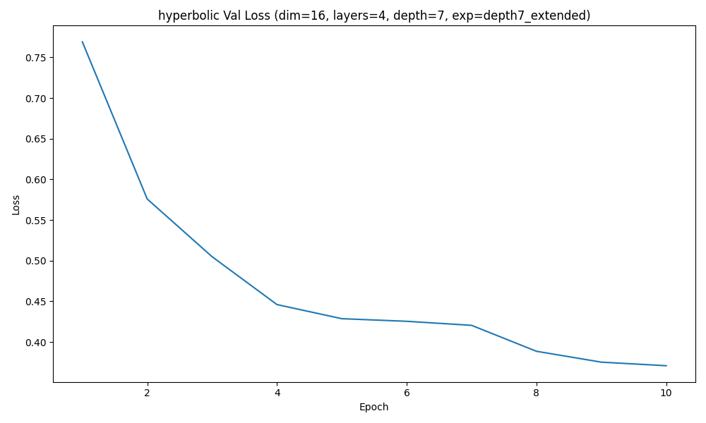

### Experiment depth2_base | depth 2 | hyperbolic | regularization=off 

Best validation loss: 0.332425
Test loss: 0.326676
Test accuracy: 0.0294

Sample trajectory (hyperbolic) 1:
  Visit 1: ['C002', 'C102', 'C210', 'C320']
  Visit 2: ['C144', 'C321', 'C400', 'C42']
  Visit 3: ['C013', 'C123', 'C133', 'C30']
  Visit 4: ['C00', 'C102', 'C114', 'C44']
  Visit 5: ['C013', 'C022', 'C133', 'C30']
  Visit 6: ['C013', 'C123', 'C144', 'C30']

Sample trajectory (hyperbolic) 2:
  Visit 1: ['C00', 'C102', 'C114', 'C44']
  Visit 2: ['C103', 'C123', 'C144', 'C223']
  Visit 3: ['C103', 'C123', 'C134', 'C144']
  Visit 4: ['C00', 'C010', 'C014', 'C424']
  Visit 5: ['C03', 'C112', 'C144', 'C344']
  Visit 6: ['C00', 'C114', 'C314', 'C44']

Sample trajectory (hyperbolic) 3:
  Visit 1: ['C02', 'C112', 'C411', 'C433']
  Visit 2: ['C124', 'C22', 'C23', 'C442']
  Visit 3: ['C103', 'C123', 'C134', 'C144']
  Visit 4: ['C023', 'C102', 'C214', 'C421']
  Visit 5: ['C10', 'C223', 'C30', 'C330']
  Visit 6: ['C024', 'C133', 'C221', 'C434']
  
Correlation(tree_dist, hyperbolic_embedding_dist) = -0.0031

### Experiment depth2_base | depth 2 | euclidean | regularization=off 

Best validation loss: 0.623683
Test loss: 0.618369
Test accuracy: 0.1057

Sample trajectory (euclidean) 1:
  Visit 1: ['C040', 'C323', 'C403', 'C411']
  Visit 2: ['C033', 'C213', 'C24', 'C423']
  Visit 3: ['C012', 'C233', 'C323', 'C400']
  Visit 4: ['C303', 'C342', 'C343', 'C413']
  Visit 5: ['C104', 'C341', 'C440', 'C441']
  Visit 6: ['C003', 'C121', 'C130', 'C210']

Sample trajectory (euclidean) 2:
  Visit 1: ['C104', 'C341', 'C43', 'C440']
  Visit 2: ['C043', 'C14', 'C24', 'C312']
  Visit 3: ['C001', 'C010', 'C223', 'C341']
  Visit 4: ['C012', 'C034', 'C323', 'C434']
  Visit 5: ['C043', 'C121', 'C14', 'C210']
  Visit 6: ['C020', 'C040', 'C44', 'C444']

Sample trajectory (euclidean) 3:
  Visit 1: ['C040', 'C31', 'C41', 'C43']
  Visit 2: ['C012', 'C040', 'C240', 'C411']
  Visit 3: ['C023', 'C044', 'C14', 'C440']
  Visit 4: ['C044', 'C122', 'C413', 'C441']
  Visit 5: ['C104', 'C3', 'C341', 'C440']
  Visit 6: ['C02', 'C023', 'C122', 'C14']

Correlation(tree_dist, euclidean_embedding_dist) = 0.0515

### Experiment depth2_base | depth 2 | hyperbolic | regularization=on 

Best validation loss: 0.377999
Test loss: 0.376347
Test accuracy: 0.0210

Sample trajectory (hyperbolic) 1:
  Visit 1: ['C203', 'C342', 'C420', 'C421']
  Visit 2: ['C030', 'C102', 'C213', 'C311']
  Visit 3: ['C010', 'C031', 'C421', 'C424']
  Visit 4: ['C010', 'C132', 'C223', 'C344']
  Visit 5: ['C132', 'C134', 'C223', 'C301']
  Visit 6: ['C310', 'C311', 'C313', 'C410']

Sample trajectory (hyperbolic) 2:
  Visit 1: ['C034', 'C310', 'C311', 'C410']
  Visit 2: ['C002', 'C203', 'C322', 'C404']
  Visit 3: ['C012', 'C134', 'C223', 'C303']
  Visit 4: ['C310', 'C311', 'C313', 'C410']
  Visit 5: ['C032', 'C203', 'C313', 'C414']
  Visit 6: ['C030', 'C034', 'C311', 'C313']

Sample trajectory (hyperbolic) 3:
  Visit 1: ['C123', 'C124', 'C340', 'C343']
  Visit 2: ['C130', 'C132', 'C134', 'C224']
  Visit 3: ['C030', 'C034', 'C102', 'C311']
  Visit 4: ['C010', 'C131', 'C132', 'C304']
  Visit 5: ['C030', 'C034', 'C102', 'C311']
  Visit 6: ['C132', 'C134', 'C223', 'C301']

Correlation(tree_dist, hyperbolic_embedding_dist) = 0.9868

### Experiment depth2_base | depth 2 | euclidean | regularization=on 

Best validation loss: 0.635257
Test loss: 0.655352
Test accuracy: 0.1133

Sample trajectory (euclidean) 1:
  Visit 1: ['C001', 'C022', 'C311', 'C413']
  Visit 2: ['C043', 'C113', 'C133', 'C244']
  Visit 3: ['C202', 'C230', 'C413', 'C414']
  Visit 4: ['C001', 'C022', 'C044', 'C202']
  Visit 5: ['C122', 'C123', 'C133', 'C413']
  Visit 6: ['C002', 'C133', 'C202', 'C402']

Sample trajectory (euclidean) 2:
  Visit 1: ['C012', 'C33', 'C41', 'C431']
  Visit 2: ['C140', 'C230', 'C413', 'C424']
  Visit 3: ['C240', 'C301', 'C342', 'C404']
  Visit 4: ['C123', 'C202', 'C221', 'C3']
  Visit 5: ['C122', 'C123', 'C230', 'C413']
  Visit 6: ['C123', 'C221', 'C233', 'C41']

Sample trajectory (euclidean) 3:
  Visit 1: ['C023', 'C201', 'C404', 'C421']
  Visit 2: ['C010', 'C240', 'C342', 'C404']
  Visit 3: ['C120', 'C122', 'C342', 'C413']
  Visit 4: ['C120', 'C122', 'C342', 'C413']
  Visit 5: ['C240', 'C301', 'C404', 'C424']
  Visit 6: ['C024', 'C101', 'C124', 'C204']

Correlation(tree_dist, euclidean_embedding_dist) = 0.3726

### Experiment depth7_extended | depth 7 | hyperbolic | regularization=off 

Best validation loss: 0.326480
Test loss: 0.330172
Test accuracy: 0.0046

Sample trajectory (hyperbolic) 1:
  Visit 1: ['C244', 'C310', 'C400', 'C103d1']
  Visit 2: ['C244', 'C031d3', 'C212d0', 'C442d2']
  Visit 3: ['C030', 'C422', 'C144d0', 'C431d2']
  Visit 4: ['C030', 'C142', 'C021d2', 'C123d3']
  Visit 5: ['C023', 'C030', 'C142', 'C422']
  Visit 6: ['C142', 'C422', 'C201d2', 'C431d2']

Sample trajectory (hyperbolic) 2:
  Visit 1: ['C030', 'C142', 'C422', 'C431d2']
  Visit 2: ['C030', 'C142', 'C422', 'C021d2']
  Visit 3: ['C112d3', 'C204d4', 'C300d3', 'C324d2']
  Visit 4: ['C030', 'C142', 'C030d3', 'C123d3']
  Visit 5: ['C030', 'C142', 'C234d3', 'C404d4']
  Visit 6: ['C031d3', 'C131d2', 'C240d2', 'C442d2']

Sample trajectory (hyperbolic) 3:
  Visit 1: ['C112d3', 'C142d0', 'C143d2', 'C431d4']
  Visit 2: ['C030', 'C234', 'C131d0', 'C431d2']
  Visit 3: ['C030', 'C030d3', 'C041d0', 'C343d0']
  Visit 4: ['C203', 'C031d3', 'C111d4', 'C432d2']
  Visit 5: ['C030', 'C142', 'C422', 'C021d2']
  Visit 6: ['C031d3', 'C131d2', 'C212d0', 'C442d2']
  
Correlation(tree_dist, hyperbolic_embedding_dist) = 0.0509

### Experiment depth7_extended | depth 7 | euclidean | regularization=off 

Best validation loss: 0.633295
Test loss: 0.635111
Test accuracy: 0.0394

Sample trajectory (euclidean) 1:
  Visit 1: ['C044', 'C023d3', 'C134d0', 'C433d1']
  Visit 2: ['C401', 'C101d3', 'C134d0', 'C141d2']
  Visit 3: ['C113d3', 'C224d4', 'C413d2', 'C444d2']
  Visit 4: ['C011d0', 'C233d1', 'C301d3', 'C414d3']
  Visit 5: ['C134d0', 'C240d2', 'C331d4', 'C443d0']
  Visit 6: ['C014', 'C111', 'C130', 'C211d2']

Sample trajectory (euclidean) 2:
  Visit 1: ['C044', 'C424', 'C232d0', 'C340d2']
  Visit 2: ['C044', 'C014d2', 'C110d1', 'C134d0']
  Visit 3: ['C413', 'C133d0', 'C400d3', 'C401d0']
  Visit 4: ['C144d0', 'C202d3', 'C202d4', 'C301d1']
  Visit 5: ['C113d3', 'C124d2', 'C202d4', 'C210d3']
  Visit 6: ['C120d2', 'C134d0', 'C203d0', 'C240d2']

Sample trajectory (euclidean) 3:
  Visit 1: ['C124d2', 'C210d3', 'C222d0', 'C432d3']
  Visit 2: ['C044', 'C120d1', 'C331d3', 'C442d4']
  Visit 3: ['C044', 'C424', 'C232d0', 'C331d3']
  Visit 4: ['C044', 'C424', 'C331d3', 'C442d4']
  Visit 5: ['C030d0', 'C222d0', 'C310d2', 'C401d0']
  Visit 6: ['C424', 'C002d0', 'C424d0', 'C430d0']

Correlation(tree_dist, euclidean_embedding_dist) = -0.0043

### Experiment depth7_extended | depth 7 | hyperbolic | regularization=on 

Best validation loss: 0.370899
Test loss: 0.381992
Test accuracy: 0.0124

Sample trajectory (hyperbolic) 1:
  Visit 1: ['C010d3', 'C010d4', 'C011d4', 'C014d4']
  Visit 2: ['C103d4', 'C203d2', 'C203d3', 'C203d4']
  Visit 3: ['C001d4', 'C010d3', 'C010d4', 'C133d4']
  Visit 4: ['C010d3', 'C010d4', 'C011d4', 'C410d4']
  Visit 5: ['C010d3', 'C010d4', 'C233d3', 'C233d4']
  Visit 6: ['C141d4', 'C331d2', 'C331d3', 'C331d4']

Sample trajectory (hyperbolic) 2:
  Visit 1: ['C041d3', 'C041d4', 'C141d3', 'C141d4']
  Visit 2: ['C010d4', 'C011d3', 'C011d4', 'C424d4']
  Visit 3: ['C010d3', 'C010d4', 'C211d4', 'C403d4']
  Visit 4: ['C011d3', 'C011d4', 'C221d4', 'C444d4']
  Visit 5: ['C122d4', 'C240d3', 'C240d4', 'C323d4']
  Visit 6: ['C011d3', 'C011d4', 'C410d4', 'C424d4']

Sample trajectory (hyperbolic) 3:
  Visit 1: ['C122d3', 'C122d4', 'C200d4', 'C203d4']
  Visit 2: ['C011d3', 'C011d4', 'C424d4', 'C444d4']
  Visit 3: ['C100d4', 'C240d4', 'C321d4', 'C400d4']
  Visit 4: ['C033d3', 'C033d4', 'C240d4', 'C442d4']
  Visit 5: ['C011d3', 'C011d4', 'C221d4', 'C444d4']
  Visit 6: ['C122d4', 'C203d4', 'C411d3', 'C411d4']

Correlation(tree_dist, hyperbolic_embedding_dist) = 0.9704

### Experiment depth7_extended | depth 7 | euclidean | regularization=on 

Best validation loss: 0.648082
Test loss: 0.646227
Test accuracy: 0.0277

Sample trajectory (euclidean) 1:
  Visit 1: ['C130d1', 'C232d4', 'C343d3', 'C411d0']
  Visit 2: ['C012d1', 'C233d3', 'C234d1', 'C303d2']
  Visit 3: ['C303d2', 'C303d3', 'C320d0', 'C411d0']
  Visit 4: ['C242d0', 'C344d4', 'C400d0', 'C412d3']
  Visit 5: ['C100d3', 'C231d2', 'C304d4', 'C342d3']
  Visit 6: ['C043d1', 'C114d3', 'C203d3', 'C412d3']

Sample trajectory (euclidean) 2:
  Visit 1: ['C004', 'C112d4', 'C242d4', 'C301d4']
  Visit 2: ['C110d2', 'C110d3', 'C312d4', 'C411d0']
  Visit 3: ['C112d4', 'C113d4', 'C412d3', 'C434d4']
  Visit 4: ['C43', 'C103d4', 'C232d1', 'C423d3']
  Visit 5: ['C312d4', 'C313d4', 'C320d4', 'C411d0']
  Visit 6: ['C004', 'C043d1', 'C103d4', 'C423d1']

Sample trajectory (euclidean) 3:
  Visit 1: ['C110d3', 'C232d4', 'C303d2', 'C320d4']
  Visit 2: ['C110d2', 'C320d4', 'C333d1', 'C342d4']
  Visit 3: ['C223d2', 'C230d0', 'C242d4', 'C301d4']
  Visit 4: ['C430', 'C043d1', 'C240d4', 'C324d0']
  Visit 5: ['C003d1', 'C141d1', 'C212d3', 'C324d0']
  Visit 6: ['C230d0', 'C310d2', 'C423d3', 'C441d4']

Correlation(tree_dist, euclidean_embedding_dist) = 0.2246

## Comparision Table
| Depth / Experiment | Source | Embedding | Reg | Mean depth | Depth std | Mean tree dist | Tree dist std | Mean root purity | Root purity std | Corr(tree, emb) | Best val loss | Test loss | Test accuracy |
| --- | --- | --- | --- | --- | --- | --- | --- | --- | --- | --- | --- | --- | --- |
| depth2_base | Real | — | — | 1.6439 | 0.5138 | 2.1206 | 1.2453 | 0.6242 | 0.2040 | — | — | — | — |
| depth2_base | Synthetic | Hyperbolic | Off | 1.6700 | 0.4881 | 3.3617 | 0.8362 | 0.5139 | 0.1456 | -0.0031 | 0.3324 | 0.3267 | 0.0294 |
| depth2_base | Synthetic | Euclidean | Off | 1.8534 | 0.3756 | 3.3779 | 0.8635 | 0.4648 | 0.1389 | 0.0515 | 0.6237 | 0.6184 | 0.1057 |
| depth2_base | Synthetic | Hyperbolic | On | 2.0000 | 0.0000 | 2.4406 | 0.8289 | 0.4676 | 0.1536 | 0.9868 | 0.3780 | 0.3763 | 0.0210 |
| depth2_base | Synthetic | Euclidean | On | 1.9552 | 0.2235 | 3.4458 | 0.9052 | 0.4728 | 0.1355 | 0.3726 | 0.6353 | 0.6554 | 0.1133 |
| depth7_extended | Real | — | — | 5.3798 | 1.7295 | 5.7591 | 4.7567 | 0.6290 | 0.2047 | — | — | — | — |
| depth7_extended | Synthetic | Hyperbolic | Off | 4.1254 | 1.6717 | 7.9647 | 2.5450 | 0.4735 | 0.1343 | 0.0509 | 0.3265 | 0.3302 | 0.0046 |
| depth7_extended | Synthetic | Euclidean | Off | 4.3008 | 1.7453 | 8.0325 | 2.8330 | 0.4927 | 0.1380 | -0.0043 | 0.6333 | 0.6351 | 0.0394 |
| depth7_extended | Synthetic | Hyperbolic | On | 6.6254 | 0.5911 | 3.8443 | 4.8164 | 0.5664 | 0.1433 | 0.9704 | 0.3709 | 0.3820 | 0.0124 |
| depth7_extended | Synthetic | Euclidean | On | 5.0636 | 1.7319 | 9.6324 | 3.0117 | 0.4779 | 0.1517 | 0.2246 | 0.6481 | 0.6462 | 0.0277 |

## Results
This section evaluates the performance of the proposed hyperbolic diffusion framework across two controlled ICD hierarchies of varying depth—depth2_base (a shallow taxonomy) and depth7_extended (a richer, multi-level structure). For each hierarchy, I compare synthetic trajectories generated using hyperbolic vs. Euclidean latent geometries, with and without the proposed geometric regularization, and analyze the resulting distributions using several hierarchy-aware metrics: mean visit depth, intra-visit tree distance, root purity (top-level category consistency), and correlation between hierarchical tree distance and latent embedding distance. Together, these measurements quantify the degree to which each configuration preserves the underlying medical taxonomy.
### Shallow hierarchy (depth2_base)
The real dataset exhibits a mean visit depth of 1.64 with moderate variance, consistent with a shallow ICD structure. Without regularization, both hyperbolic and Euclidean diffusion models deviate from this distribution. Hyperbolic diffusion (reg-off) produces synthetic visits with a mean depth of 1.67—reasonably close to the real data—while Euclidean diffusion further inflates depth to 1.85, suggesting that Euclidean trajectories drift toward deeper, less representative nodes. This drift is accompanied by an increase in mean intra-visit tree distance (~3.36–3.38 vs. the real 2.12), indicating that diffusion in unconstrained latent space promotes co-occurrence of more semantically distant codes.
The clearest signal of structural misalignment appears in the correlation between tree distance and embedding distance. Both unregularized hyperbolic and Euclidean models produce correlations near zero (–0.003 and 0.051), revealing that diffusion alone, regardless of geometry, fails to internalize hierarchical structure. Introducing the geometric regularizer dramatically alters this landscape. Hyperbolic with regularization jumps to a correlation of 0.9868, effectively recovering the ICD tree structure in the learned code embeddings. This is accompanied by depth values that converge exactly to the maximum depth allowed by the hierarchy (mean = 2.0, std = 0.0). Although this depth collapse reflects a strong inductive pull from the radius–depth constraint, the other structural metrics show meaningful improvement: the mean tree distance moves closer to the real distribution (2.44 vs. 2.12), and root purity remains stable. Euclidean with regularization improves modestly (correlation = 0.3726), but it still falls far short of the hyperbolic regime, underscoring the representational limitations of Euclidean space for hierarchical structure.
### Deep hierarchy (depth7_extended) 
The deeper ICD hierarchy provides a more realistic and challenging test scenario. Real trajectories have a mean depth of 5.38 with large variation and exhibit a wide spread of intra-visit tree distances (mean = 5.76, std = 4.75). This complexity magnifies the differences between geometric spaces.Unregularized diffusion in both geometries systematically underestimates depth and increases semantic spread. Hyperbolic diffusion (reg-off) produces a depth of 4.12, while Euclidean (reg-off) climbs slightly higher to 4.30, but both remain significantly shallower than real trajectories. At the same time, intra-visit tree distances inflate to ~8.0, indicating a breakdown of clinical coherence. Once again, the correlation results are telling: both models produce correlations near zero or even slightly negative (0.0509 for hyperbolic, –0.0043 for Euclidean), showing that the raw diffusion process does not respect hierarchical structure. When the geometric regularizer is activated, the behavior changes substantially. Hyperbolic (reg-on) shifts mean depth to 6.62—slightly overshooting but significantly closer to the real distribution—and, importantly, reduces tree-distance variance while increasing root purity. Most notably, it achieves a tree–embedding correlation of 0.9704, nearly matching the shallow-hierarchy behavior and demonstrating that hyperbolic geometry scales effectively to deeper taxonomies. These results indicate that the hyperbolic manifold can simultaneously preserve local structure (via reduced tree distance) and global hierarchy (via depth–radius alignment), even under a diffusion process that adds substantial noise. In contrast, Euclidean with regularization exhibits minimal improvement. Although depth increases to 5.06 (somewhat closer to real), tree distances explode to 9.63, worse than in the unregularized model and correlation increases only modestly to 0.2246. These results reflect a structural mismatch: Euclidean distance cannot faithfully represent exponential branching and therefore cannot leverage the depth-based regularizer effectively.
### Summary
Across both shallow and deep ICD hierarchies, the experimental results consistently highlight four points:
* Diffusion alone does not preserve hierarchical structure, regardless of latent geometry.
* Hyperbolic geometry combined with geometric regularization yields near-perfect reconstruction of the ICD tree, achieving correlations of 0.97–0.99 across depths.
* Euclidean geometry cannot match hyperbolic performance, even with the same regularization signals, especially as hierarchical depth increases.
* These findings validate the central design choice of embedding EHR trajectories in hyperbolic latent space and demonstrate the effectiveness of the proposed geometric regularizer as a scalable mechanism for hierarchy preservation in generative healthcare models.
