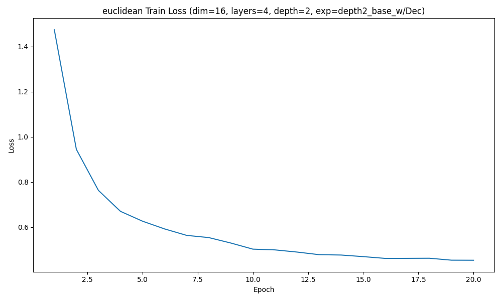
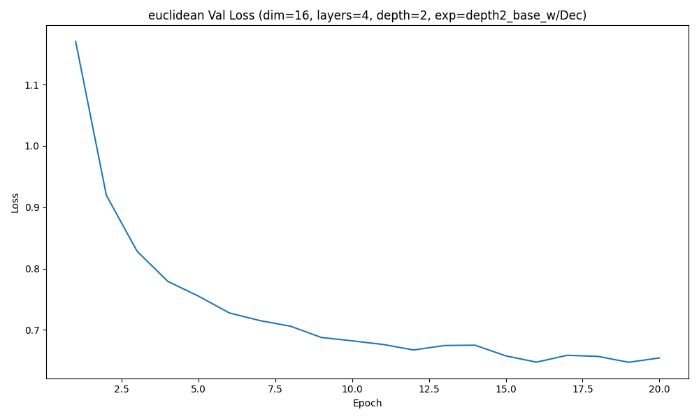
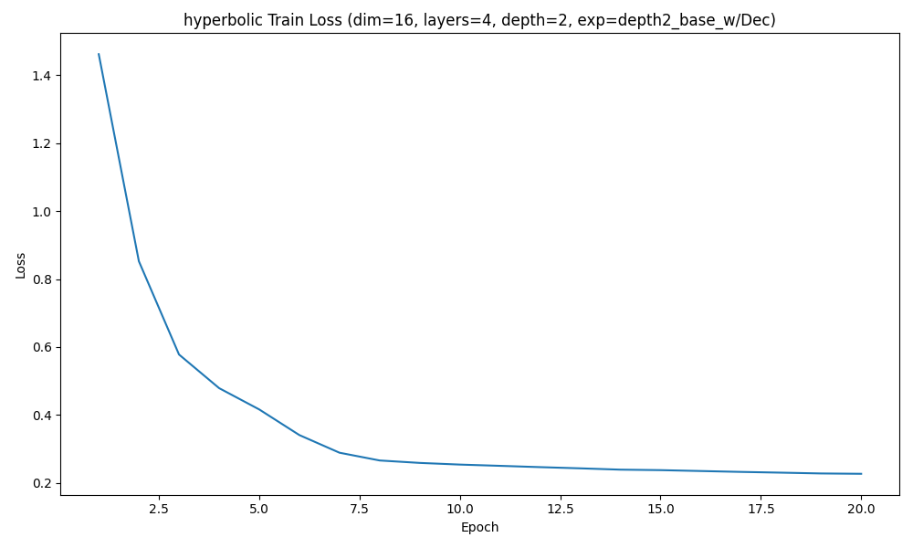
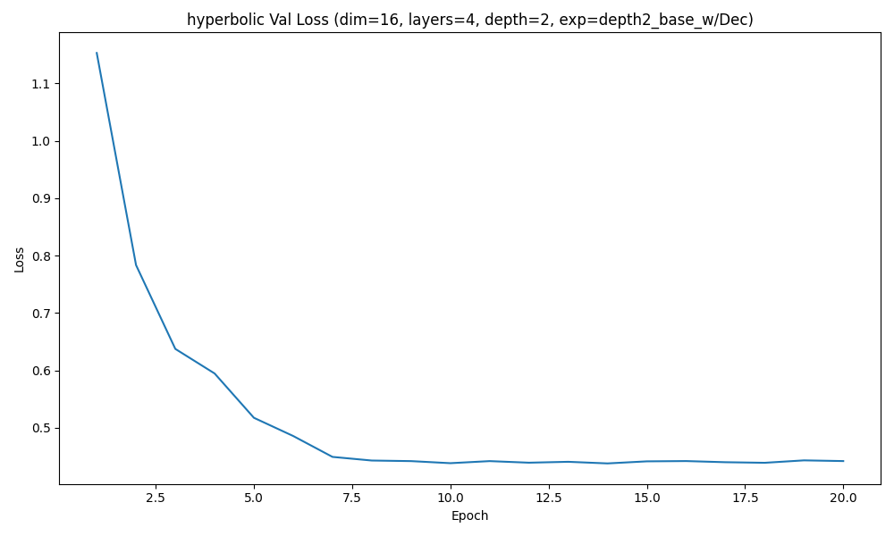
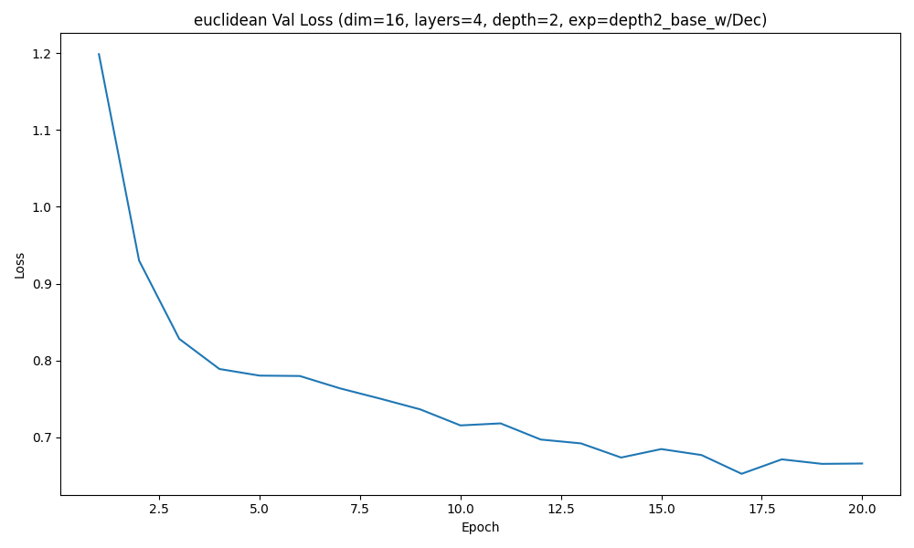
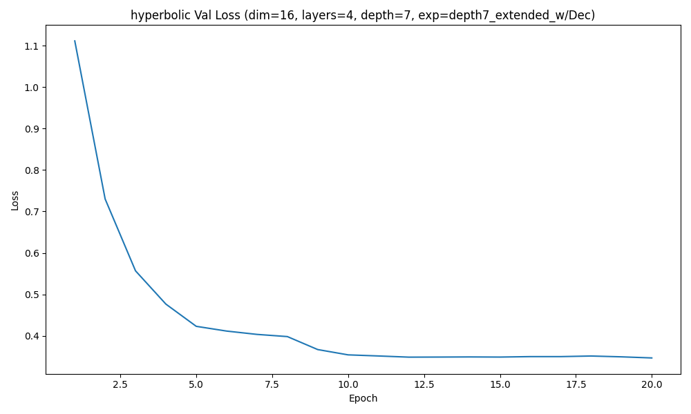
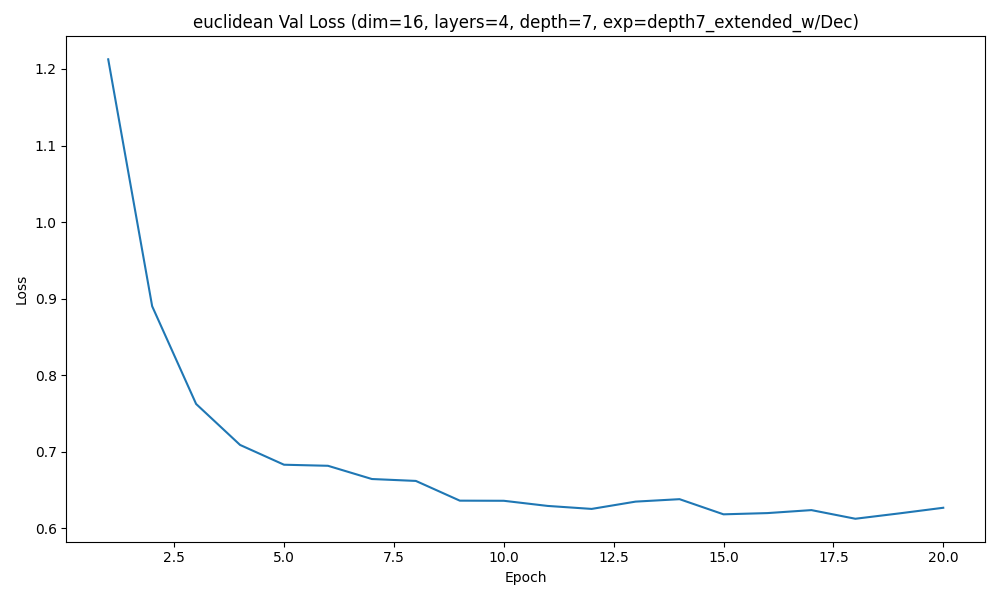
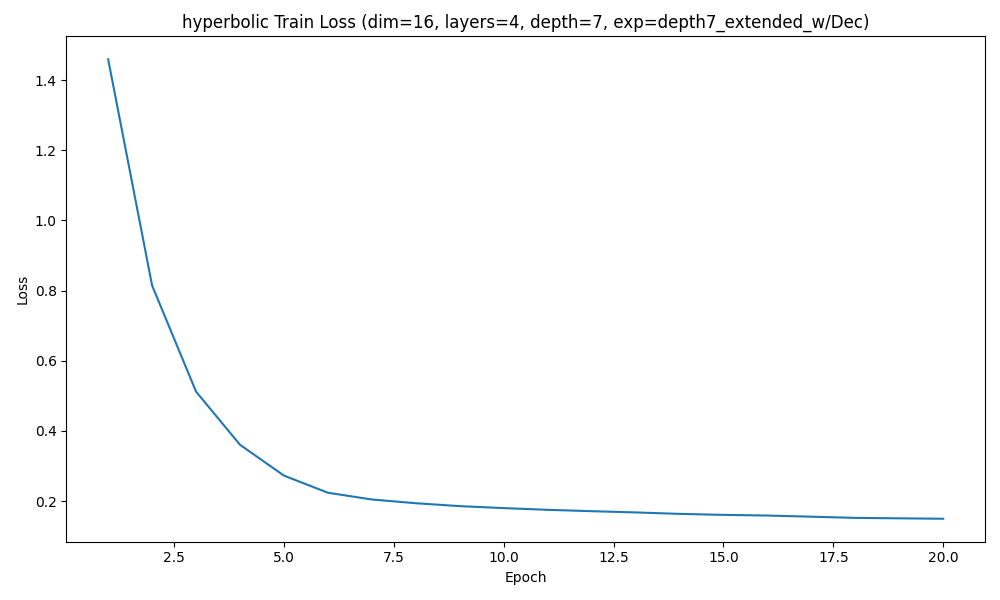

### Experiment depth2_base_w/Dec | depth 2 | hyperbolic | regularization=off

Best validation loss: 0.431862  
Test recall@4: 0.0493

Sample trajectory (hyperbolic) 1:
  Visit 1: ['C020', 'C104', 'C3', 'C410']
  Visit 2: ['C01', 'C043', 'C402', 'C413']
  Visit 3: ['C00', 'C10', 'C23', 'C32']
  Visit 4: ['C00', 'C10', 'C31', 'C40']
  Visit 5: ['C004', 'C020', 'C111', 'C402']
  Visit 6: ['C0', 'C043', 'C402', 'C421']

Sample trajectory (hyperbolic) 2:
  Visit 1: ['C00', 'C01', 'C10', 'C24']
  Visit 2: ['C02', 'C11', 'C30', 'C44']
  Visit 3: ['C00', 'C01', 'C402', 'C413']
  Visit 4: ['C020', 'C211', 'C3', 'C410']
  Visit 5: ['C021', 'C143', 'C302', 'C410']
  Visit 6: ['C0', 'C241', 'C3', 'C4']

Sample trajectory (hyperbolic) 3:
  Visit 1: ['C03', 'C23', 'C30', 'C42']
  Visit 2: ['C043', 'C102', 'C402', 'C413']
  Visit 3: ['C0', 'C022', 'C4', 'C443']
  Visit 4: ['C020', 'C021', 'C3', 'C410']
  Visit 5: ['C043', 'C241', 'C402', 'C413']
  Visit 6: ['C00', 'C01', 'C102', 'C413']
Correlation(tree_dist, hyperbolic_embedding_dist) = 0.0463

Synthetic (hyperbolic) stats (N=1000): {'mean_depth': 1.3694583333333334, 'std_depth': 0.6919481242096276, 'mean_tree_dist': 2.658041697691735, 'std_tree_dist': 0.9128868276723565, 'mean_root_purity': 0.4290833333333333, 'std_root_purity': 0.13644288080446784}

### Experiment depth2_base_w/Dec | depth 2 | euclidean | regularization=off

Best validation loss: 0.647204  
Test recall@4: 0.2446

Sample trajectory (euclidean) 1:
  Visit 1: ['C03', 'C143', 'C340', 'C442']
  Visit 2: ['C013', 'C134', 'C30', 'C301']
  Visit 3: ['C014', 'C02', 'C30', 'C402']
  Visit 4: ['C112', 'C134', 'C32', 'C402']
  Visit 5: ['C321', 'C33', 'C34', 'C340']
  Visit 6: ['C01', 'C014', 'C040', 'C402']

Sample trajectory (euclidean) 2:
  Visit 1: ['C10', 'C131', 'C301', 'C312']
  Visit 2: ['C34', 'C344', 'C433', 'C442']
  Visit 3: ['C211', 'C310', 'C313', 'C402']
  Visit 4: ['C231', 'C33', 'C330', 'C340']
  Visit 5: ['C10', 'C144', 'C33', 'C330']
  Visit 6: ['C00', 'C010', 'C31', 'C40']

Sample trajectory (euclidean) 3:
  Visit 1: ['C224', 'C23', 'C330', 'C411']
  Visit 2: ['C01', 'C31', 'C310', 'C402']
  Visit 3: ['C11', 'C23', 'C400', 'C442']
  Visit 4: ['C011', 'C144', 'C224', 'C23']
  Visit 5: ['C23', 'C301', 'C433', 'C442']
  Visit 6: ['C204', 'C413', 'C44', 'C442']
Correlation(tree_dist, euclidean_embedding_dist) = 0.0483

Synthetic (euclidean) stats (N=1000): {'mean_depth': 1.631375, 'std_depth': 0.48424230440452015, 'mean_tree_dist': 2.6212617779598526, 'std_tree_dist': 1.165768145120876, 'mean_root_purity': 0.5488333333333333, 'std_root_purity': 0.16479372628295724}

### Experiment depth2_base_w/Dec | depth 2 | hyperbolic | regularization=on

Best validation loss: 0.437931  
Test recall@4: 0.0488

Sample trajectory (hyperbolic) 1:
  Visit 1: ['C04', 'C21', 'C30', 'C42']
  Visit 2: ['C020', 'C123', 'C201', 'C313']
  Visit 3: ['C04', 'C21', 'C30', 'C42']
  Visit 4: ['C00', 'C14', 'C244', 'C313']
  Visit 5: ['C03', 'C04', 'C30', 'C42']
  Visit 6: ['C34', 'C404', 'C41', 'C43']

Sample trajectory (hyperbolic) 2:
  Visit 1: ['C020', 'C123', 'C222', 'C313']
  Visit 2: ['C03', 'C04', 'C42', 'C43']
  Visit 3: ['C020', 'C123', 'C201', 'C41']
  Visit 4: ['C03', 'C04', 'C30', 'C42']
  Visit 5: ['C132', 'C14', 'C22', 'C42']
  Visit 6: ['C14', 'C22', 'C33', 'C34']

Sample trajectory (hyperbolic) 3:
  Visit 1: ['C04', 'C21', 'C30', 'C42']
  Visit 2: ['C03', 'C04', 'C30', 'C42']
  Visit 3: ['C00', 'C14', 'C41', 'C42']
  Visit 4: ['C041', 'C1', 'C314', 'C404']
  Visit 5: ['C020', 'C123', 'C201', 'C313']
  Visit 6: ['C03', 'C14', 'C22', 'C30']
Correlation(tree_dist, hyperbolic_embedding_dist) = 0.9879

Synthetic (hyperbolic) stats (N=1000): {'mean_depth': 1.3542083333333332, 'std_depth': 0.5106317557012642, 'mean_tree_dist': 2.3730242360379346, 'std_tree_dist': 0.8250231790610231, 'mean_root_purity': 0.38979166666666665, 'std_root_purity': 0.13945563188300747}

### Experiment depth2_base_w/Dec | depth 2 | euclidean | regularization=on

Best validation loss: 0.652734  
Test recall@4: 0.2237

Sample trajectory (euclidean) 1:
  Visit 1: ['C10', 'C100', 'C41', 'C411']
  Visit 2: ['C211', 'C224', 'C402', 'C42']
  Visit 3: ['C004', 'C030', 'C123', 'C413']
  Visit 4: ['C021', 'C023', 'C14', 'C31']
  Visit 5: ['C04', 'C22', 'C224', 'C402']
  Visit 6: ['C04', 'C143', 'C211', 'C402']

Sample trajectory (euclidean) 2:
  Visit 1: ['C110', 'C211', 'C224', 'C402']
  Visit 2: ['C03', 'C032', 'C11', 'C244']
  Visit 3: ['C10', 'C11', 'C114', 'C443']
  Visit 4: ['C01', 'C11', 'C111', 'C120']
  Visit 5: ['C024', 'C23', 'C231', 'C32']
  Visit 6: ['C114', 'C13', 'C422', 'C423']

Sample trajectory (euclidean) 3:
  Visit 1: ['C20', 'C200', 'C31', 'C312']
  Visit 2: ['C013', 'C211', 'C22', 'C223']
  Visit 3: ['C01', 'C020', 'C12', 'C301']
  Visit 4: ['C030', 'C10', 'C100', 'C344']
  Visit 5: ['C01', 'C20', 'C32', 'C410']
  Visit 6: ['C140', 'C221', 'C314', 'C422']
Correlation(tree_dist, euclidean_embedding_dist) = 0.5077

Synthetic (euclidean) stats (N=1000): {'mean_depth': 1.6311666666666667, 'std_depth': 0.5165223185454386, 'mean_tree_dist': 2.4414581066376497, 'std_tree_dist': 1.181283327773499, 'mean_root_purity': 0.53125, 'std_root_purity': 0.15904172670507993}

### Experiment depth7_extended_w/Dec | depth 7 | hyperbolic | regularization=off

Best validation loss: 0.346782  
Test recall@4: 0.0094

Sample trajectory (hyperbolic) 1:
  Visit 1: ['C121d3', 'C131d4', 'C334d3', 'C414d4']
  Visit 2: ['C010d4', 'C043d3', 'C111d4', 'C324d4']
  Visit 3: ['C000', 'C004', 'C231d0', 'C302d2']
  Visit 4: ['C1', 'C401', 'C213d1', 'C224d0']
  Visit 5: ['C121d3', 'C131d4', 'C232d4', 'C414d4']
  Visit 6: ['C004', 'C412', 'C422', 'C230d0']

Sample trajectory (hyperbolic) 2:
  Visit 1: ['C121d3', 'C131d4', 'C411d3', 'C414d4']
  Visit 2: ['C000', 'C204', 'C241', 'C314d0']
  Visit 3: ['C000', 'C41', 'C412', 'C134d0']
  Visit 4: ['C114d3', 'C121d3', 'C232d4', 'C420d3']
  Visit 5: ['C020d4', 'C023d3', 'C131d4', 'C414d4']
  Visit 6: ['C004', 'C231d0', 'C314d0', 'C344d0']

Sample trajectory (hyperbolic) 3:
  Visit 1: ['C104', 'C022d2', 'C231d0', 'C344d0']
  Visit 2: ['C023d3', 'C213d4', 'C240d3', 'C341d3']
  Visit 3: ['C123', 'C41', 'C303d0', 'C310d3']
  Visit 4: ['C121d3', 'C232d4', 'C334d3', 'C414d4']
  Visit 5: ['C000', 'C004', 'C022d2', 'C231d0']
  Visit 6: ['C004', 'C231d0', 'C314d0', 'C344d0']
Correlation(tree_dist, hyperbolic_embedding_dist) = -0.0415

Synthetic (hyperbolic) stats (N=1000): {'mean_depth': 4.6375416666666665, 'std_depth': 2.019323060647773, 'mean_tree_dist': 8.488310969705353, 'std_tree_dist': 4.06970429546887, 'mean_root_purity': 0.49391666666666667, 'std_root_purity': 0.13793292955474973}

### Experiment depth7_extended_w/Dec | depth 7 | euclidean | regularization=off

Best validation loss: 0.612466  
Test recall@4: 0.1416

Sample trajectory (euclidean) 1:
  Visit 1: ['C014d3', 'C014d4', 'C334d3', 'C334d4']
  Visit 2: ['C021d4', 'C334d3', 'C334d4', 'C432d3']
  Visit 3: ['C002d3', 'C002d4', 'C042d3', 'C130d4']
  Visit 4: ['C002d3', 'C002d4', 'C114d4', 'C344d3']
  Visit 5: ['C112d3', 'C310d3', 'C310d4', 'C342d4']
  Visit 6: ['C021d4', 'C334d3', 'C334d4', 'C432d3']

Sample trajectory (euclidean) 2:
  Visit 1: ['C002d3', 'C002d4', 'C114d4', 'C304d3']
  Visit 2: ['C112d3', 'C334d3', 'C334d4', 'C432d3']
  Visit 3: ['C002d4', 'C114d4', 'C130d3', 'C232d4']
  Visit 4: ['C021d4', 'C334d3', 'C334d4', 'C432d3']
  Visit 5: ['C121d4', 'C314d4', 'C332d3', 'C332d4']
  Visit 6: ['C041d3', 'C041d4', 'C114d3', 'C114d4']

Sample trajectory (euclidean) 3:
  Visit 1: ['C014d4', 'C204d4', 'C331d3', 'C401d3']
  Visit 2: ['C112d3', 'C112d4', 'C334d3', 'C334d4']
  Visit 3: ['C002d3', 'C002d4', 'C304d3', 'C423d4']
  Visit 4: ['C002d3', 'C002d4', 'C102d4', 'C304d3']
  Visit 5: ['C002d3', 'C002d4', 'C324d4', 'C423d4']
  Visit 6: ['C004d3', 'C021d4', 'C213d3', 'C334d3']
Correlation(tree_dist, euclidean_embedding_dist) = -0.0843

Synthetic (euclidean) stats (N=1000): {'mean_depth': 6.48525, 'std_depth': 0.49978239014595144, 'mean_tree_dist': 6.4741301963911875, 'std_tree_dist': 5.905505160937394, 'mean_root_purity': 0.54575, 'std_root_purity': 0.138182623726719}

### Experiment depth7_extended_w/Dec | depth 7 | hyperbolic | regularization=on

Best validation loss: 0.351564  
Test recall@4: 0.0106

Sample trajectory (hyperbolic) 1:
  Visit 1: ['C331', 'C002d0', 'C032d1', 'C122d1']
  Visit 2: ['C331', 'C022d1', 'C122d1', 'C403d1']
  Visit 3: ['C012d4', 'C114d3', 'C120d3', 'C204d4']
  Visit 4: ['C422', 'C022d1', 'C122d1', 'C122d2']
  Visit 5: ['C331', 'C022d1', 'C122d1', 'C403d1']
  Visit 6: ['C012d4', 'C013d3', 'C204d4', 'C304d3']

Sample trajectory (hyperbolic) 2:
  Visit 1: ['C122d1', 'C203d1', 'C320d1', 'C400d0']
  Visit 2: ['C321', 'C331', 'C203d1', 'C403d1']
  Visit 3: ['C422', 'C022d1', 'C122d1', 'C143d1']
  Visit 4: ['C331', 'C122d1', 'C304d4', 'C324d3']
  Visit 5: ['C122d1', 'C122d2', 'C131d2', 'C320d1']
  Visit 6: ['C120d3', 'C204d4', 'C402d4', 'C423d4']

Sample trajectory (hyperbolic) 3:
  Visit 1: ['C022d4', 'C103d3', 'C322d4', 'C444d4']
  Visit 2: ['C321', 'C331', 'C121d2', 'C122d1']
  Visit 3: ['C114d4', 'C204d4', 'C314d4', 'C402d4']
  Visit 4: ['C331', 'C422', 'C022d1', 'C122d1']
  Visit 5: ['C331', 'C022d1', 'C122d1', 'C403d1']
  Visit 6: ['C331', 'C032d1', 'C122d1', 'C403d1']
Correlation(tree_dist, hyperbolic_embedding_dist) = 0.9725

Synthetic (hyperbolic) stats (N=1000): {'mean_depth': 5.208208333333333, 'std_depth': 1.8587919795565855, 'mean_tree_dist': 9.419073463849584, 'std_tree_dist': 4.187826142776691, 'mean_root_purity': 0.42995833333333333, 'std_root_purity': 0.1530944640754706}

### Experiment depth7_extended_w/Dec | depth 7 | euclidean | regularization=on

Best validation loss: 0.630772  
Test recall@4: 0.1903

Sample trajectory (euclidean) 1:
  Visit 1: ['C030d3', 'C030d4', 'C220d4', 'C440d4']
  Visit 2: ['C012d3', 'C012d4', 'C230d3', 'C230d4']
  Visit 3: ['C224d4', 'C413d3', 'C440d3', 'C440d4']
  Visit 4: ['C102d3', 'C102d4', 'C203d4', 'C304d3']
  Visit 5: ['C312d4', 'C331d4', 'C430d3', 'C430d4']
  Visit 6: ['C230d3', 'C230d4', 'C312d3', 'C312d4']

Sample trajectory (euclidean) 2:
  Visit 1: ['C112d3', 'C220d4', 'C310d3', 'C310d4']
  Visit 2: ['C120d3', 'C234d3', 'C334d3', 'C334d4']
  Visit 3: ['C104d3', 'C104d4', 'C322d3', 'C322d4']
  Visit 4: ['C011d3', 'C011d4', 'C312d3', 'C312d4']
  Visit 5: ['C230d3', 'C232d4', 'C312d3', 'C312d4']
  Visit 6: ['C120d3', 'C144d4', 'C234d3', 'C334d3']

Sample trajectory (euclidean) 3:
  Visit 1: ['C120d3', 'C120d4', 'C234d3', 'C334d3']
  Visit 2: ['C233d3', 'C233d4', 'C421d3', 'C421d4']
  Visit 3: ['C014d4', 'C233d4', 'C304d4', 'C324d4']
  Visit 4: ['C122d3', 'C230d3', 'C230d4', 'C231d4']
  Visit 5: ['C004d4', 'C120d3', 'C120d4', 'C233d4']
  Visit 6: ['C032d4', 'C113d3', 'C223d3', 'C331d3']
Correlation(tree_dist, euclidean_embedding_dist) = 0.4818

Synthetic (euclidean) stats (N=1000): {'mean_depth': 6.464666666666667, 'std_depth': 0.4987499930381509, 'mean_tree_dist': 6.646397497311566, 'std_tree_dist': 5.8206486833263495, 'mean_root_purity': 0.5469583333333333, 'std_root_purity': 0.13491169308312587}

## Comparison Table
| Depth / Experiment | Source | Embedding | Reg | Mean depth | Depth std | Mean tree dist | Tree dist std | Mean root purity | Root purity std | Corr(tree, emb) | Best val loss | Test recall@4 |
| --- | --- | --- | --- | --- | --- | --- | --- | --- | --- | --- | --- | --- |
| depth2_base_w/Dec | Real | — | — | 1.6439 | 0.5138 | 2.1206 | 1.2453 | 0.6242 | 0.2040 | — | — | — |
| depth7_extended_w/Dec | Real | — | — | 5.3798 | 1.7295 | 5.7591 | 4.7567 | 0.6290 | 0.2047 | — | — | — |
| depth2_base_w/Dec | Synthetic | hyperbolic | off | 1.3695 | 0.6919 | 2.6580 | 0.9129 | 0.4291 | 0.1364 | 0.0463 | 0.4319 | 0.0493 |
| depth2_base_w/Dec | Synthetic | euclidean | off | 1.6314 | 0.4842 | 2.6213 | 1.1658 | 0.5488 | 0.1648 | 0.0483 | 0.6472 | 0.2446 |
| depth2_base_w/Dec | Synthetic | hyperbolic | on | 1.3542 | 0.5106 | 2.3730 | 0.8250 | 0.3898 | 0.1395 | 0.9879 | 0.4379 | 0.0488 |
| depth2_base_w/Dec | Synthetic | euclidean | on | 1.6312 | 0.5165 | 2.4415 | 1.1813 | 0.5313 | 0.1590 | 0.5077 | 0.6527 | 0.2237 |
| depth7_extended_w/Dec | Synthetic | hyperbolic | off | 4.6375 | 2.0193 | 8.4883 | 4.0697 | 0.4939 | 0.1379 | -0.0415 | 0.3468 | 0.0094 |
| depth7_extended_w/Dec | Synthetic | euclidean | off | 6.4853 | 0.4998 | 6.4741 | 5.9055 | 0.5458 | 0.1382 | -0.0843 | 0.6125 | 0.1416 |
| depth7_extended_w/Dec | Synthetic | hyperbolic | on | 5.2082 | 1.8588 | 9.4191 | 4.1878 | 0.4300 | 0.1531 | 0.9725 | 0.3516 | 0.0106 |
| depth7_extended_w/Dec | Synthetic | euclidean | on | 6.4647 | 0.4987 | 6.6464 | 5.8206 | 0.5470 | 0.1349 | 0.4818 | 0.6308 | 0.1903 |

## Summary
- **depth2_base_w/Dec (shallow hierarchy):** Euclidean models dominate recall. The unregularized Euclidean setting reaches 0.2446 recall@4 while keeping depth statistics close to real visits. Hyperbolic runs either remain too shallow (reg-off) or collapse all codes to the deepest shell (reg-on), yielding recall under 0.05 despite better tree-distance correlations.
- **depth7_extended_w/Dec (deep hierarchy):** Reconstruction is harder overall, yet Euclidean regularization still attains the top recall@4 (0.1903). Hyperbolic models achieve excellent tree-distance alignment (≈0.97) but fail to map back to discrete codes (recall ≈0.01), indicating the decoder cannot fully leverage their structured latent space at greater depths.
- **Overall observation:** Without diffusion-distance supervision, Euclidean embeddings balance reconstruction fidelity and hierarchy best, whereas the current hyperbolic setup trades recall for geometry. Stronger decoding or diffusion-distance objectives will be necessary to convert hyperbolic structure-awareness into better multi-label recall.
