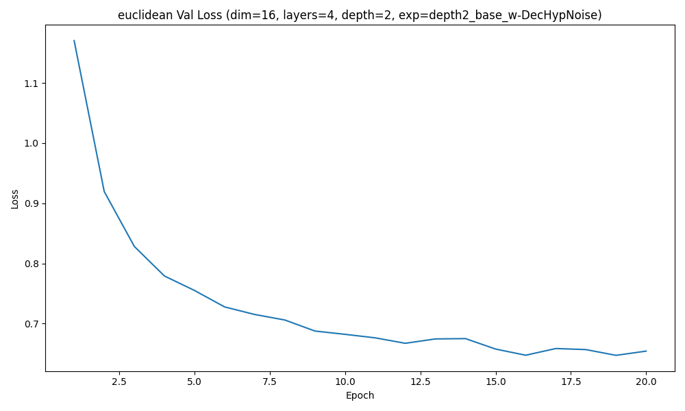
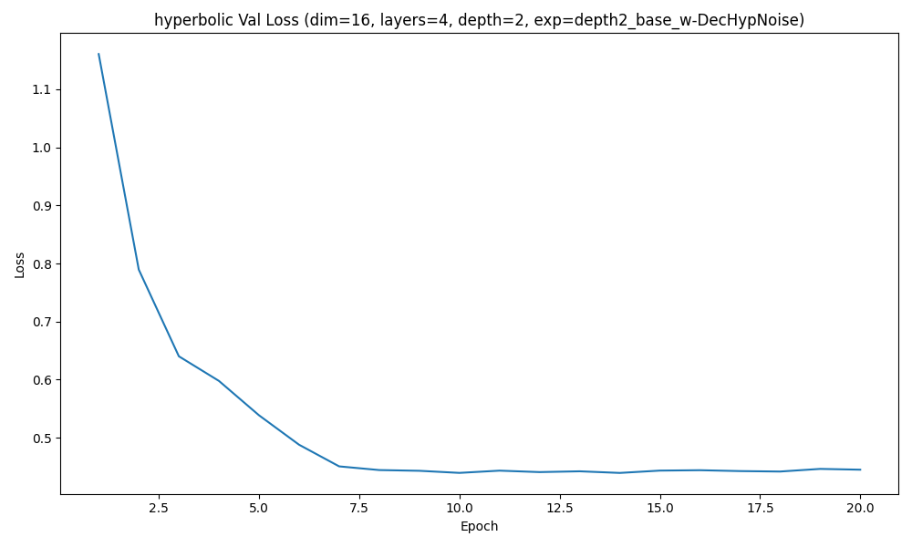
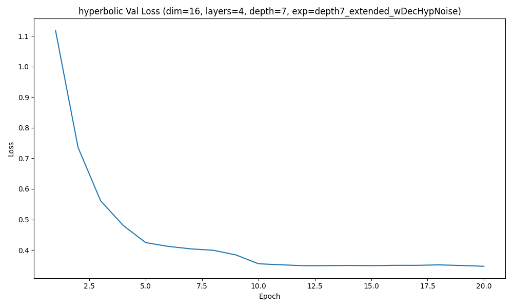
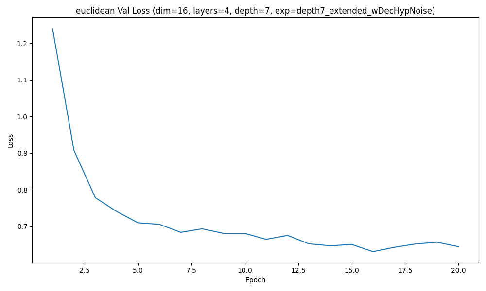

### Experiment depth2_base_w/DecHypNoise | depth 2 | hyperbolic | regularization=off

Best validation loss: 0.431846  
Test recall@4: 0.0471

Sample trajectory (hyperbolic) 1:
  Visit 1: ['C03', 'C12', 'C30', 'C41']
  Visit 2: ['C03', 'C12', 'C30', 'C41']
  Visit 3: ['C03', 'C12', 'C30', 'C41']
  Visit 4: ['C03', 'C12', 'C30', 'C41']
  Visit 5: ['C00', 'C01', 'C33', 'C44']
  Visit 6: ['C00', 'C01', 'C33', 'C44']

Sample trajectory (hyperbolic) 2:
  Visit 1: ['C00', 'C01', 'C33', 'C44']
  Visit 2: ['C00', 'C01', 'C33', 'C44']
  Visit 3: ['C03', 'C12', 'C30', 'C41']
  Visit 4: ['C03', 'C12', 'C30', 'C41']
  Visit 5: ['C00', 'C01', 'C33', 'C44']
  Visit 6: ['C03', 'C12', 'C30', 'C41']

Sample trajectory (hyperbolic) 3:
  Visit 1: ['C00', 'C01', 'C33', 'C44']
  Visit 2: ['C00', 'C01', 'C33', 'C44']
  Visit 3: ['C03', 'C12', 'C30', 'C41']
  Visit 4: ['C00', 'C01', 'C33', 'C44']
  Visit 5: ['C03', 'C12', 'C30', 'C41']
  Visit 6: ['C00', 'C01', 'C33', 'C44']
Correlation(tree_dist, hyperbolic_embedding_dist) = 0.0463

Synthetic (hyperbolic) stats (N=1000): {'mean_depth': 1.0, 'std_depth': 0.0, 'mean_tree_dist': 2.0, 'std_tree_dist': 0.0, 'mean_root_purity': 0.371625, 'std_root_purity': 0.12495442919320626}

### Experiment depth2_base_w/DecHypNoise | depth 2 | euclidean | regularization=off

Best validation loss: 0.647204  
Test recall@4: 0.2446

Sample trajectory (euclidean) 1:
  Visit 1: ['C03', 'C034', 'C340', 'C442']
  Visit 2: ['C023', 'C211', 'C31', 'C313']
  Visit 3: ['C01', 'C02', 'C30', 'C402']
  Visit 4: ['C112', 'C233', 'C32', 'C402']
  Visit 5: ['C224', 'C33', 'C330', 'C340']
  Visit 6: ['C01', 'C02', 'C30', 'C402']

Sample trajectory (euclidean) 2:
  Visit 1: ['C10', 'C114', 'C131', 'C312']
  Visit 2: ['C34', 'C344', 'C433', 'C44']
  Visit 3: ['C01', 'C02', 'C310', 'C402']
  Visit 4: ['C224', 'C33', 'C330', 'C340']
  Visit 5: ['C33', 'C330', 'C334', 'C340']
  Visit 6: ['C13', 'C342', 'C420', 'C433']

Sample trajectory (euclidean) 3:
  Visit 1: ['C224', 'C33', 'C330', 'C340']
  Visit 2: ['C01', 'C31', 'C310', 'C402']
  Visit 3: ['C034', 'C33', 'C330', 'C340']
  Visit 4: ['C121', 'C144', 'C224', 'C23']
  Visit 5: ['C224', 'C23', 'C33', 'C330']
  Visit 6: ['C204', 'C413', 'C44', 'C442']
Correlation(tree_dist, euclidean_embedding_dist) = 0.0483

Synthetic (euclidean) stats (N=1000): {'mean_depth': 1.6091666666666666, 'std_depth': 0.4890459817054243, 'mean_tree_dist': 2.572414380644062, 'std_tree_dist': 1.143962936121926, 'mean_root_purity': 0.60025, 'std_root_purity': 0.16147735909408475}

### Experiment depth2_base_w/DecHypNoise | depth 2 | hyperbolic | regularization=on

Best validation loss: 0.439326  
Test recall@4: 0.0514

Sample trajectory (hyperbolic) 1:
  Visit 1: ['C01', 'C14', 'C20', 'C41']
  Visit 2: ['C01', 'C14', 'C20', 'C41']
  Visit 3: ['C01', 'C14', 'C20', 'C41']
  Visit 4: ['C01', 'C14', 'C20', 'C41']
  Visit 5: ['C01', 'C14', 'C20', 'C41']
  Visit 6: ['C01', 'C14', 'C20', 'C41']

Sample trajectory (hyperbolic) 2:
  Visit 1: ['C03', 'C04', 'C30', 'C42']
  Visit 2: ['C03', 'C04', 'C30', 'C42']
  Visit 3: ['C01', 'C14', 'C20', 'C41']
  Visit 4: ['C03', 'C04', 'C30', 'C42']
  Visit 5: ['C03', 'C04', 'C30', 'C42']
  Visit 6: ['C01', 'C14', 'C20', 'C41']

Sample trajectory (hyperbolic) 3:
  Visit 1: ['C03', 'C04', 'C30', 'C42']
  Visit 2: ['C03', 'C04', 'C30', 'C42']
  Visit 3: ['C01', 'C14', 'C20', 'C41']
  Visit 4: ['C03', 'C04', 'C30', 'C42']
  Visit 5: ['C01', 'C14', 'C20', 'C41']
  Visit 6: ['C03', 'C04', 'C30', 'C42']
Correlation(tree_dist, hyperbolic_embedding_dist) = 0.9879

Synthetic (hyperbolic) stats (N=1000): {'mean_depth': 1.0, 'std_depth': 0.0, 'mean_tree_dist': 2.0, 'std_tree_dist': 0.0, 'mean_root_purity': 0.376125, 'std_root_purity': 0.12499493739748024}

### Experiment depth2_base_w/DecHypNoise | depth 2 | euclidean | regularization=on

Best validation loss: 0.652734  
Test recall@4: 0.2237

Sample trajectory (euclidean) 1:
  Visit 1: ['C100', 'C30', 'C301', 'C31']
  Visit 2: ['C211', 'C22', 'C224', 'C402']
  Visit 3: ['C004', 'C030', 'C123', 'C413']
  Visit 4: ['C021', 'C023', 'C123', 'C31']
  Visit 5: ['C211', 'C22', 'C221', 'C402']
  Visit 6: ['C211', 'C22', 'C224', 'C402']

Sample trajectory (euclidean) 2:
  Visit 1: ['C211', 'C22', 'C224', 'C402']
  Visit 2: ['C00', 'C020', 'C120', 'C31']
  Visit 3: ['C04', 'C104', 'C110', 'C22']
  Visit 4: ['C030', 'C123', 'C2', 'C31']
  Visit 5: ['C221', 'C231', 'C32', 'C402']
  Visit 6: ['C110', 'C114', 'C402', 'C423']

Sample trajectory (euclidean) 3:
  Visit 1: ['C123', 'C20', 'C201', 'C31']
  Visit 2: ['C013', 'C211', 'C22', 'C224']
  Visit 3: ['C01', 'C020', 'C12', 'C301']
  Visit 4: ['C030', 'C100', 'C123', 'C31']
  Visit 5: ['C123', 'C20', 'C202', 'C31']
  Visit 6: ['C140', 'C221', 'C402', 'C422']
Correlation(tree_dist, euclidean_embedding_dist) = 0.5077

Synthetic (euclidean) stats (N=1000): {'mean_depth': 1.6279166666666667, 'std_depth': 0.5250910965939359, 'mean_tree_dist': 2.4264346764346763, 'std_tree_dist': 1.2214926895503617, 'mean_root_purity': 0.5520833333333334, 'std_root_purity': 0.16309453206312247}

### Experiment depth7_extended_w/DecHypNoise | depth 7 | hyperbolic | regularization=off

Best validation loss: 0.346793  
Test recall@4: 0.0098

Sample trajectory (hyperbolic) 1:
  Visit 1: ['C121d3', 'C411d3', 'C420d3', 'C441d4']
  Visit 2: ['C000', 'C113d3', 'C223d3', 'C400d0']
  Visit 3: ['C000', 'C113d3', 'C223d3', 'C400d0']
  Visit 4: ['C121d3', 'C411d3', 'C420d3', 'C441d4']
  Visit 5: ['C000', 'C113d3', 'C223d3', 'C400d0']
  Visit 6: ['C000', 'C113d3', 'C223d3', 'C400d0']

Sample trajectory (hyperbolic) 2:
  Visit 1: ['C121d3', 'C411d3', 'C420d3', 'C441d4']
  Visit 2: ['C000', 'C113d3', 'C223d3', 'C400d0']
  Visit 3: ['C121d3', 'C411d3', 'C420d3', 'C441d4']
  Visit 4: ['C121d3', 'C411d3', 'C420d3', 'C441d4']
  Visit 5: ['C121d3', 'C411d3', 'C420d3', 'C441d4']
  Visit 6: ['C000', 'C113d3', 'C223d3', 'C400d0']

Sample trajectory (hyperbolic) 3:
  Visit 1: ['C121d3', 'C411d3', 'C420d3', 'C441d4']
  Visit 2: ['C121d3', 'C411d3', 'C420d3', 'C441d4']
  Visit 3: ['C000', 'C113d3', 'C223d3', 'C400d0']
  Visit 4: ['C000', 'C113d3', 'C223d3', 'C400d0']
  Visit 5: ['C000', 'C113d3', 'C223d3', 'C400d0']
  Visit 6: ['C121d3', 'C411d3', 'C420d3', 'C441d4']
Correlation(tree_dist, hyperbolic_embedding_dist) = -0.0415

Synthetic (hyperbolic) stats (N=1000): {'mean_depth': 5.261375, 'std_depth': 1.6341077410547322, 'mean_tree_dist': 12.655878467635404, 'std_tree_dist': 0.4750809439744333, 'mean_root_purity': 0.504375, 'std_root_purity': 0.24687974678980854}

### Experiment depth7_extended_w/DecHypNoise | depth 7 | euclidean | regularization=off

Best validation loss: 0.612466  
Test recall@4: 0.1416

Sample trajectory (euclidean) 1:
  Visit 1: ['C112d3', 'C334d3', 'C334d4', 'C432d3']
  Visit 2: ['C021d4', 'C334d3', 'C334d4', 'C432d3']
  Visit 3: ['C002d3', 'C002d4', 'C114d4', 'C332d3']
  Visit 4: ['C002d3', 'C002d4', 'C230d3', 'C332d3']
  Visit 5: ['C112d3', 'C334d3', 'C334d4', 'C432d3']
  Visit 6: ['C021d4', 'C334d3', 'C334d4', 'C432d3']

Sample trajectory (euclidean) 2:
  Visit 1: ['C002d3', 'C002d4', 'C102d4', 'C114d4']
  Visit 2: ['C021d4', 'C334d3', 'C334d4', 'C432d3']
  Visit 3: ['C002d3', 'C002d4', 'C114d4', 'C344d3']
  Visit 4: ['C021d4', 'C334d3', 'C334d4', 'C432d3']
  Visit 5: ['C114d4', 'C121d4', 'C332d3', 'C332d4']
  Visit 6: ['C041d3', 'C041d4', 'C114d3', 'C114d4']

Sample trajectory (euclidean) 3:
  Visit 1: ['C014d4', 'C021d4', 'C334d3', 'C334d4']
  Visit 2: ['C112d3', 'C334d3', 'C334d4', 'C432d3']
  Visit 3: ['C002d3', 'C002d4', 'C230d3', 'C332d3']
  Visit 4: ['C002d3', 'C002d4', 'C114d4', 'C130d3']
  Visit 5: ['C002d3', 'C002d4', 'C324d4', 'C423d4']
  Visit 6: ['C004d3', 'C021d4', 'C334d3', 'C334d4']
Correlation(tree_dist, euclidean_embedding_dist) = -0.0843

Synthetic (euclidean) stats (N=1000): {'mean_depth': 6.471375, 'std_depth': 0.49917993687146517, 'mean_tree_dist': 5.385145050231403, 'std_tree_dist': 5.733773465551494, 'mean_root_purity': 0.5239583333333333, 'std_root_purity': 0.10810372301893932}

### Experiment depth7_extended_w/DecHypNoise | depth 7 | hyperbolic | regularization=on

Best validation loss: 0.354010  
Test recall@4: 0.0106

Sample trajectory (hyperbolic) 1:
  Visit 1: ['C110d4', 'C114d4', 'C204d4', 'C402d4']
  Visit 2: ['C203d3', 'C304d4', 'C324d3', 'C330d4']
  Visit 3: ['C110d4', 'C114d4', 'C204d4', 'C402d4']
  Visit 4: ['C203d3', 'C304d4', 'C324d3', 'C330d4']
  Visit 5: ['C110d4', 'C114d4', 'C204d4', 'C402d4']
  Visit 6: ['C203d3', 'C304d4', 'C324d3', 'C330d4']

Sample trajectory (hyperbolic) 2:
  Visit 1: ['C110d4', 'C114d4', 'C204d4', 'C402d4']
  Visit 2: ['C203d3', 'C304d4', 'C324d3', 'C330d4']
  Visit 3: ['C203d3', 'C304d4', 'C324d3', 'C330d4']
  Visit 4: ['C110d4', 'C114d4', 'C204d4', 'C402d4']
  Visit 5: ['C110d4', 'C114d4', 'C204d4', 'C402d4']
  Visit 6: ['C203d3', 'C304d4', 'C324d3', 'C330d4']

Sample trajectory (hyperbolic) 3:
  Visit 1: ['C110d4', 'C114d4', 'C204d4', 'C402d4']
  Visit 2: ['C203d3', 'C304d4', 'C324d3', 'C330d4']
  Visit 3: ['C203d3', 'C304d4', 'C324d3', 'C330d4']
  Visit 4: ['C203d3', 'C304d4', 'C324d3', 'C330d4']
  Visit 5: ['C110d4', 'C114d4', 'C204d4', 'C402d4']
  Visit 6: ['C110d4', 'C114d4', 'C204d4', 'C402d4']
Correlation(tree_dist, hyperbolic_embedding_dist) = 0.9725

Synthetic (hyperbolic) stats (N=1000): {'mean_depth': 6.7491666666666665, 'std_depth': 0.4334927591347083, 'mean_tree_dist': 13.001663893510816, 'std_tree_dist': 0.7065163017956323, 'mean_root_purity': 0.6254166666666666, 'std_root_purity': 0.12499930555362654}

### Experiment depth7_extended_w/DecHypNoise | depth 7 | euclidean | regularization=on

Best validation loss: 0.630772  
Test recall@4: 0.1903

Sample trajectory (euclidean) 1:
  Visit 1: ['C030d4', 'C231d3', 'C323d3', 'C440d4']
  Visit 2: ['C230d3', 'C230d4', 'C312d3', 'C312d4']
  Visit 3: ['C224d4', 'C234d3', 'C301d3', 'C413d3']
  Visit 4: ['C114d3', 'C114d4', 'C211d3', 'C222d4']
  Visit 5: ['C230d3', 'C312d3', 'C312d4', 'C430d3']
  Visit 6: ['C230d3', 'C232d4', 'C312d3', 'C312d4']

Sample trajectory (euclidean) 2:
  Visit 1: ['C220d4', 'C231d4', 'C310d3', 'C310d4']
  Visit 2: ['C120d3', 'C120d4', 'C234d3', 'C334d3']
  Visit 3: ['C120d3', 'C234d3', 'C234d4', 'C334d3']
  Visit 4: ['C011d3', 'C312d3', 'C312d4', 'C441d4']
  Visit 5: ['C230d3', 'C232d4', 'C312d3', 'C312d4']
  Visit 6: ['C120d3', 'C143d4', 'C234d3', 'C334d3']

Sample trajectory (euclidean) 3:
  Visit 1: ['C120d3', 'C120d4', 'C234d3', 'C334d3']
  Visit 2: ['C230d3', 'C233d3', 'C312d4', 'C421d3']
  Visit 3: ['C212d3', 'C212d4', 'C233d4', 'C412d4']
  Visit 4: ['C230d3', 'C232d4', 'C312d3', 'C312d4']
  Visit 5: ['C120d3', 'C120d4', 'C143d4', 'C334d3']
  Visit 6: ['C032d4', 'C223d3', 'C331d3', 'C331d4']
Correlation(tree_dist, euclidean_embedding_dist) = 0.4818

Synthetic (euclidean) stats (N=1000): {'mean_depth': 6.4267916666666665, 'std_depth': 0.49461150404186477, 'mean_tree_dist': 5.95960720793683, 'std_tree_dist': 5.609165149866249, 'mean_root_purity': 0.5315416666666667, 'std_root_purity': 0.11307684671889684}

## Comparison Table
| Depth / Experiment | Source | Embedding | Reg | Mean depth | Depth std | Mean tree dist | Tree dist std | Mean root purity | Root purity std | Corr(tree, emb) | Best val loss | Test recall@4 |
| --- | --- | --- | --- | --- | --- | --- | --- | --- | --- | --- | --- | --- |
| depth2_base_w/DecHypNoise | Real | — | — | 1.6439 | 0.5138 | 2.1206 | 1.2453 | 0.6242 | 0.2040 | — | — | — |
| depth7_extended_w/DecHypNoise | Real | — | — | 5.3798 | 1.7295 | 5.7591 | 4.7567 | 0.6290 | 0.2047 | — | — | — |
| depth2_base_w/DecHypNoise | Synthetic | hyperbolic | off | 1.0000 | 0.0000 | 2.0000 | 0.0000 | 0.3716 | 0.1250 | 0.0463 | 0.4318 | 0.0471 |
| depth2_base_w/DecHypNoise | Synthetic | euclidean | off | 1.6092 | 0.4890 | 2.5724 | 1.1440 | 0.6003 | 0.1615 | 0.0483 | 0.6472 | 0.2446 |
| depth2_base_w/DecHypNoise | Synthetic | hyperbolic | on | 1.0000 | 0.0000 | 2.0000 | 0.0000 | 0.3761 | 0.1250 | 0.9879 | 0.4393 | 0.0514 |
| depth2_base_w/DecHypNoise | Synthetic | euclidean | on | 1.6279 | 0.5251 | 2.4264 | 1.2215 | 0.5521 | 0.1631 | 0.5077 | 0.6527 | 0.2237 |
| depth7_extended_w/DecHypNoise | Synthetic | hyperbolic | off | 5.2614 | 1.6341 | 12.6559 | 0.4751 | 0.5044 | 0.2469 | -0.0415 | 0.3468 | 0.0098 |
| depth7_extended_w/DecHypNoise | Synthetic | euclidean | off | 6.4714 | 0.4992 | 5.3851 | 5.7338 | 0.5240 | 0.1081 | -0.0843 | 0.6125 | 0.1416 |
| depth7_extended_w/DecHypNoise | Synthetic | hyperbolic | on | 6.7492 | 0.4335 | 13.0017 | 0.7065 | 0.6254 | 0.1250 | 0.9725 | 0.3540 | 0.0106 |
| depth7_extended_w/DecHypNoise | Synthetic | euclidean | on | 6.4268 | 0.4946 | 5.9596 | 5.6092 | 0.5315 | 0.1131 | 0.4818 | 0.6308 | 0.1903 |

## Summary
- **Shallow depth2_base_w/DecHypNoise:** Euclidean embeddings continue to dominate recall (0.22–0.24) while roughly matching the real depth statistics. Hyperbolic runs—especially with regularization—collapse to a single radius shell, giving nearly perfect tree-distance correlations (0.99) but little diversity and under 0.06 recall.
- **Deep depth7_extended_w/DecHypNoise:** All models struggle to reconstruct trajectories, yet Euclidean geometry still recovers the highest recall (0.19) albeit with poor hierarchy adherence (correlation ≤0.48). Hyperbolic models track hierarchical distance extremely well (0.97 correlation when regularized) but their decoder outputs degenerate two-code loops, limiting recall to ~0.01.
- **Overall observation:** Injecting decoder noise helps neither geometry close the recall gap; instead it amplifies the trade-off, hyperbolic space captures hierarchy yet fails at discrete decoding, while Euclidean space sacrifices structural alignment for higher retrieval accuracy. Improving the decoder or adding diffusion-distance supervision is necessary to convert hyperbolic structure into usable predictions.
