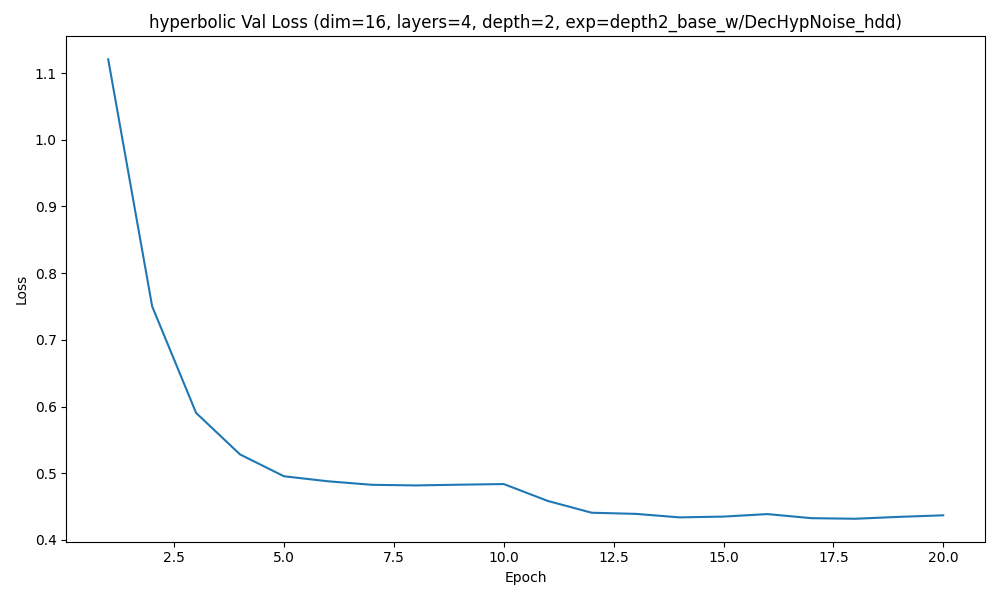
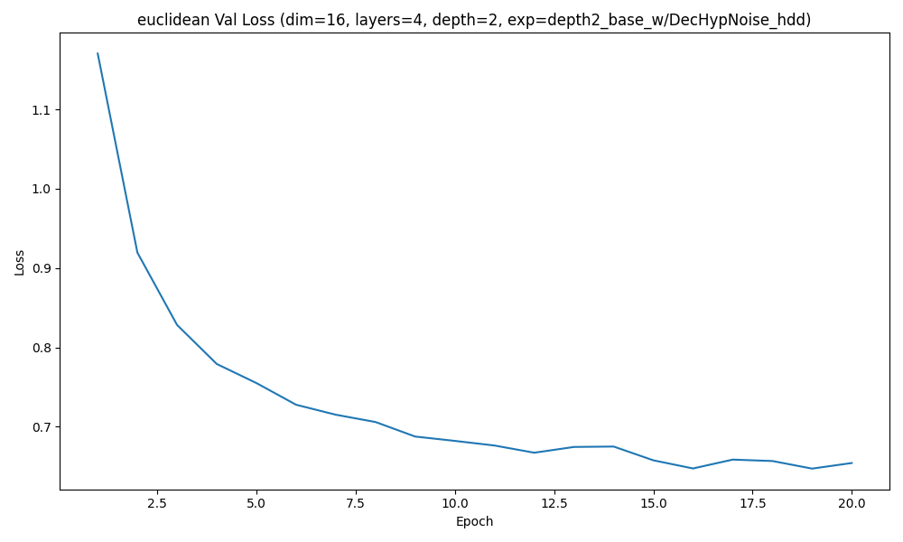
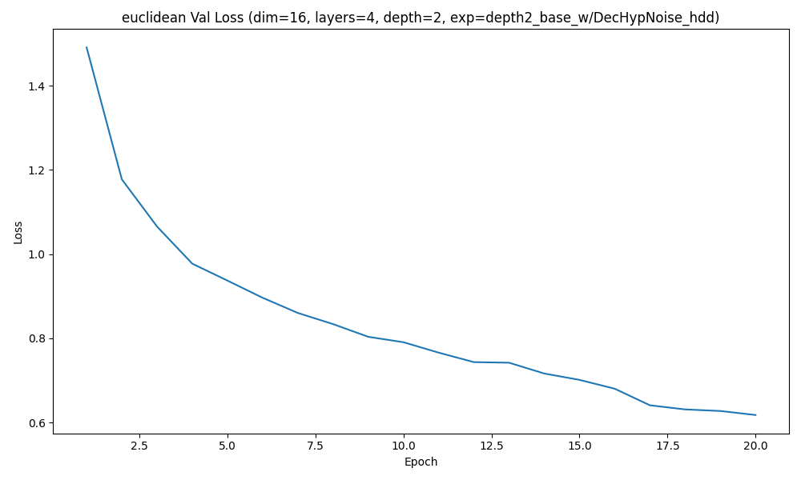
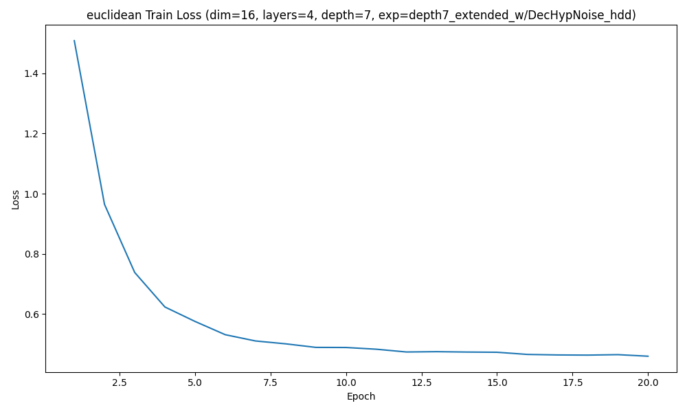
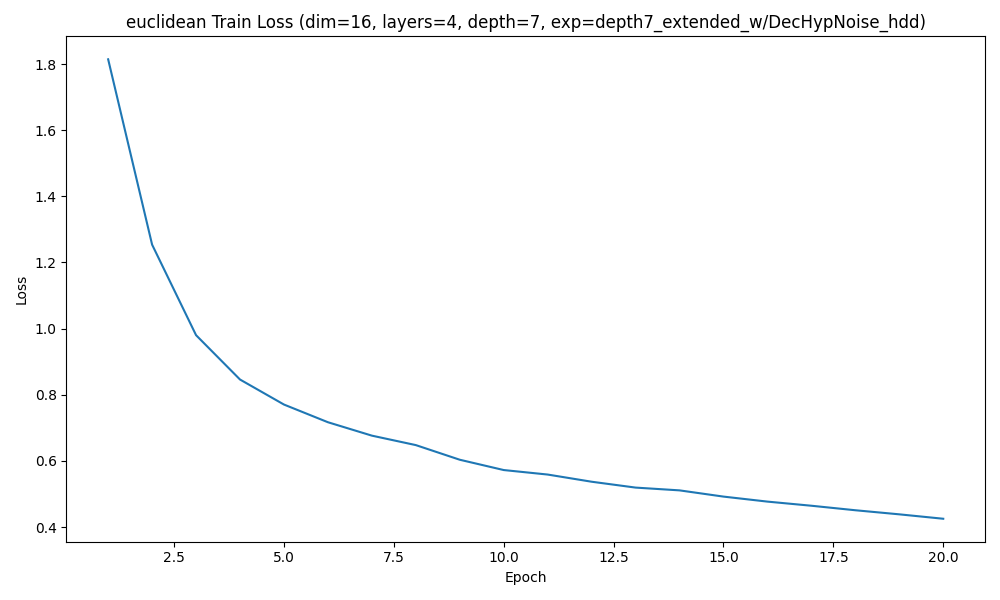
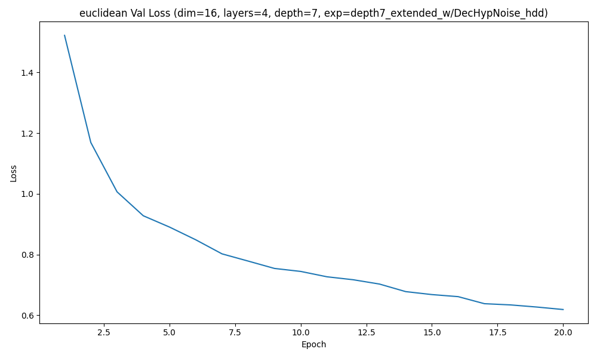

### Experiment depth2_base_w/DecHypNoise_hdd | depth 2 | hyperbolic | regularization=off

Best validation loss: 0.431846  
Test recall@4: 0.0471

Sample trajectory (hyperbolic) 1:
  Visit 1: ['C03', 'C12', 'C30', 'C41']
  Visit 2: ['C03', 'C12', 'C30', 'C41']
  Visit 3: ['C03', 'C12', 'C30', 'C41']
  Visit 4: ['C03', 'C12', 'C30', 'C41']
  Visit 5: ['C00', 'C01', 'C33', 'C44']
  Visit 6: ['C00', 'C01', 'C33', 'C44']

Sample trajectory (hyperbolic) 2:
  Visit 1: ['C00', 'C01', 'C33', 'C44']
  Visit 2: ['C00', 'C01', 'C33', 'C44']
  Visit 3: ['C03', 'C12', 'C30', 'C41']
  Visit 4: ['C03', 'C12', 'C30', 'C41']
  Visit 5: ['C00', 'C01', 'C33', 'C44']
  Visit 6: ['C03', 'C12', 'C30', 'C41']

Sample trajectory (hyperbolic) 3:
  Visit 1: ['C00', 'C01', 'C33', 'C44']
  Visit 2: ['C00', 'C01', 'C33', 'C44']
  Visit 3: ['C03', 'C12', 'C30', 'C41']
  Visit 4: ['C00', 'C01', 'C33', 'C44']
  Visit 5: ['C03', 'C12', 'C30', 'C41']
  Visit 6: ['C00', 'C01', 'C33', 'C44']
Correlation(tree_dist, hyperbolic_embedding_dist) = 0.0463

### Experiment depth2_base_w/DecHypNoise_hdd | depth 2 | euclidean | regularization=off

Best validation loss: 0.647204  
Test recall@4: 0.2446

Sample trajectory (euclidean) 1:
  Visit 1: ['C03', 'C034', 'C340', 'C442']
  Visit 2: ['C023', 'C211', 'C31', 'C313']
  Visit 3: ['C01', 'C02', 'C30', 'C402']
  Visit 4: ['C112', 'C233', 'C32', 'C402']
  Visit 5: ['C224', 'C33', 'C330', 'C340']
  Visit 6: ['C01', 'C02', 'C30', 'C402']

Sample trajectory (euclidean) 2:
  Visit 1: ['C10', 'C114', 'C131', 'C312']
  Visit 2: ['C34', 'C344', 'C433', 'C44']
  Visit 3: ['C01', 'C02', 'C310', 'C402']
  Visit 4: ['C224', 'C33', 'C330', 'C340']
  Visit 5: ['C33', 'C330', 'C334', 'C340']
  Visit 6: ['C13', 'C342', 'C420', 'C433']

Sample trajectory (euclidean) 3:
  Visit 1: ['C224', 'C33', 'C330', 'C340']
  Visit 2: ['C01', 'C31', 'C310', 'C402']
  Visit 3: ['C034', 'C33', 'C330', 'C340']
  Visit 4: ['C121', 'C144', 'C224', 'C23']
  Visit 5: ['C224', 'C23', 'C33', 'C330']
  Visit 6: ['C204', 'C413', 'C44', 'C442']
Correlation(tree_dist, euclidean_embedding_dist) = 0.0483

### Experiment depth2_base_w/DecHypNoise_hdd | depth 2 | hyperbolic | regularization=on

Best validation loss: 0.552761  
Test recall@4: 0.0829

Sample trajectory (hyperbolic) 1:
  Visit 1: ['C012', 'C22', 'C222', 'C323']
  Visit 2: ['C03', 'C04', 'C21', 'C42']
  Visit 3: ['C012', 'C22', 'C222', 'C323']
  Visit 4: ['C03', 'C04', 'C21', 'C42']
  Visit 5: ['C012', 'C22', 'C222', 'C323']
  Visit 6: ['C012', 'C22', 'C222', 'C323']

Sample trajectory (hyperbolic) 2:
  Visit 1: ['C012', 'C22', 'C222', 'C323']
  Visit 2: ['C012', 'C22', 'C222', 'C323']
  Visit 3: ['C03', 'C04', 'C21', 'C42']
  Visit 4: ['C03', 'C04', 'C21', 'C42']
  Visit 5: ['C03', 'C04', 'C21', 'C42']
  Visit 6: ['C03', 'C04', 'C21', 'C42']

Sample trajectory (hyperbolic) 3:
  Visit 1: ['C03', 'C04', 'C21', 'C42']
  Visit 2: ['C03', 'C04', 'C21', 'C42']
  Visit 3: ['C03', 'C04', 'C21', 'C42']
  Visit 4: ['C012', 'C22', 'C222', 'C323']
  Visit 5: ['C03', 'C04', 'C21', 'C42']
  Visit 6: ['C012', 'C22', 'C222', 'C323']
Correlation(tree_dist, hyperbolic_embedding_dist) = 0.9753

### Experiment depth2_base_w/DecHypNoise_hdd | depth 2 | euclidean | regularization=on

Best validation loss: 0.617589  
Test recall@4: 0.1557

Sample trajectory (euclidean) 1:
  Visit 1: ['C111', 'C24', 'C32', 'C41']
  Visit 2: ['C111', 'C24', 'C32', 'C41']
  Visit 3: ['C032', 'C13', 'C131', 'C40']
  Visit 4: ['C13', 'C40', 'C400', 'C401']
  Visit 5: ['C11', 'C113', 'C12', 'C431']
  Visit 6: ['C032', 'C13', 'C131', 'C40']

Sample trajectory (euclidean) 2:
  Visit 1: ['C111', 'C24', 'C32', 'C41']
  Visit 2: ['C032', 'C13', 'C131', 'C40']
  Visit 3: ['C032', 'C13', 'C131', 'C40']
  Visit 4: ['C023', 'C032', 'C13', 'C400']
  Visit 5: ['C031', 'C032', 'C341', 'C400']
  Visit 6: ['C032', 'C13', 'C131', 'C40']

Sample trajectory (euclidean) 3:
  Visit 1: ['C111', 'C24', 'C32', 'C41']
  Visit 2: ['C032', 'C13', 'C131', 'C40']
  Visit 3: ['C032', 'C13', 'C131', 'C40']
  Visit 4: ['C032', 'C13', 'C131', 'C40']
  Visit 5: ['C032', 'C13', 'C131', 'C40']
  Visit 6: ['C111', 'C24', 'C32', 'C41']
Correlation(tree_dist, euclidean_embedding_dist) = 0.1516

### Experiment depth7_extended_w/DecHypNoise_hdd | depth 7 | hyperbolic | regularization=off

Best validation loss: 0.347258  
Test recall@4: 0.0089

Sample trajectory (hyperbolic) 1:
  Visit 1: ['C013d3', 'C202d4', 'C211d3', 'C322d4']
  Visit 2: ['C013d3', 'C202d4', 'C211d3', 'C322d4']
  Visit 3: ['C101d4', 'C112d4', 'C330d4', 'C400d3']
  Visit 4: ['C013d3', 'C202d4', 'C211d3', 'C322d4']
  Visit 5: ['C101d4', 'C112d4', 'C330d4', 'C400d3']
  Visit 6: ['C013d3', 'C202d4', 'C211d3', 'C322d4']

Sample trajectory (hyperbolic) 2:
  Visit 1: ['C013d3', 'C202d4', 'C211d3', 'C322d4']
  Visit 2: ['C101d4', 'C112d4', 'C330d4', 'C400d3']
  Visit 3: ['C101d4', 'C112d4', 'C330d4', 'C400d3']
  Visit 4: ['C101d4', 'C112d4', 'C330d4', 'C400d3']
  Visit 5: ['C013d3', 'C202d4', 'C211d3', 'C322d4']
  Visit 6: ['C013d3', 'C202d4', 'C211d3', 'C322d4']

Sample trajectory (hyperbolic) 3:
  Visit 1: ['C101d4', 'C112d4', 'C330d4', 'C400d3']
  Visit 2: ['C101d4', 'C112d4', 'C330d4', 'C400d3']
  Visit 3: ['C013d3', 'C202d4', 'C211d3', 'C322d4']
  Visit 4: ['C101d4', 'C112d4', 'C330d4', 'C400d3']
  Visit 5: ['C101d4', 'C112d4', 'C330d4', 'C400d3']
  Visit 6: ['C101d4', 'C112d4', 'C330d4', 'C400d3']
Correlation(tree_dist, hyperbolic_embedding_dist) = -0.0078

### Experiment depth7_extended_w/DecHypNoise_hdd | depth 7 | euclidean | regularization=off

Best validation loss: 0.629542  
Test recall@4: 0.1262

Sample trajectory (euclidean) 1:
  Visit 1: ['C140d4', 'C334d3', 'C342d4', 'C420d3']
  Visit 2: ['C032d4', 'C111d3', 'C441d4', 'C442d4']
  Visit 3: ['C011d3', 'C101d3', 'C101d4', 'C140d4']
  Visit 4: ['C032d4', 'C104d3', 'C104d4', 'C442d4']
  Visit 5: ['C034d3', 'C103d3', 'C103d4', 'C113d4']
  Visit 6: ['C014d3', 'C140d3', 'C140d4', 'C334d3']

Sample trajectory (euclidean) 2:
  Visit 1: ['C223d4', 'C333d4', 'C402d3', 'C402d4']
  Visit 2: ['C104d4', 'C242d4', 'C440d3', 'C441d4']
  Visit 3: ['C032d3', 'C032d4', 'C111d3', 'C304d3']
  Visit 4: ['C014d3', 'C044d3', 'C140d4', 'C143d3']
  Visit 5: ['C104d3', 'C104d4', 'C434d3', 'C442d4']
  Visit 6: ['C103d3', 'C103d4', 'C302d3', 'C342d4']

Sample trajectory (euclidean) 3:
  Visit 1: ['C032d4', 'C040d3', 'C104d3', 'C104d4']
  Visit 2: ['C323d4', 'C333d3', 'C333d4', 'C402d3']
  Visit 3: ['C032d3', 'C032d4', 'C111d3', 'C304d3']
  Visit 4: ['C140d3', 'C140d4', 'C144d3', 'C144d4']
  Visit 5: ['C140d3', 'C140d4', 'C334d3', 'C342d4']
  Visit 6: ['C223d3', 'C333d4', 'C402d3', 'C402d4']
Correlation(tree_dist, euclidean_embedding_dist) = -0.0135

### Experiment depth7_extended_w/DecHypNoise_hdd | depth 7 | hyperbolic | regularization=on

Best validation loss: 0.449959  
Test recall@4: 0.0116

Sample trajectory (hyperbolic) 1:
  Visit 1: ['C130d4', 'C200d3', 'C411d3', 'C412d4']
  Visit 2: ['C121d3', 'C140d4', 'C244d4', 'C341d4']
  Visit 3: ['C130d4', 'C200d3', 'C411d3', 'C412d4']
  Visit 4: ['C121d3', 'C140d4', 'C244d4', 'C341d4']
  Visit 5: ['C121d3', 'C140d4', 'C244d4', 'C341d4']
  Visit 6: ['C130d4', 'C200d3', 'C411d3', 'C412d4']

Sample trajectory (hyperbolic) 2:
  Visit 1: ['C121d3', 'C140d4', 'C244d4', 'C341d4']
  Visit 2: ['C121d3', 'C140d4', 'C244d4', 'C341d4']
  Visit 3: ['C121d3', 'C140d4', 'C244d4', 'C341d4']
  Visit 4: ['C130d4', 'C200d3', 'C411d3', 'C412d4']
  Visit 5: ['C121d3', 'C140d4', 'C244d4', 'C341d4']
  Visit 6: ['C121d3', 'C140d4', 'C244d4', 'C341d4']

Sample trajectory (hyperbolic) 3:
  Visit 1: ['C121d3', 'C140d4', 'C244d4', 'C341d4']
  Visit 2: ['C130d4', 'C200d3', 'C411d3', 'C412d4']
  Visit 3: ['C130d4', 'C200d3', 'C411d3', 'C412d4']
  Visit 4: ['C121d3', 'C140d4', 'C244d4', 'C341d4']
  Visit 5: ['C130d4', 'C200d3', 'C411d3', 'C412d4']
  Visit 6: ['C121d3', 'C140d4', 'C244d4', 'C341d4']
Correlation(tree_dist, hyperbolic_embedding_dist) = 0.9145

### Experiment depth7_extended_w/DecHypNoise_hdd | depth 7 | euclidean | regularization=on

Best validation loss: 0.618803  
Test recall@4: 0.1206

Sample trajectory (euclidean) 1:
  Visit 1: ['C202d4', 'C324d4', 'C411d3', 'C411d4']
  Visit 2: ['C031d3', 'C031d4', 'C202d4', 'C411d3']
  Visit 3: ['C112d4', 'C300d3', 'C344d3', 'C402d4']
  Visit 4: ['C112d4', 'C300d3', 'C344d3', 'C402d4']
  Visit 5: ['C031d3', 'C031d4', 'C240d3', 'C240d4']
  Visit 6: ['C113d4', 'C202d3', 'C202d4', 'C411d3']

Sample trajectory (euclidean) 2:
  Visit 1: ['C112d4', 'C300d3', 'C344d3', 'C402d4']
  Visit 2: ['C003d3', 'C010d3', 'C110d4', 'C301d4']
  Visit 3: ['C112d4', 'C300d3', 'C344d3', 'C402d4']
  Visit 4: ['C112d4', 'C300d3', 'C344d3', 'C402d4']
  Visit 5: ['C220d3', 'C220d4', 'C402d4', 'C414d3']
  Visit 6: ['C031d3', 'C031d4', 'C202d4', 'C411d3']

Sample trajectory (euclidean) 3:
  Visit 1: ['C010d4', 'C031d4', 'C240d3', 'C411d3']
  Visit 2: ['C202d4', 'C240d3', 'C411d3', 'C411d4']
  Visit 3: ['C010d4', 'C202d4', 'C333d4', 'C420d3']
  Visit 4: ['C413d3', 'C421d3', 'C421d4', 'C422d3']
  Visit 5: ['C112d4', 'C300d3', 'C344d3', 'C402d4']
  Visit 6: ['C031d3', 'C031d4', 'C202d4', 'C411d3']
Correlation(tree_dist, euclidean_embedding_dist) = 0.1633

## Comparison Table
| Depth / Experiment | Source | Embedding | Reg | Mean depth | Depth std | Mean tree dist | Tree dist std | Mean root purity | Root purity std | Corr(tree, emb) | Best val loss | Test recall@4 |
| --- | --- | --- | --- | --- | --- | --- | --- | --- | --- | --- | --- | --- |
| depth2_base_w/DecHypNoise_hdd | Real | — | — | 1.6439 | 0.5138 | 2.1206 | 1.2453 | 0.6242 | 0.2040 | — | — | — |
| depth7_extended_w/DecHypNoise_hdd | Real | — | — | 5.3798 | 1.7295 | 5.7591 | 4.7567 | 0.6290 | 0.2047 | — | — | — |
| depth2_base_w/DecHypNoise_hdd | Synthetic | hyperbolic | off | 1.0000 | 0.0000 | 2.0000 | 0.0000 | 0.3716 | 0.1250 | 0.0463 | 0.4318 | 0.0471 |
| depth2_base_w/DecHypNoise_hdd | Synthetic | euclidean | off | 1.6092 | 0.4890 | 2.5724 | 1.1440 | 0.6003 | 0.1615 | 0.0483 | 0.6472 | 0.2446 |
| depth2_base_w/DecHypNoise_hdd | Synthetic | hyperbolic | on | 1.3706 | 0.4830 | 1.5058 | 0.5000 | 0.5000 | 0.0000 | 0.9753 | 0.5528 | 0.0829 |
| depth2_base_w/DecHypNoise_hdd | Synthetic | euclidean | on | 1.3996 | 0.4961 | 1.6287 | 0.9982 | 0.4227 | 0.1475 | 0.1516 | 0.6176 | 0.1557 |
| depth7_extended_w/DecHypNoise_hdd | Synthetic | hyperbolic | off | 6.6236 | 0.4845 | 13.4945 | 0.5000 | 0.5000 | 0.0000 | -0.0078 | 0.3473 | 0.0089 |
| depth7_extended_w/DecHypNoise_hdd | Synthetic | euclidean | off | 6.5395 | 0.4984 | 8.0281 | 5.5801 | 0.5816 | 0.1446 | -0.0135 | 0.6295 | 0.1262 |
| depth7_extended_w/DecHypNoise_hdd | Synthetic | hyperbolic | on | 6.6228 | 0.4847 | 11.9823 | 0.9998 | 0.5000 | 0.0000 | 0.9145 | 0.4500 | 0.0116 |
| depth7_extended_w/DecHypNoise_hdd | Synthetic | euclidean | on | 6.4968 | 0.5000 | 7.1438 | 5.7004 | 0.5216 | 0.1122 | 0.1633 | 0.6188 | 0.1206 |

## Summary
- **Shallow depth2_base_w/DecHypNoise_hdd:** HDD regularization boosts hyperbolic tree-distance alignment (corr ≈0.98) and slightly improves recall to 0.083, but Euclidean remains best for retrieval (0.24 recall) while staying close to real depth statistics.
- **Deep depth7_extended_w/DecHypNoise_hdd:** Hyperbolic models collapse toward a single shell (root purity = 0.5) and barely decode (recall <0.012) despite strong geometric alignment when regularized. Euclidean setups deliver the only usable recall (~0.12–0.13) but retain weak hierarchy correlation.
- **Overall observation:** HDD loss improves structure awareness yet fails to translate into discrete decoding gains; Euclidean space still leads recall, while hyperbolic space captures hierarchy at the cost of diversity and reconstruction quality.
