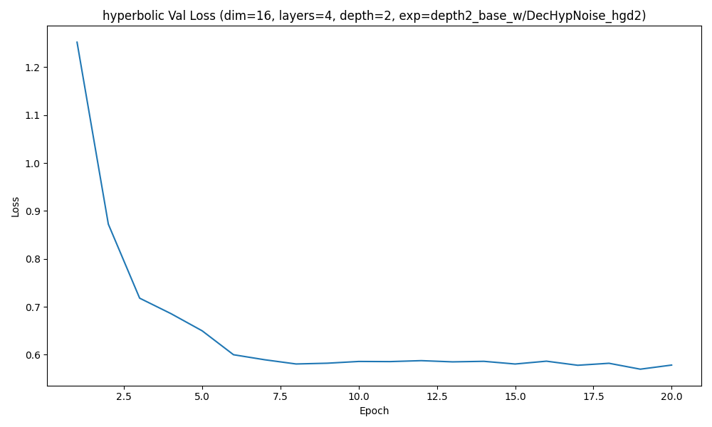
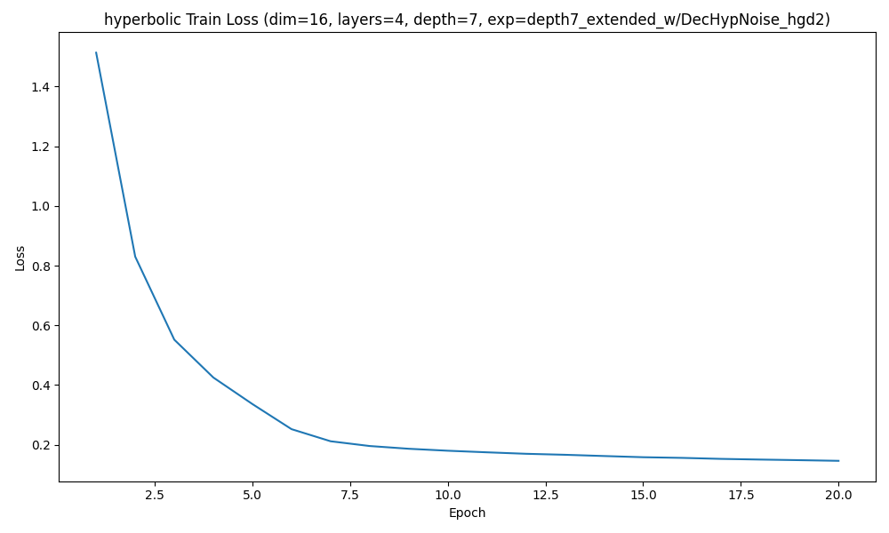
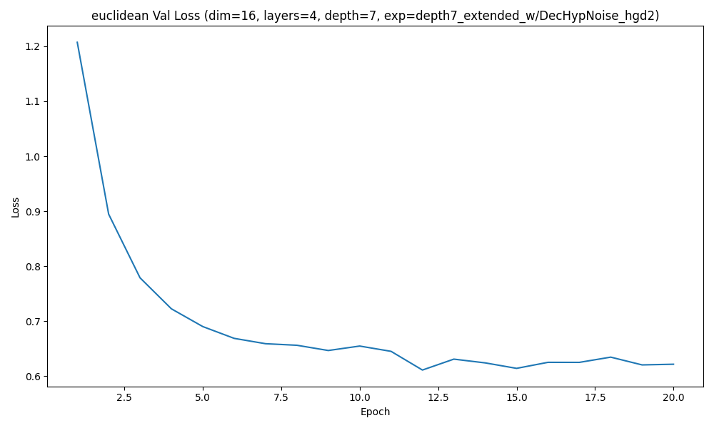
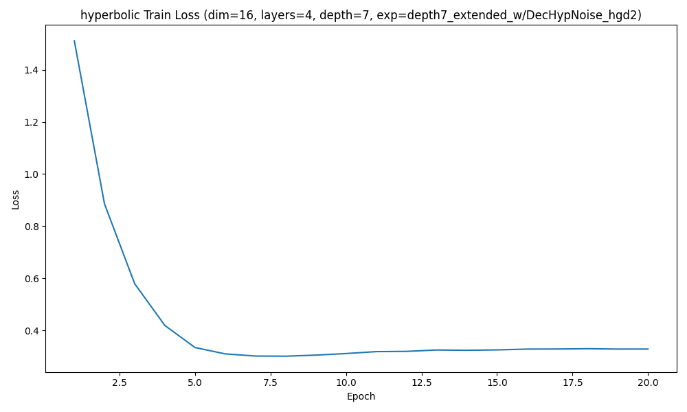
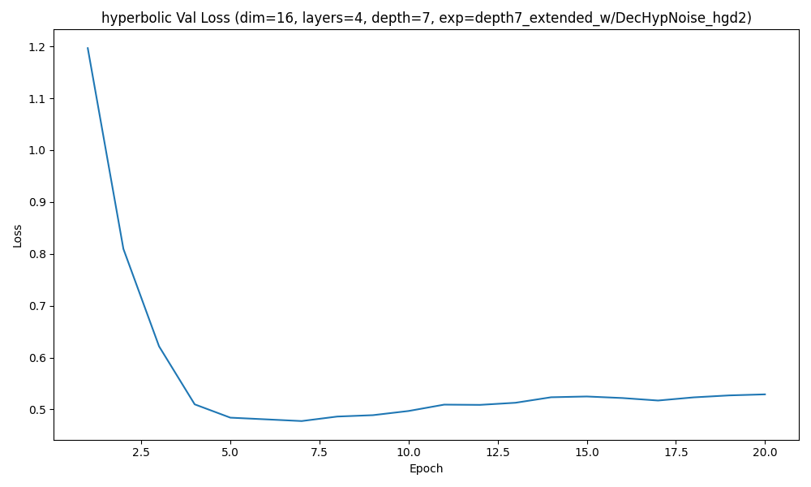
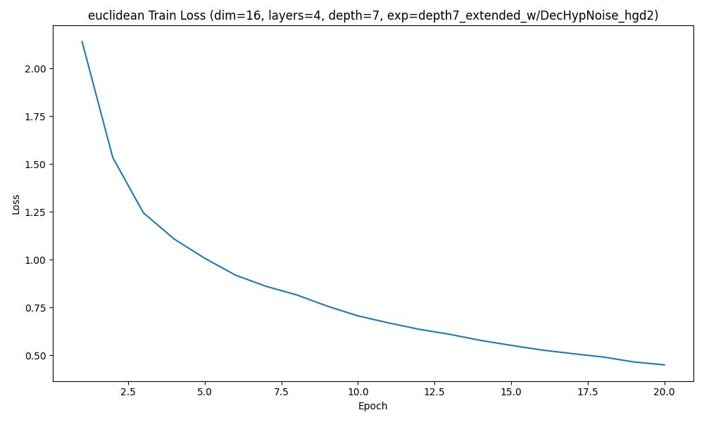
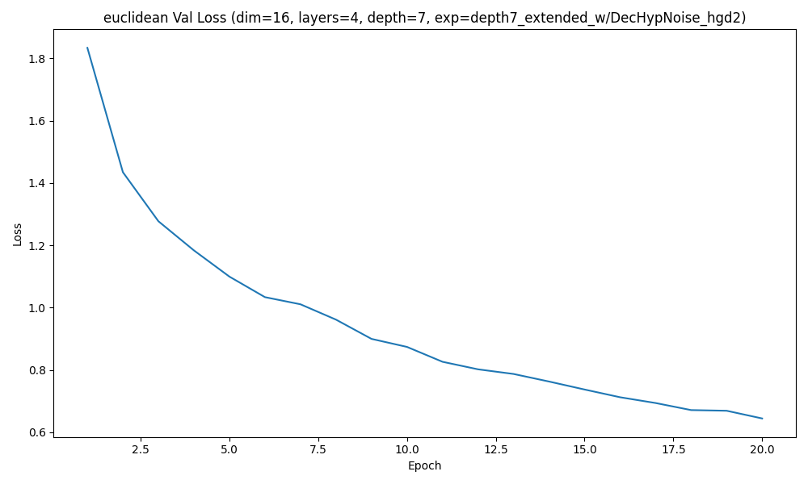

### Experiment depth2_base_w/DecHypNoise_hgd2 | depth 2 | hyperbolic | regularization=off

Best validation loss: 0.431846  
Test recall@4: 0.0471

Sample trajectory (hyperbolic) 1:
  Visit 1: ['C03', 'C12', 'C30', 'C41']
  Visit 2: ['C03', 'C12', 'C30', 'C41']
  Visit 3: ['C03', 'C12', 'C30', 'C41']
  Visit 4: ['C03', 'C12', 'C30', 'C41']
  Visit 5: ['C00', 'C01', 'C33', 'C44']
  Visit 6: ['C00', 'C01', 'C33', 'C44']

Sample trajectory (hyperbolic) 2:
  Visit 1: ['C00', 'C01', 'C33', 'C44']
  Visit 2: ['C00', 'C01', 'C33', 'C44']
  Visit 3: ['C03', 'C12', 'C30', 'C41']
  Visit 4: ['C03', 'C12', 'C30', 'C41']
  Visit 5: ['C00', 'C01', 'C33', 'C44']
  Visit 6: ['C03', 'C12', 'C30', 'C41']

Sample trajectory (hyperbolic) 3:
  Visit 1: ['C00', 'C01', 'C33', 'C44']
  Visit 2: ['C00', 'C01', 'C33', 'C44']
  Visit 3: ['C03', 'C12', 'C30', 'C41']
  Visit 4: ['C00', 'C01', 'C33', 'C44']
  Visit 5: ['C03', 'C12', 'C30', 'C41']
  Visit 6: ['C00', 'C01', 'C33', 'C44']
Correlation(tree_dist, hyperbolic_embedding_dist) = 0.0463

### Experiment depth2_base_w/DecHypNoise_hgd2 | depth 2 | euclidean | regularization=off

Best validation loss: 0.647204  
Test recall@4: 0.2446

Sample trajectory (euclidean) 1:
  Visit 1: ['C03', 'C034', 'C340', 'C442']
  Visit 2: ['C023', 'C211', 'C31', 'C313']
  Visit 3: ['C01', 'C02', 'C30', 'C402']
  Visit 4: ['C112', 'C233', 'C32', 'C402']
  Visit 5: ['C224', 'C33', 'C330', 'C340']
  Visit 6: ['C01', 'C02', 'C30', 'C402']

Sample trajectory (euclidean) 2:
  Visit 1: ['C10', 'C114', 'C131', 'C312']
  Visit 2: ['C34', 'C344', 'C433', 'C44']
  Visit 3: ['C01', 'C02', 'C310', 'C402']
  Visit 4: ['C224', 'C33', 'C330', 'C340']
  Visit 5: ['C33', 'C330', 'C334', 'C340']
  Visit 6: ['C13', 'C342', 'C420', 'C433']

Sample trajectory (euclidean) 3:
  Visit 1: ['C224', 'C33', 'C330', 'C340']
  Visit 2: ['C01', 'C31', 'C310', 'C402']
  Visit 3: ['C034', 'C33', 'C330', 'C340']
  Visit 4: ['C121', 'C144', 'C224', 'C23']
  Visit 5: ['C224', 'C23', 'C33', 'C330']
  Visit 6: ['C204', 'C413', 'C44', 'C442']
Correlation(tree_dist, euclidean_embedding_dist) = 0.0483

### Experiment depth2_base_w/DecHypNoise_hgd2 | depth 2 | hyperbolic | regularization=on

Best validation loss: 0.569686  
Test recall@4: 0.1454

Sample trajectory (hyperbolic) 1:
  Visit 1: ['C14', 'C20', 'C22', 'C41']
  Visit 2: ['C14', 'C20', 'C22', 'C41']
  Visit 3: ['C03', 'C04', 'C24', 'C42']
  Visit 4: ['C03', 'C04', 'C24', 'C42']
  Visit 5: ['C14', 'C20', 'C22', 'C41']
  Visit 6: ['C03', 'C04', 'C24', 'C42']

Sample trajectory (hyperbolic) 2:
  Visit 1: ['C14', 'C20', 'C22', 'C41']
  Visit 2: ['C14', 'C20', 'C22', 'C41']
  Visit 3: ['C03', 'C04', 'C24', 'C42']
  Visit 4: ['C03', 'C04', 'C24', 'C42']
  Visit 5: ['C03', 'C04', 'C24', 'C42']
  Visit 6: ['C14', 'C20', 'C22', 'C41']

Sample trajectory (hyperbolic) 3:
  Visit 1: ['C03', 'C04', 'C24', 'C42']
  Visit 2: ['C14', 'C20', 'C22', 'C41']
  Visit 3: ['C14', 'C20', 'C22', 'C41']
  Visit 4: ['C03', 'C04', 'C24', 'C42']
  Visit 5: ['C03', 'C04', 'C24', 'C42']
  Visit 6: ['C03', 'C04', 'C24', 'C42']
Correlation(tree_dist, hyperbolic_embedding_dist) = 0.9777

### Experiment depth2_base_w/DecHypNoise_hgd2 | depth 2 | euclidean | regularization=on

Best validation loss: 0.665742  
Test recall@4: 0.1406

Sample trajectory (euclidean) 1:
  Visit 1: ['C20', 'C204', 'C322', 'C43']
  Visit 2: ['C303', 'C323', 'C42', 'C420']
  Visit 3: ['C30', 'C322', 'C404', 'C42']
  Visit 4: ['C100', 'C130', 'C312', 'C442']
  Visit 5: ['C303', 'C323', 'C42', 'C420']
  Visit 6: ['C10', 'C121', 'C34', 'C342']

Sample trajectory (euclidean) 2:
  Visit 1: ['C303', 'C32', 'C42', 'C420']
  Visit 2: ['C00', 'C22', 'C404', 'C43']
  Visit 3: ['C22', 'C223', 'C322', 'C404']
  Visit 4: ['C10', 'C112', 'C34', 'C342']
  Visit 5: ['C012', 'C10', 'C34', 'C342']
  Visit 6: ['C30', 'C303', 'C323', 'C42']

Sample trajectory (euclidean) 3:
  Visit 1: ['C00', 'C10', 'C12', 'C14']
  Visit 2: ['C02', 'C124', 'C233', 'C442']
  Visit 3: ['C012', 'C10', 'C34', 'C342']
  Visit 4: ['C10', 'C12', 'C34', 'C342']
  Visit 5: ['C00', 'C12', 'C14', 'C43']
  Visit 6: ['C30', 'C303', 'C323', 'C42']
Correlation(tree_dist, euclidean_embedding_dist) = 0.0790

### Experiment depth7_extended_w/DecHypNoise_hgd2 | depth 7 | hyperbolic | regularization=off

Best validation loss: 0.345884  
Test recall@4: 0.0093

Sample trajectory (hyperbolic) 1:
  Visit 1: ['C023d4', 'C210d4', 'C420d3', 'C431d4']
  Visit 2: ['C104d4', 'C320d4', 'C333d4', 'C411d4']
  Visit 3: ['C104d4', 'C320d4', 'C333d4', 'C411d4']
  Visit 4: ['C023d4', 'C210d4', 'C420d3', 'C431d4']
  Visit 5: ['C104d4', 'C320d4', 'C333d4', 'C411d4']
  Visit 6: ['C104d4', 'C320d4', 'C333d4', 'C411d4']

Sample trajectory (hyperbolic) 2:
  Visit 1: ['C023d4', 'C210d4', 'C420d3', 'C431d4']
  Visit 2: ['C104d4', 'C320d4', 'C333d4', 'C411d4']
  Visit 3: ['C104d4', 'C320d4', 'C333d4', 'C411d4']
  Visit 4: ['C104d4', 'C320d4', 'C333d4', 'C411d4']
  Visit 5: ['C023d4', 'C210d4', 'C420d3', 'C431d4']
  Visit 6: ['C023d4', 'C210d4', 'C420d3', 'C431d4']

Sample trajectory (hyperbolic) 3:
  Visit 1: ['C023d4', 'C210d4', 'C420d3', 'C431d4']
  Visit 2: ['C104d4', 'C320d4', 'C333d4', 'C411d4']
  Visit 3: ['C104d4', 'C320d4', 'C333d4', 'C411d4']
  Visit 4: ['C104d4', 'C320d4', 'C333d4', 'C411d4']
  Visit 5: ['C104d4', 'C320d4', 'C333d4', 'C411d4']
  Visit 6: ['C023d4', 'C210d4', 'C420d3', 'C431d4']
Correlation(tree_dist, hyperbolic_embedding_dist) = 0.0168

### Experiment depth7_extended_w/DecHypNoise_hgd2 | depth 7 | euclidean | regularization=off

Best validation loss: 0.611237  
Test recall@4: 0.1379

Sample trajectory (euclidean) 1:
  Visit 1: ['C041d4', 'C223d3', 'C223d4', 'C400d3']
  Visit 2: ['C011d3', 'C011d4', 'C103d3', 'C103d4']
  Visit 3: ['C023d3', 'C023d4', 'C240d4', 'C410d3']
  Visit 4: ['C011d3', 'C041d4', 'C223d3', 'C400d3']
  Visit 5: ['C021d4', 'C034d4', 'C421d3', 'C421d4']
  Visit 6: ['C023d4', 'C144d4', 'C332d4', 'C403d4']

Sample trajectory (euclidean) 2:
  Visit 1: ['C204d4', 'C214d4', 'C331d3', 'C331d4']
  Visit 2: ['C021d4', 'C230d4', 'C341d3', 'C442d3']
  Visit 3: ['C041d4', 'C223d3', 'C223d4', 'C400d3']
  Visit 4: ['C021d4', 'C213d3', 'C213d4', 'C333d3']
  Visit 5: ['C023d3', 'C023d4', 'C204d4', 'C402d3']
  Visit 6: ['C110d3', 'C110d4', 'C213d3', 'C224d4']

Sample trajectory (euclidean) 3:
  Visit 1: ['C021d4', 'C110d4', 'C213d3', 'C213d4']
  Visit 2: ['C032d4', 'C223d3', 'C223d4', 'C400d3']
  Visit 3: ['C023d4', 'C041d4', 'C223d3', 'C400d3']
  Visit 4: ['C041d4', 'C223d3', 'C223d4', 'C400d3']
  Visit 5: ['C030d3', 'C333d3', 'C333d4', 'C434d3']
  Visit 6: ['C011d3', 'C041d4', 'C223d3', 'C223d4']
Correlation(tree_dist, euclidean_embedding_dist) = -0.0796

Synthetic (euclidean) stats (N=1000): {'mean_depth': 6.501625, 'std_depth': 0.4999973593680271, 'mean_tree_dist': 6.112317073170732, 'std_tree_dist': 5.89579796597222, 'mean_root_purity': 0.5165, 'std_root_purity': 0.11346181442817374}

### Experiment depth7_extended_w/DecHypNoise_hgd2 | depth 7 | hyperbolic | regularization=on

Best validation loss: 0.477531  
Test recall@4: 0.0127

Sample trajectory (hyperbolic) 1:
  Visit 1: ['C033d3', 'C314d3', 'C423d3', 'C432d3']
  Visit 2: ['C331', 'C002d0', 'C241d3', 'C314d4']
  Visit 3: ['C331', 'C002d0', 'C241d3', 'C314d4']
  Visit 4: ['C331', 'C002d0', 'C241d3', 'C314d4']
  Visit 5: ['C033d3', 'C314d3', 'C423d3', 'C432d3']
  Visit 6: ['C331', 'C002d0', 'C241d3', 'C314d4']

Sample trajectory (hyperbolic) 2:
  Visit 1: ['C331', 'C002d0', 'C241d3', 'C314d4']
  Visit 2: ['C331', 'C002d0', 'C241d3', 'C314d4']
  Visit 3: ['C033d3', 'C314d3', 'C423d3', 'C432d3']
  Visit 4: ['C033d3', 'C314d3', 'C423d3', 'C432d3']
  Visit 5: ['C331', 'C002d0', 'C241d3', 'C314d4']
  Visit 6: ['C033d3', 'C314d3', 'C423d3', 'C432d3']

Sample trajectory (hyperbolic) 3:
  Visit 1: ['C033d3', 'C314d3', 'C423d3', 'C432d3']
  Visit 2: ['C033d3', 'C314d3', 'C423d3', 'C432d3']
  Visit 3: ['C033d3', 'C314d3', 'C423d3', 'C432d3']
  Visit 4: ['C331', 'C002d0', 'C241d3', 'C314d4']
  Visit 5: ['C033d3', 'C314d3', 'C423d3', 'C432d3']
  Visit 6: ['C331', 'C002d0', 'C241d3', 'C314d4']
Correlation(tree_dist, hyperbolic_embedding_dist) = 0.8070

### Experiment depth7_extended_w/DecHypNoise_hgd2 | depth 7 | euclidean | regularization=on

Best validation loss: 0.644523  
Test recall@4: 0.1054

Sample trajectory (euclidean) 1:
  Visit 1: ['C311d4', 'C434d4', 'C441d3', 'C441d4']
  Visit 2: ['C140d3', 'C434d4', 'C441d3', 'C441d4']
  Visit 3: ['C140d3', 'C434d4', 'C441d3', 'C441d4']
  Visit 4: ['C012d4', 'C142d4', 'C302d3', 'C333d4']
  Visit 5: ['C140d3', 'C434d4', 'C441d3', 'C441d4']
  Visit 6: ['C023d4', 'C030d3', 'C132d3', 'C132d4']

Sample trajectory (euclidean) 2:
  Visit 1: ['C434d3', 'C434d4', 'C441d3', 'C441d4']
  Visit 2: ['C203d3', 'C213d3', 'C240d3', 'C341d4']
  Visit 3: ['C140d3', 'C311d3', 'C441d3', 'C441d4']
  Visit 4: ['C024d4', 'C210d3', 'C221d3', 'C403d3']
  Visit 5: ['C033d3', 'C203d3', 'C244d3', 'C341d4']
  Visit 6: ['C320d4', 'C434d4', 'C441d3', 'C441d4']

Sample trajectory (euclidean) 3:
  Visit 1: ['C142d4', 'C434d4', 'C441d3', 'C441d4']
  Visit 2: ['C033d3', 'C203d3', 'C244d3', 'C341d4']
  Visit 3: ['C320d4', 'C434d4', 'C441d3', 'C441d4']
  Visit 4: ['C142d4', 'C434d4', 'C441d3', 'C441d4']
  Visit 5: ['C033d3', 'C203d3', 'C244d3', 'C341d4']
  Visit 6: ['C142d4', 'C434d4', 'C441d3', 'C441d4']
Correlation(tree_dist, euclidean_embedding_dist) = 0.1373

## Comparison Table
| Depth / Experiment | Source | Embedding | Reg | Mean depth | Depth std | Mean tree dist | Tree dist std | Mean root purity | Root purity std | Corr(tree, emb) | Best val loss | Test recall@4 |
| --- | --- | --- | --- | --- | --- | --- | --- | --- | --- | --- | --- | --- |
| depth2_base_w/DecHypNoise_hgd2 | Real | — | — | 1.6439 | 0.5138 | 2.1206 | 1.2453 | 0.6242 | 0.2040 | — | — | — |
| depth7_extended_w/DecHypNoise_hgd2 | Real | — | — | 5.3798 | 1.7295 | 5.7591 | 4.7567 | 0.6290 | 0.2047 | — | — | — |
| depth2_base_w/DecHypNoise_hgd2 | Synthetic | hyperbolic | off | 1.0000 | 0.0000 | 2.0000 | 0.0000 | 0.3716 | 0.1250 | 0.0463 | 0.4318 | 0.0471 |
| depth2_base_w/DecHypNoise_hgd2 | Synthetic | euclidean | off | 1.6092 | 0.4890 | 2.5724 | 1.1440 | 0.6003 | 0.1615 | 0.0483 | 0.6472 | 0.2446 |
| depth2_base_w/DecHypNoise_hgd2 | Synthetic | hyperbolic | on | 1.0000 | 0.0000 | 2.0000 | 0.0000 | 0.5000 | 0.0000 | 0.9777 | 0.5697 | 0.1454 |
| depth2_base_w/DecHypNoise_hgd2 | Synthetic | euclidean | on | 1.4269 | 0.4950 | 2.2105 | 1.0299 | 0.4984 | 0.1623 | 0.0790 | 0.6657 | 0.1406 |
| depth7_extended_w/DecHypNoise_hgd2 | Synthetic | hyperbolic | off | 6.8746 | 0.3312 | 13.4983 | 0.5000 | 0.5000 | 0.0000 | 0.0168 | 0.3459 | 0.0093 |
| depth7_extended_w/DecHypNoise_hgd2 | Synthetic | euclidean | off | 6.5016 | 0.5000 | 6.1123 | 5.8958 | 0.5165 | 0.1135 | -0.0796 | 0.6112 | 0.1379 |
| depth7_extended_w/DecHypNoise_hgd2 | Synthetic | hyperbolic | on | 5.2605 | 1.6352 | 10.5131 | 1.4999 | 0.4973 | 0.0261 | 0.8070 | 0.4775 | 0.0127 |
| depth7_extended_w/DecHypNoise_hgd2 | Synthetic | euclidean | on | 6.4810 | 0.4996 | 9.4481 | 5.5281 | 0.5963 | 0.1457 | 0.1373 | 0.6445 | 0.1054 |

## Summary
- **Shallow depth2_base_w/DecHypNoise_hgd2:** Combining HDD and HGD regularizers boosts hyperbolic recall to 0.145 while keeping near-perfect tree-distance correlation. Euclidean runs still hold the peak recall (0.245) but ignore structure (corr ≈0.05).
- **Deep depth7_extended_w/DecHypNoise_hgd2:** Hyperbolic diffusion remains geometry-aware (corr up to 0.81 when regularized) yet fails to decode realistic trajectories (recall ≤0.013). Euclidean models achieve modest recall (~0.14) but correlations hover near zero or negative, signaling poor hierarchy compliance.
- **Overall observation:** Stacking HDD and HGD terms tightens hyperbolic geometry but exposes the decoder bottleneck—structured latents do not translate into better discrete reconstructions. Euclidean embeddings continue to dominate recall, trading away semantic fidelity in the process.
