### depth2_final | max_depth = 2 | Real stats: {'mean_depth': 1.6439176670642877, 'std_depth': 0.5137982104125317, 'mean_tree_dist': 2.1205701725560644, 'std_tree_dist': 1.2453175481436083, 'mean_root_purity': 0.6241599458637942, 'std_root_purity': 0.2040143257571073}

### Experiment depth2_final | depth 2 | euclidean | lambda_recon=1.0
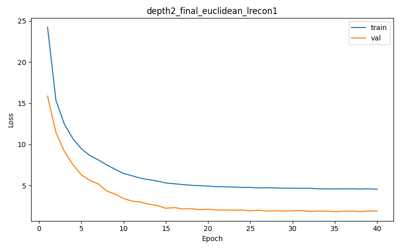

Best validation loss: 1.832076  
Test Recall@4: 0.0672  
Tree-Embedding Correlation: -0.0216  
Synthetic stats: mean_depth=1.6917, std_depth=0.4618, mean_tree_dist=2.5391, std_tree_dist=1.1700, mean_root_purity=0.7128, std_root_purity=0.2471

Sample trajectory (euclidean) 1:
  Visit 1: ['C12', 'C120', 'C13', 'C133']
  Visit 2: ['C12', 'C120', 'C13', 'C133']
  Visit 3: ['C030', 'C104', 'C142', 'C334']
  Visit 4: ['C030', 'C104', 'C142', 'C334']
  Visit 5: ['C01', 'C12', 'C13', 'C44']
  Visit 6: ['C12', 'C120', 'C13', 'C133']

Sample trajectory (euclidean) 2:
  Visit 1: ['C030', 'C104', 'C142', 'C334']
  Visit 2: ['C12', 'C120', 'C13', 'C133']
  Visit 3: ['C030', 'C104', 'C142', 'C334']
  Visit 4: ['C12', 'C120', 'C13', 'C133']
  Visit 5: ['C12', 'C120', 'C13', 'C133']
  Visit 6: ['C01', 'C13', 'C133', 'C44']

Sample trajectory (euclidean) 3:
  Visit 1: ['C030', 'C104', 'C142', 'C334']
  Visit 2: ['C030', 'C104', 'C142', 'C334']
  Visit 3: ['C12', 'C120', 'C13', 'C133']
  Visit 4: ['C030', 'C104', 'C142', 'C334']
  Visit 5: ['C12', 'C120', 'C13', 'C133']
  Visit 6: ['C030', 'C104', 'C142', 'C334']

### Experiment depth2_final | depth 2 | euclidean | lambda_recon=10.0
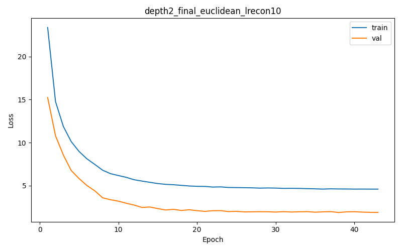

Best validation loss: 1.874482  
Test Recall@4: 0.2493  
Tree-Embedding Correlation: 0.0488  
Synthetic stats: mean_depth=1.3805, std_depth=0.4872, mean_tree_dist=1.8120, std_tree_dist=0.6290, mean_root_purity=0.4133, std_root_purity=0.1548

Sample trajectory (euclidean) 1:
  Visit 1: ['C21', 'C30', 'C33', 'C422']
  Visit 2: ['C003', 'C21', 'C33', 'C422']
  Visit 3: ['C21', 'C30', 'C33', 'C422']
  Visit 4: ['C03', 'C22', 'C42', 'C43']
  Visit 5: ['C003', 'C21', 'C33', 'C422']
  Visit 6: ['C003', 'C21', 'C33', 'C422']

Sample trajectory (euclidean) 2:
  Visit 1: ['C04', 'C042', 'C32', 'C321']
  Visit 2: ['C21', 'C30', 'C33', 'C422']
  Visit 3: ['C003', 'C21', 'C33', 'C422']
  Visit 4: ['C21', 'C30', 'C33', 'C422']
  Visit 5: ['C04', 'C141', 'C32', 'C321']
  Visit 6: ['C21', 'C30', 'C33', 'C422']

Sample trajectory (euclidean) 3:
  Visit 1: ['C003', 'C21', 'C33', 'C422']
  Visit 2: ['C21', 'C30', 'C33', 'C422']
  Visit 3: ['C21', 'C30', 'C33', 'C422']
  Visit 4: ['C003', 'C21', 'C33', 'C422']
  Visit 5: ['C003', 'C21', 'C33', 'C422']
  Visit 6: ['C003', 'C21', 'C33', 'C422']

### Experiment depth2_final | depth 2 | euclidean | lambda_recon=100.0

Best validation loss: 2.030545  
Test Recall@4: 0.8702  
Tree-Embedding Correlation: -0.0155  
Synthetic stats: mean_depth=1.7430, std_depth=0.4483, mean_tree_dist=2.6803, std_tree_dist=1.2199, mean_root_purity=0.4926, std_root_purity=0.1494

Sample trajectory (euclidean) 1:
  Visit 1: ['C043', 'C144', 'C300', 'C440']
  Visit 2: ['C22', 'C320', 'C403', 'C404']
  Visit 3: ['C101', 'C241', 'C3', 'C433']
  Visit 4: ['C023', 'C134', 'C204', 'C301']
  Visit 5: ['C042', 'C131', 'C200', 'C31']
  Visit 6: ['C10', 'C101', 'C303', 'C433']

Sample trajectory (euclidean) 2:
  Visit 1: ['C042', 'C131', 'C200', 'C210']
  Visit 2: ['C101', 'C133', 'C34', 'C443']
  Visit 3: ['C013', 'C304', 'C334', 'C433']
  Visit 4: ['C014', 'C021', 'C112', 'C143']
  Visit 5: ['C014', 'C342', 'C432', 'C433']
  Visit 6: ['C01', 'C022', 'C131', 'C20']

Sample trajectory (euclidean) 3:
  Visit 1: ['C02', 'C100', 'C243', 'C433']
  Visit 2: ['C10', 'C100', 'C303', 'C433']
  Visit 3: ['C022', 'C111', 'C13', 'C31']
  Visit 4: ['C042', 'C131', 'C200', 'C210']
  Visit 5: ['C10', 'C100', 'C303', 'C432']
  Visit 6: ['C111', 'C230', 'C401', 'C403']

### Experiment depth2_final | depth 2 | euclidean | lambda_recon=1000.0
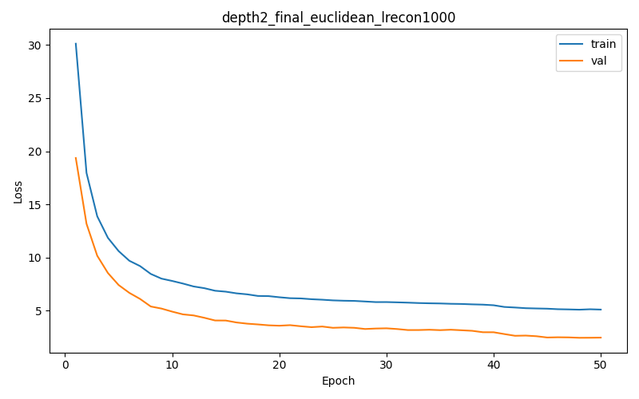

Best validation loss: 2.439485  
Test Recall@4: 0.9227  
Tree-Embedding Correlation: 0.0527  
Synthetic stats: mean_depth=1.6424, std_depth=0.5588, mean_tree_dist=2.8897, std_tree_dist=1.0498, mean_root_purity=0.5012, std_root_purity=0.1524

Sample trajectory (euclidean) 1:
  Visit 1: ['C120', 'C21', 'C213', 'C42']
  Visit 2: ['C01', 'C030', 'C40', 'C42']
  Visit 3: ['C0', 'C011', 'C142', 'C204']
  Visit 4: ['C144', 'C214', 'C334', 'C343']
  Visit 5: ['C100', 'C133', 'C23', 'C303']
  Visit 6: ['C102', 'C104', 'C110', 'C330']

Sample trajectory (euclidean) 2:
  Visit 1: ['C103', 'C33', 'C333', 'C34']
  Visit 2: ['C14', 'C40', 'C414', 'C43']
  Visit 3: ['C00', 'C134', 'C340', 'C421']
  Visit 4: ['C004', 'C01', 'C421', 'C424']
  Visit 5: ['C04', 'C233', 'C33', 'C414']
  Visit 6: ['C04', 'C1', 'C34', 'C423']

Sample trajectory (euclidean) 3:
  Visit 1: ['C01', 'C013', 'C13', 'C23']
  Visit 2: ['C1', 'C11', 'C312', 'C423']
  Visit 3: ['C013', 'C124', 'C130', 'C232']
  Visit 4: ['C1', 'C123', 'C224', 'C34']
  Visit 5: ['C004', 'C124', 'C203', 'C33']
  Visit 6: ['C113', 'C134', 'C201', 'C30']

### Experiment depth2_final | depth 2 | hyperbolic | lambda_recon=1.0
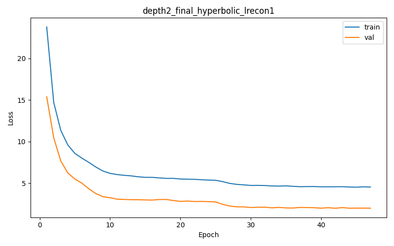

Best validation loss: 1.979262  
Test Recall@4: 0.0549  
Tree-Embedding Correlation: 0.0913  
Synthetic stats: mean_depth=1.8545, std_depth=0.3551, mean_tree_dist=3.8368, std_tree_dist=0.5690, mean_root_purity=0.4934, std_root_purity=0.0671

Sample trajectory (hyperbolic) 1:
  Visit 1: ['C023', 'C11', 'C214', 'C223']
  Visit 2: ['C034', 'C11', 'C214', 'C223']
  Visit 3: ['C203', 'C222', 'C330', 'C333']
  Visit 4: ['C013', 'C203', 'C234', 'C321']
  Visit 5: ['C013', 'C041', 'C132', 'C321']
  Visit 6: ['C013', 'C203', 'C234', 'C321']

Sample trajectory (hyperbolic) 2:
  Visit 1: ['C013', 'C132', 'C203', 'C321']
  Visit 2: ['C023', 'C11', 'C214', 'C223']
  Visit 3: ['C023', 'C11', 'C214', 'C223']
  Visit 4: ['C013', 'C203', 'C234', 'C321']
  Visit 5: ['C023', 'C11', 'C223', 'C443']
  Visit 6: ['C034', 'C11', 'C214', 'C223']

Sample trajectory (hyperbolic) 3:
  Visit 1: ['C013', 'C203', 'C234', 'C321']
  Visit 2: ['C023', 'C034', 'C11', 'C223']
  Visit 3: ['C013', 'C041', 'C203', 'C321']
  Visit 4: ['C013', 'C203', 'C234', 'C321']
  Visit 5: ['C01', 'C013', 'C041', 'C302']
  Visit 6: ['C034', 'C11', 'C214', 'C223']

### Experiment depth2_final | depth 2 | hyperbolic | lambda_recon=10.0

Best validation loss: 2.870362  
Test Recall@4: 0.0516  
Tree-Embedding Correlation: -0.3309  
Synthetic stats: mean_depth=1.3006, std_depth=0.6608, mean_tree_dist=2.8233, std_tree_dist=0.9319, mean_root_purity=0.4627, std_root_purity=0.1368

Sample trajectory (hyperbolic) 1:
  Visit 1: ['C320', 'C434', 'C443']
  Visit 2: ['C110', 'C123', 'C2']
  Visit 3: ['C041', 'C1', 'C233', 'C3']
  Visit 4: ['C13', 'C24', 'C31', 'C41']
  Visit 5: ['C13', 'C24', 'C31', 'C41']
  Visit 6: ['C10', 'C12', 'C21', 'C24']

Sample trajectory (hyperbolic) 2:
  Visit 1: ['C1', 'C320', 'C434']
  Visit 2: ['C13', 'C21', 'C24', 'C41']
  Visit 3: ['C02', 'C041', 'C24', 'C40']
  Visit 4: ['C022', 'C123', 'C42']
  Visit 5: ['C02', 'C041', 'C32', 'C40']
  Visit 6: ['C13', 'C24', 'C31', 'C41']

Sample trajectory (hyperbolic) 3:
  Visit 1: ['C02', 'C24', 'C32', 'C40']
  Visit 2: ['C13', 'C24', 'C41', 'C444']
  Visit 3: ['C024', 'C434', 'C443']
  Visit 4: ['C12', 'C21', 'C24', 'C44']
  Visit 5: ['C104', 'C424', 'C443']
  Visit 6: ['C13', 'C24', 'C41', 'C42']

### Experiment depth2_final | depth 2 | hyperbolic | lambda_recon=100.0
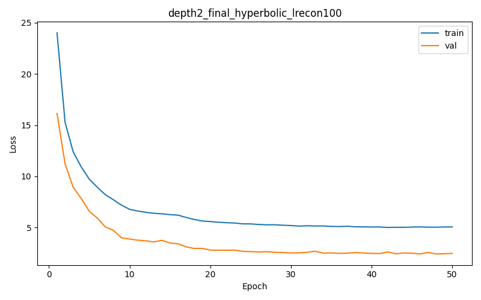

Best validation loss: 2.415631  
Test Recall@4: 0.1587  
Tree-Embedding Correlation: -0.0071  
Synthetic stats: mean_depth=1.1557, std_depth=0.3678, mean_tree_dist=1.9694, std_tree_dist=0.7683, mean_root_purity=0.5440, std_root_purity=0.1790

Sample trajectory (hyperbolic) 1:
  Visit 1: ['C21', 'C32', 'C33', 'C334']
  Visit 2: ['C01', 'C02', 'C10', 'C21']
  Visit 3: ['C21', 'C32', 'C33', 'C334']
  Visit 4: ['C21', 'C214', 'C32', 'C33']
  Visit 5: ['C00', 'C11', 'C42']
  Visit 6: ['C012', 'C023', 'C101', 'C131']

Sample trajectory (hyperbolic) 2:
  Visit 1: ['C00', 'C11', 'C41']
  Visit 2: ['C00', 'C12', 'C22', 'C42']
  Visit 3: ['C12', 'C22', 'C23', 'C34']
  Visit 4: ['C00', 'C11', 'C41', 'C42']
  Visit 5: ['C21', 'C32', 'C33', 'C334']
  Visit 6: ['C00', 'C11', 'C41']

Sample trajectory (hyperbolic) 3:
  Visit 1: ['C022', 'C101', 'C301', 'C303']
  Visit 2: ['C102', 'C30', 'C301', 'C303']
  Visit 3: ['C21', 'C32', 'C33', 'C334']
  Visit 4: ['C21', 'C214', 'C32', 'C33']
  Visit 5: ['C21', 'C32', 'C33', 'C40']
  Visit 6: ['C00', 'C11', 'C41']

### Experiment depth2_final | depth 2 | hyperbolic | lambda_recon=1000.0

Best validation loss: 5.282482  
Test Recall@4: 0.5962  
Tree-Embedding Correlation: 0.5987  
Synthetic stats: mean_depth=1.8124, std_depth=0.3994, mean_tree_dist=1.9616, std_tree_dist=1.1097, mean_root_purity=0.6600, std_root_purity=0.1985

Sample trajectory (hyperbolic) 1:
  Visit 1: ['C31', 'C311', 'C313', 'C314']
  Visit 2: ['C32', 'C320', 'C322']
  Visit 3: ['C32', 'C320', 'C322']
  Visit 4: ['C23', 'C232', 'C233', 'C304']
  Visit 5: ['C000', 'C001', 'C320', 'C322']
  Visit 6: ['C241', 'C243', 'C30', 'C304']

Sample trajectory (hyperbolic) 2:
  Visit 1: ['C000', 'C43', 'C430', 'C432']
  Visit 2: ['C23', 'C230', 'C232', 'C233']
  Visit 3: ['C32', 'C320', 'C322']
  Visit 4: ['C003', 'C021', 'C221', 'C432']
  Visit 5: ['C000', 'C32', 'C320', 'C322']
  Visit 6: ['C001', 'C32', 'C440']

Sample trajectory (hyperbolic) 3:
  Visit 1: ['C32', 'C320', 'C322']
  Visit 2: ['C13', 'C130', 'C243', 'C304']
  Visit 3: ['C024', 'C243', 'C304', 'C403']
  Visit 4: ['C000', 'C32', 'C320', 'C322']
  Visit 5: ['C32', 'C322', 'C440']
  Visit 6: ['C000', 'C32', 'C320', 'C324']

### Experiment depth2_final | depth 2 | hyperbolic | lambda_recon=2000.0
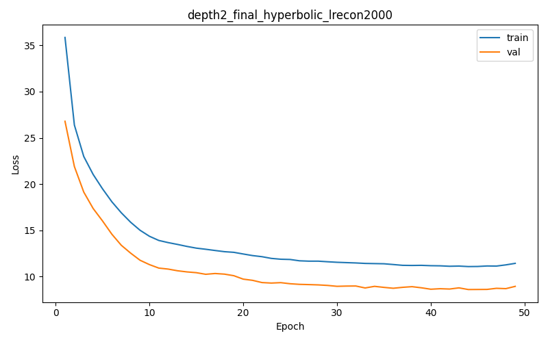

Best validation loss: 8.607137  
Test Recall@4: 0.5919  
Tree-Embedding Correlation: 0.6206  
Synthetic stats: mean_depth=1.8036, std_depth=0.5111, mean_tree_dist=2.1903, std_tree_dist=1.1438, mean_root_purity=0.5951, std_root_purity=0.1734

Sample trajectory (hyperbolic) 1:
  Visit 1: ['C232', 'C34', 'C341', 'C343']
  Visit 2: ['C022', 'C10', 'C100', 'C104']
  Visit 3: ['C001', 'C210', 'C420', 'C422']
  Visit 4: ['C001', 'C210', 'C213', 'C220']
  Visit 5: ['C104', 'C341', 'C40', 'C402']
  Visit 6: ['C0', 'C1', 'C2', 'C4']

Sample trajectory (hyperbolic) 2:
  Visit 1: ['C001', 'C210', 'C213', 'C220']
  Visit 2: ['C341', 'C343', 'C423', 'C443']
  Visit 3: ['C001', 'C1', 'C123', 'C210']
  Visit 4: ['C022', 'C101', 'C241']
  Visit 5: ['C001', 'C21', 'C210', 'C220']
  Visit 6: ['C001', 'C210', 'C213', 'C220']

Sample trajectory (hyperbolic) 3:
  Visit 1: ['C341', 'C343', 'C401', 'C443']
  Visit 2: ['C1', 'C123', 'C222', 'C323']
  Visit 3: ['C001', 'C1', 'C210', 'C220']
  Visit 4: ['C032', 'C32', 'C321', 'C343']
  Visit 5: ['C022', 'C10', 'C100', 'C104']
  Visit 6: ['C123', 'C210', 'C212', 'C413']

### Experiment depth2_final | depth 2 | hyperbolic | lambda_recon=3000.0

Best validation loss: 12.012943  
Test Recall@4: 0.5743  
Tree-Embedding Correlation: 0.6204  
Synthetic stats: mean_depth=1.8162, std_depth=0.4106, mean_tree_dist=1.7415, std_tree_dist=0.9391, mean_root_purity=0.6586, std_root_purity=0.1799

Sample trajectory (hyperbolic) 1:
  Visit 1: ['C02', 'C023', 'C302', 'C414']
  Visit 2: ['C31', 'C310', 'C311', 'C401']
  Visit 3: ['C02', 'C023', 'C302', 'C414']
  Visit 4: ['C02', 'C021', 'C023', 'C414']
  Visit 5: ['C023', 'C043', 'C102', 'C302']
  Visit 6: ['C31', 'C310', 'C401', 'C404']

Sample trajectory (hyperbolic) 2:
  Visit 1: ['C31', 'C310', 'C401', 'C404']
  Visit 2: ['C02', 'C020', 'C021', 'C023']
  Visit 3: ['C310', 'C343', 'C400', 'C401']
  Visit 4: ['C021', 'C023', 'C102', 'C414']
  Visit 5: ['C020', 'C101', 'C111', 'C231']
  Visit 6: ['C02', 'C023', 'C302', 'C414']

Sample trajectory (hyperbolic) 3:
  Visit 1: ['C02', 'C023', 'C224', 'C414']
  Visit 2: ['C31', 'C310', 'C311', 'C401']
  Visit 3: ['C02', 'C021', 'C023', 'C414']
  Visit 4: ['C020', 'C023', 'C304', 'C414']
  Visit 5: ['C004', 'C31', 'C310', 'C400']
  Visit 6: ['C31', 'C310', 'C401', 'C404']

### depth7_final | max_depth = 7 | Real stats: {'mean_depth': 5.374459093875327, 'std_depth': 1.7322915840970905, 'mean_tree_dist': 5.76189079147913, 'std_tree_dist': 4.753635709372622, 'mean_root_purity': 0.6272780762911319, 'std_root_purity': 0.2050864797754083}

### Experiment depth7_final | depth 7 | euclidean | lambda_recon=1.0
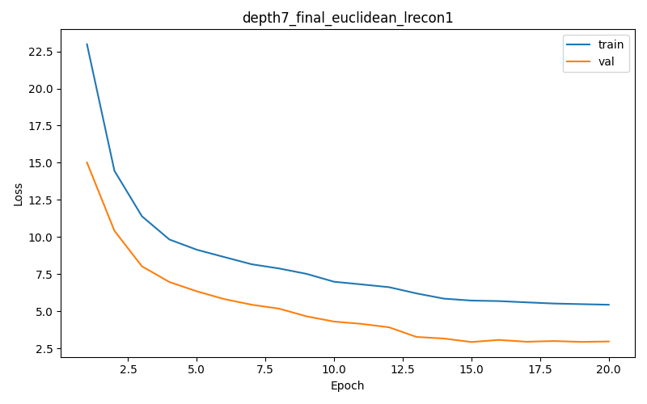

Best validation loss: 2.935548  
Test Recall@4: 0.0098  
Tree-Embedding Correlation: 0.0303  
Synthetic stats: mean_depth=5.4627, std_depth=1.5877, mean_tree_dist=7.2343, std_tree_dist=4.8878, mean_root_purity=0.5231, std_root_purity=0.1190

Sample trajectory (euclidean) 1:
  Visit 1: ['C230', 'C212d0', 'C310d0', 'C323d1']
  Visit 2: ['C131d3', 'C131d4', 'C244d3', 'C340d3']
  Visit 3: ['C131d3', 'C244d3', 'C331d4', 'C340d3']
  Visit 4: ['C003', 'C001d2', 'C323d1', 'C441d1']
  Visit 5: ['C230', 'C212d0', 'C310d0', 'C323d1']
  Visit 6: ['C002d3', 'C131d3', 'C440d4', 'C443d3']

Sample trajectory (euclidean) 2:
  Visit 1: ['C103d4', 'C331d3', 'C331d4', 'C340d3']
  Visit 2: ['C230', 'C212d0', 'C310d0', 'C323d1']
  Visit 3: ['C230', 'C002d4', 'C022d1', 'C410d3']
  Visit 4: ['C230', 'C212d0', 'C310d0', 'C323d1']
  Visit 5: ['C131d3', 'C131d4', 'C244d3', 'C340d3']
  Visit 6: ['C230', 'C111d1', 'C310d0', 'C323d1']

Sample trajectory (euclidean) 3:
  Visit 1: ['C131d3', 'C131d4', 'C244d3', 'C340d3']
  Visit 2: ['C103d4', 'C214d3', 'C331d4', 'C420d3']
  Visit 3: ['C001d2', 'C002d4', 'C323d1', 'C441d1']
  Visit 4: ['C111d1', 'C212d0', 'C310d0', 'C323d1']
  Visit 5: ['C230', 'C212d0', 'C301d1', 'C310d0']
  Visit 6: ['C230', 'C212d0', 'C310d0', 'C323d1']

### Experiment depth7_final | depth 7 | euclidean | lambda_recon=10.0

Best validation loss: 2.865968  
Test Recall@4: 0.0111  
Tree-Embedding Correlation: -0.0285  
Synthetic stats: mean_depth=5.3407, std_depth=1.9723, mean_tree_dist=7.9726, std_tree_dist=4.7473, mean_root_purity=0.5426, std_root_purity=0.1404

Sample trajectory (euclidean) 1:
  Visit 1: ['C100d4', 'C134d3', 'C213d3', 'C301d4']
  Visit 2: ['C100d4', 'C134d3', 'C213d3', 'C301d4']
  Visit 3: ['C100d4', 'C134d3', 'C213d3', 'C414d4']
  Visit 4: ['C100d4', 'C134d3', 'C213d3', 'C414d4']
  Visit 5: ['C100d4', 'C134d3', 'C213d3', 'C414d4']
  Visit 6: ['C100d4', 'C134d3', 'C213d3', 'C301d4']

Sample trajectory (euclidean) 2:
  Visit 1: ['C134d3', 'C134d4', 'C213d3', 'C304d3']
  Visit 2: ['C100d4', 'C134d3', 'C213d3', 'C301d4']
  Visit 3: ['C100d4', 'C134d3', 'C213d3', 'C301d4']
  Visit 4: ['C134d3', 'C213d3', 'C304d3', 'C414d4']
  Visit 5: ['C100d4', 'C134d3', 'C213d3', 'C414d4']
  Visit 6: ['C224', 'C43', 'C431', 'C441d1']

Sample trajectory (euclidean) 3:
  Visit 1: ['C43', 'C214d1', 'C242d2', 'C441d1']
  Visit 2: ['C100d4', 'C134d3', 'C213d3', 'C414d4']
  Visit 3: ['C010d3', 'C121d4', 'C342d4', 'C414d4']
  Visit 4: ['C224', 'C43', 'C431', 'C441d1']
  Visit 5: ['C100d4', 'C134d3', 'C213d3', 'C414d4']
  Visit 6: ['C100d4', 'C134d3', 'C213d3', 'C301d4']

### Experiment depth7_final | depth 7 | euclidean | lambda_recon=100.0

Best validation loss: 3.008448  
Test Recall@4: 0.0296  
Tree-Embedding Correlation: 0.0109  
Synthetic stats: mean_depth=5.7362, std_depth=1.8264, mean_tree_dist=1.4805, std_tree_dist=2.3376, mean_root_purity=0.5032, std_root_purity=0.0358

Sample trajectory (euclidean) 1:
  Visit 1: ['C10', 'C231d3', 'C231d4', 'C331d0']
  Visit 2: ['C231d3', 'C231d4', 'C420d3', 'C420d4']
  Visit 3: ['C231d3', 'C231d4', 'C420d3', 'C420d4']
  Visit 4: ['C231d3', 'C231d4', 'C420d3', 'C420d4']
  Visit 5: ['C231d3', 'C231d4', 'C420d3', 'C420d4']
  Visit 6: ['C231d3', 'C231d4', 'C420d3', 'C420d4']

Sample trajectory (euclidean) 2:
  Visit 1: ['C231d3', 'C231d4', 'C420d3', 'C420d4']
  Visit 2: ['C231d3', 'C231d4', 'C420d3', 'C420d4']
  Visit 3: ['C10', 'C231d3', 'C231d4', 'C420d4']
  Visit 4: ['C231d3', 'C231d4', 'C420d3', 'C420d4']
  Visit 5: ['C10', 'C231d3', 'C231d4', 'C420d4']
  Visit 6: ['C231d3', 'C231d4', 'C420d3', 'C420d4']

Sample trajectory (euclidean) 3:
  Visit 1: ['C231d3', 'C231d4', 'C420d3', 'C420d4']
  Visit 2: ['C231d3', 'C231d4', 'C420d3', 'C420d4']
  Visit 3: ['C10', 'C231d3', 'C231d4', 'C420d4']
  Visit 4: ['C10', 'C231d3', 'C231d4', 'C420d4']
  Visit 5: ['C231d3', 'C231d4', 'C420d3', 'C420d4']
  Visit 6: ['C231d3', 'C231d4', 'C420d3', 'C420d4']

### Experiment depth7_final | depth 7 | euclidean | lambda_recon=1000.0
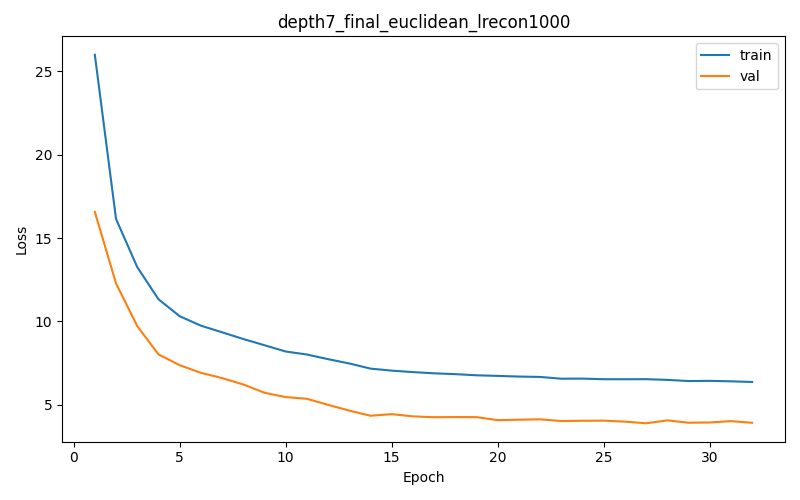

Best validation loss: 3.888043  
Test Recall@4: 0.4498  
Tree-Embedding Correlation: -0.0076  
Synthetic stats: mean_depth=4.6039, std_depth=1.5346, mean_tree_dist=8.8476, std_tree_dist=2.4226, mean_root_purity=0.5306, std_root_purity=0.1438

Sample trajectory (euclidean) 1:
  Visit 1: ['C114d3', 'C324d1', 'C331d4', 'C333d3']
  Visit 2: ['C104d4', 'C114d3', 'C333d3', 'C412d4']
  Visit 3: ['C014d1', 'C201d0', 'C231d2', 'C423d3']
  Visit 4: ['C230', 'C011d3', 'C201d0', 'C324d1']
  Visit 5: ['C114d3', 'C120d4', 'C324d1', 'C331d4']
  Visit 6: ['C114d3', 'C120d4', 'C324d1', 'C331d4']

Sample trajectory (euclidean) 2:
  Visit 1: ['C014d1', 'C033d3', 'C201d0', 'C321d1']
  Visit 2: ['C014d1', 'C201d0', 'C231d2', 'C423d3']
  Visit 3: ['C114d3', 'C320d2', 'C324d1', 'C333d3']
  Visit 4: ['C011d3', 'C114d3', 'C201d0', 'C324d1']
  Visit 5: ['C230', 'C014d1', 'C231d2', 'C423d3']
  Visit 6: ['C201d0', 'C222d3', 'C321d1', 'C431d4']

Sample trajectory (euclidean) 3:
  Visit 1: ['C201d0', 'C231d2', 'C324d1', 'C410d1']
  Visit 2: ['C014d1', 'C201d0', 'C231d2', 'C423d3']
  Visit 3: ['C230', 'C001d0', 'C040d1', 'C414d4']
  Visit 4: ['C014d1', 'C201d0', 'C231d2', 'C242d2']
  Visit 5: ['C114d3', 'C201d0', 'C222d3', 'C334d3']
  Visit 6: ['C302', 'C114d3', 'C324d1', 'C333d3']

### Experiment depth7_final | depth 7 | hyperbolic | lambda_recon=1.0
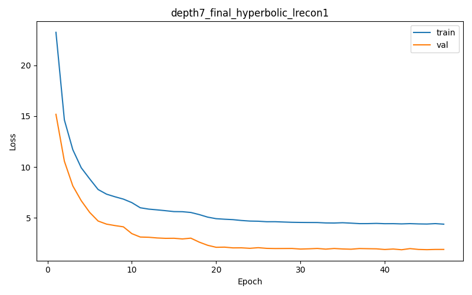

Best validation loss: 1.877002  
Test Recall@4: 0.0051  
Tree-Embedding Correlation: -0.2411  
Synthetic stats: mean_depth=3.6498, std_depth=1.2106, mean_tree_dist=7.4803, std_tree_dist=1.8087, mean_root_purity=0.3989, std_root_purity=0.1362

Sample trajectory (hyperbolic) 1:
  Visit 1: ['C123d0', 'C220d2', 'C322d0', 'C424d1']
  Visit 2: ['C123d0', 'C220d2', 'C322d0', 'C424d1']
  Visit 3: ['C024d0', 'C331d0', 'C401d0', 'C431d2']
  Visit 4: ['C233d0', 'C242d0', 'C312d4', 'C342d0']
  Visit 5: ['C242d0', 'C312d4', 'C321d2', 'C342d0']
  Visit 6: ['C10', 'C233d0', 'C242d0', 'C342d0']

Sample trajectory (hyperbolic) 2:
  Visit 1: ['C233d0', 'C242d0', 'C342d0', 'C424d0']
  Visit 2: ['C303', 'C323d2', 'C331d0', 'C404d1']
  Visit 3: ['C123d0', 'C220d2', 'C322d0', 'C424d1']
  Visit 4: ['C242d0', 'C342d0', 'C433d0']
  Visit 5: ['C322d0', 'C402d4', 'C424d1']
  Visit 6: ['C123d0', 'C220d2', 'C322d0', 'C424d1']

Sample trajectory (hyperbolic) 3:
  Visit 1: ['C242d0', 'C342d0', 'C433d0']
  Visit 2: ['C011d1', 'C100d2', 'C411d1']
  Visit 3: ['C233d0', 'C242d0', 'C321d2', 'C342d0']
  Visit 4: ['C233d0', 'C242d0', 'C321d2', 'C342d0']
  Visit 5: ['C111d1', 'C231d0', 'C321d2', 'C433d4']
  Visit 6: ['C303', 'C123d0', 'C220d2', 'C320d1']

### Experiment depth7_final | depth 7 | hyperbolic | lambda_recon=10.0

Best validation loss: 1.922391  
Test Recall@4: 0.0125  
Tree-Embedding Correlation: -0.2620  
Synthetic stats: mean_depth=3.1753, std_depth=1.1717, mean_tree_dist=6.2169, std_tree_dist=1.4446, mean_root_purity=0.6069, std_root_purity=0.1825

Sample trajectory (hyperbolic) 1:
  Visit 1: ['C034d2', 'C310d3', 'C313d0', 'C420d3']
  Visit 2: ['C304d1', 'C311d0', 'C313d0', 'C320d0']
  Visit 3: ['C424', 'C201d1', 'C210d1']
  Visit 4: ['C304d1', 'C313d0', 'C401d1']
  Visit 5: ['C424', 'C201d1', 'C210d1', 'C414d0']
  Visit 6: ['C424', 'C201d1', 'C210d1', 'C414d0']

Sample trajectory (hyperbolic) 2:
  Visit 1: ['C03', 'C424', 'C201d1']
  Visit 2: ['C424', 'C201d1', 'C210d1', 'C414d0']
  Visit 3: ['C04', 'C121d1', 'C142d1', 'C331d1']
  Visit 4: ['C03', 'C424', 'C201d1', 'C414d0']
  Visit 5: ['C013', 'C010d2', 'C401d1']
  Visit 6: ['C432', 'C304d1', 'C311d0', 'C313d0']

Sample trajectory (hyperbolic) 3:
  Visit 1: ['C210d1', 'C222d1', 'C231d1']
  Visit 2: ['C03', 'C424', 'C210d1', 'C414d0']
  Visit 3: ['C304d1', 'C311d0', 'C313d0', 'C401d1']
  Visit 4: ['C03', 'C424', 'C210d1', 'C414d0']
  Visit 5: ['C03', 'C21', 'C424']
  Visit 6: ['C03', 'C424', 'C210d1', 'C414d0']

### Experiment depth7_final | depth 7 | hyperbolic | lambda_recon=100.0

Best validation loss: 1.964240  
Test Recall@4: 0.0137  
Tree-Embedding Correlation: 0.0583  
Synthetic stats: mean_depth=5.1840, std_depth=1.7607, mean_tree_dist=9.0683, std_tree_dist=3.8531, mean_root_purity=0.5493, std_root_purity=0.1234

Sample trajectory (hyperbolic) 1:
  Visit 1: ['C243', 'C140d0', 'C201d2', 'C300d0']
  Visit 2: ['C111d4', 'C123d3', 'C300d3', 'C324d3']
  Visit 3: ['C233', 'C234d2', 'C422d0']
  Visit 4: ['C111d4', 'C230d3', 'C300d3', 'C410d4']
  Visit 5: ['C111d4', 'C230d3', 'C300d3', 'C420d3']
  Visit 6: ['C233', 'C234d2', 'C422d0']

Sample trajectory (hyperbolic) 2:
  Visit 1: ['C233', 'C234d2', 'C422d0']
  Visit 2: ['C233', 'C234d2', 'C422d0']
  Visit 3: ['C002d3', 'C034d4', 'C134d4', 'C324d3']
  Visit 4: ['C233', 'C234d2', 'C422d0']
  Visit 5: ['C002d3', 'C034d4', 'C340d4', 'C400d3']
  Visit 6: ['C233', 'C234d2', 'C422d0']

Sample trajectory (hyperbolic) 3:
  Visit 1: ['C140d0', 'C201d2', 'C300d0', 'C333d2']
  Visit 2: ['C002d3', 'C032d2', 'C111d4', 'C324d3']
  Visit 3: ['C002d3', 'C034d4', 'C134d4', 'C324d3']
  Visit 4: ['C233', 'C234d2', 'C422d0']
  Visit 5: ['C301', 'C024d0', 'C303d2']
  Visit 6: ['C233', 'C234d2', 'C422d0']

### Experiment depth7_final | depth 7 | hyperbolic | lambda_recon=1000.0
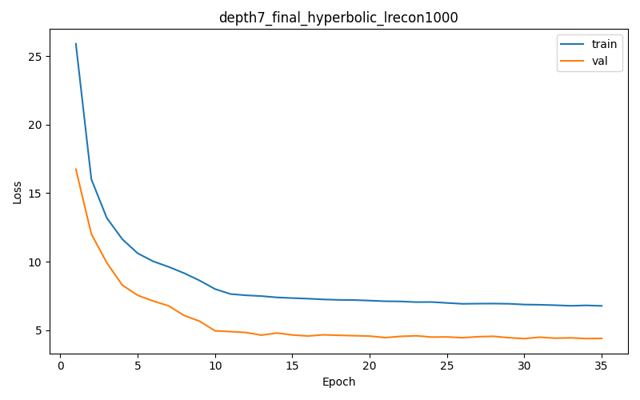

Best validation loss: 4.384935  
Test Recall@4: 0.0617  
Tree-Embedding Correlation: 0.3997  
Synthetic stats: mean_depth=6.1469, std_depth=1.2356, mean_tree_dist=5.9719, std_tree_dist=5.5262, mean_root_purity=0.5666, std_root_purity=0.1308

Sample trajectory (hyperbolic) 1:
  Visit 1: ['C244d3', 'C244d4', 'C303d3', 'C303d4']
  Visit 2: ['C103d4', 'C244d4', 'C312d3', 'C312d4']
  Visit 3: ['C312d3', 'C312d4', 'C424d3', 'C424d4']
  Visit 4: ['C032d2', 'C112d0', 'C134d2']
  Visit 5: ['C331d4', 'C332d4', 'C414d3', 'C414d4']
  Visit 6: ['C103d4', 'C312d3', 'C312d4', 'C330d4']

Sample trajectory (hyperbolic) 2:
  Visit 1: ['C101d3', 'C244d3', 'C244d4', 'C303d4']
  Visit 2: ['C312d3', 'C312d4', 'C424d3', 'C424d4']
  Visit 3: ['C012d3', 'C034d3', 'C213d4', 'C334d3']
  Visit 4: ['C012d3', 'C034d3', 'C401d4']
  Visit 5: ['C114d4', 'C244d3', 'C244d4', 'C312d4']
  Visit 6: ['C312d3', 'C312d4', 'C424d3', 'C424d4']

Sample trajectory (hyperbolic) 3:
  Visit 1: ['C214d3', 'C232d4', 'C413d3', 'C432d4']
  Visit 2: ['C012d3', 'C032d2', 'C034d3']
  Visit 3: ['C332d4', 'C402d3', 'C402d4', 'C414d4']
  Visit 4: ['C143d3', 'C332d3', 'C332d4', 'C440d4']
  Visit 5: ['C114d4', 'C244d3', 'C303d3', 'C303d4']
  Visit 6: ['C312d4', 'C424d3', 'C424d4']

### Experiment depth7_final | depth 7 | hyperbolic | lambda_recon=1800

Best validation loss: 3.964018  
Test Recall@4: 0.3819  
Tree-Embedding Correlation: 0.0571  
Synthetic stats: mean_depth=6.2866, std_depth=0.9593, mean_tree_dist=4.3535, std_tree_dist=5.2050, mean_root_purity=0.5509, std_root_purity=0.1367

Sample trajectory (hyperbolic) 1:
  Visit 1: ['C143d3', 'C143d4', 'C441d3', 'C441d4']
  Visit 2: ['C024d3', 'C231d3', 'C231d4', 'C443d4']
  Visit 3: ['C310d3', 'C310d4', 'C443d3', 'C443d4']
  Visit 4: ['C102d3', 'C112d4', 'C440d3', 'C440d4']
  Visit 5: ['C000d4', 'C122d4', 'C240d3', 'C441d4']
  Visit 6: ['C102d3', 'C213d4', 'C440d3', 'C440d4']

Sample trajectory (hyperbolic) 2:
  Visit 1: ['C022d3', 'C022d4', 'C112d3', 'C112d4']
  Visit 2: ['C310d3', 'C310d4', 'C404d3', 'C404d4']
  Visit 3: ['C320d4', 'C411d4', 'C420d3', 'C420d4']
  Visit 4: ['C213d3', 'C213d4', 'C440d3', 'C440d4']
  Visit 5: ['C213d3', 'C213d4', 'C440d3', 'C440d4']
  Visit 6: ['C102d3', 'C112d4', 'C440d3', 'C440d4']

Sample trajectory (hyperbolic) 3:
  Visit 1: ['C040d0', 'C103d2', 'C401d1']
  Visit 2: ['C102d3', 'C301d3', 'C301d4', 'C440d3']
  Visit 3: ['C024d3', 'C024d4', 'C231d3', 'C231d4']
  Visit 4: ['C031d3', 'C031d4', 'C420d3', 'C420d4']
  Visit 5: ['C031d4', 'C102d3', 'C440d3', 'C440d4']
  Visit 6: ['C320d3', 'C320d4', 'C440d3', 'C440d4']

### Experiment depth7_final | depth 7 | hyperbolic | lambda_recon=2000
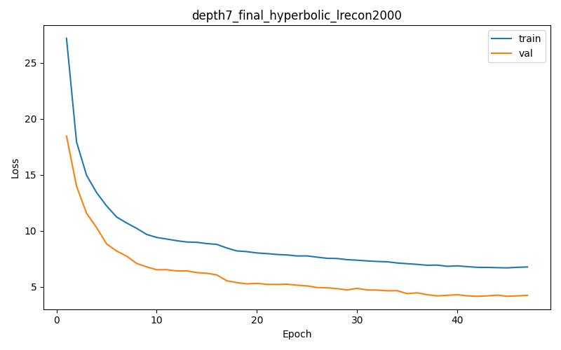

Best validation loss: 4.160874  
Test Recall@4: 0.4096  
Tree-Embedding Correlation: 0.1375  
Synthetic stats: mean_depth=5.2436, std_depth=1.8960, mean_tree_dist=4.2188, std_tree_dist=4.4117, mean_root_purity=0.5246, std_root_purity=0.1329

Sample trajectory (hyperbolic) 1:
  Visit 1: ['C103d3', 'C143d2', 'C330d3', 'C330d4']
  Visit 2: ['C1', 'C244', 'C243d1']
  Visit 3: ['C011d3', 'C033d4', 'C402d3', 'C402d4']
  Visit 4: ['C011d3', 'C011d4', 'C403d3', 'C403d4']
  Visit 5: ['C113d1', 'C212d1', 'C233d0', 'C243d1']
  Visit 6: ['C033d3', 'C033d4', 'C324d3', 'C324d4']

Sample trajectory (hyperbolic) 2:
  Visit 1: ['C103', 'C033d3', 'C324d3', 'C324d4']
  Visit 2: ['C033d4', 'C144d3', 'C144d4', 'C342d4']
  Visit 3: ['C044d3', 'C044d4', 'C103d3', 'C103d4']
  Visit 4: ['C033d3', 'C033d4', 'C324d3', 'C324d4']
  Visit 5: ['C003', 'C231d0', 'C300d1', 'C401d0']
  Visit 6: ['C243d1', 'C302d2', 'C431d0']

Sample trajectory (hyperbolic) 3:
  Visit 1: ['C011d3', 'C033d3', 'C033d4', 'C403d4']
  Visit 2: ['C033d3', 'C033d4', 'C324d3', 'C324d4']
  Visit 3: ['C244', 'C204d1', 'C223d3', 'C223d4']
  Visit 4: ['C130', 'C143d1', 'C231d0', 'C300d1']
  Visit 5: ['C1', 'C212d1', 'C243d1']
  Visit 6: ['C103', 'C214d2', 'C234d0', 'C402d2']

### Experiment depth7_final | depth 7 | hyperbolic | lambda_recon=2200

Best validation loss: 4.579852  
Test Recall@4: 0.4015  
Tree-Embedding Correlation: 0.0963  
Synthetic stats: mean_depth=6.3591, std_depth=0.8415, mean_tree_dist=3.9483, std_tree_dist=5.0059, mean_root_purity=0.5505, std_root_purity=0.1342

Sample trajectory (hyperbolic) 1:
  Visit 1: ['C124d3', 'C124d4', 'C131d3', 'C131d4']
  Visit 2: ['C231d3', 'C231d4', 'C421d3', 'C421d4']
  Visit 3: ['C102d4', 'C301d4', 'C440d3', 'C440d4']
  Visit 4: ['C231d3', 'C231d4', 'C432d3', 'C432d4']
  Visit 5: ['C242d3', 'C242d4', 'C440d3', 'C440d4']
  Visit 6: ['C102d3', 'C102d4', 'C440d3', 'C440d4']

Sample trajectory (hyperbolic) 2:
  Visit 1: ['C202d3', 'C202d4', 'C313d4', 'C411d4']
  Visit 2: ['C024d3', 'C231d3', 'C231d4', 'C300d3']
  Visit 3: ['C021d3', 'C021d4', 'C231d3', 'C231d4']
  Visit 4: ['C102d3', 'C301d3', 'C433d3', 'C440d3']
  Visit 5: ['C102d3', 'C102d4', 'C440d3', 'C440d4']
  Visit 6: ['C024d3', 'C024d4', 'C331d3', 'C331d4']

Sample trajectory (hyperbolic) 3:
  Visit 1: ['C031d4', 'C102d3', 'C440d3', 'C440d4']
  Visit 2: ['C231d3', 'C231d4', 'C432d3', 'C432d4']
  Visit 3: ['C031d4', 'C102d3', 'C440d3', 'C440d4']
  Visit 4: ['C022d3', 'C022d4', 'C031d3', 'C031d4']
  Visit 5: ['C333d3', 'C333d4', 'C444d3', 'C444d4']
  Visit 6: ['C024d3', 'C024d4', 'C443d3', 'C443d4']

### Experiment depth7_final | depth 7 | hyperbolic | lambda_recon=2500
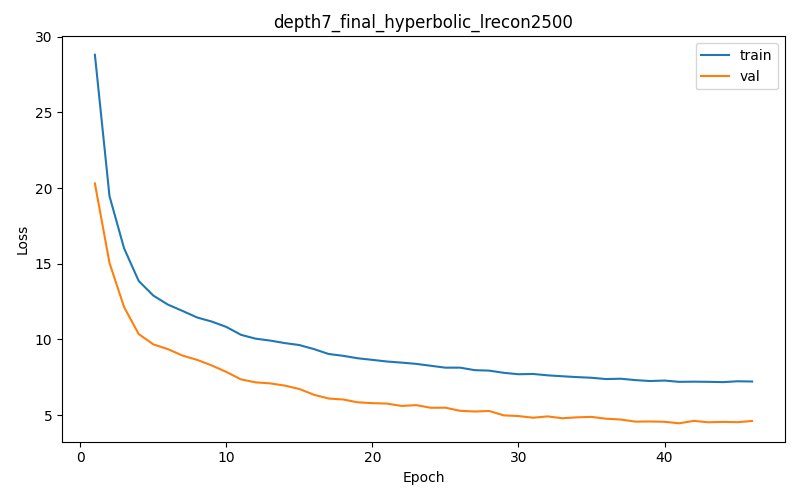

Best validation loss: 4.451853  
Test Recall@4: 0.4611  
Tree-Embedding Correlation: -0.0900  
Synthetic stats: mean_depth=5.4921, std_depth=1.7349, mean_tree_dist=4.0347, std_tree_dist=4.2789, mean_root_purity=0.5372, std_root_purity=0.1318

Sample trajectory (hyperbolic) 1:
  Visit 1: ['C340d3', 'C340d4', 'C441d3', 'C441d4']
  Visit 2: ['C012', 'C021d0', 'C103d4', 'C422d3']
  Visit 3: ['C011d0', 'C222d3', 'C222d4', 'C324d0']
  Visit 4: ['C132', 'C021d0', 'C123d2', 'C332d1']
  Visit 5: ['C111d4', 'C242d3', 'C333d3', 'C444d3']
  Visit 6: ['C200d1', 'C244d2', 'C314d2', 'C322d3']

Sample trajectory (hyperbolic) 2:
  Visit 1: ['C131d3', 'C131d4', 'C202d3', 'C400d4']
  Visit 2: ['C214', 'C244', 'C034d2', 'C221d1']
  Visit 3: ['C300', 'C440', 'C020d1', 'C314d2']
  Visit 4: ['C131d3', 'C131d4', 'C400d3', 'C400d4']
  Visit 5: ['C044d3', 'C130d3', 'C332d1', 'C410d2']
  Visit 6: ['C30', 'C303', 'C034d2', 'C304d1']

Sample trajectory (hyperbolic) 3:
  Visit 1: ['C034d4', 'C131d3', 'C404d3', 'C404d4']
  Visit 2: ['C034d3', 'C034d4', 'C202d3', 'C202d4']
  Visit 3: ['C012', 'C103d4', 'C422d3', 'C422d4']
  Visit 4: ['C011d3', 'C120d3', 'C421d3', 'C421d4']
  Visit 5: ['C123d3', 'C410d3', 'C410d4', 'C432d0']
  Visit 6: ['C202d3', 'C202d4', 'C400d4', 'C421d3']

### Experiment depth7_final | depth 7 | hyperbolic | lambda_recon=3000.0
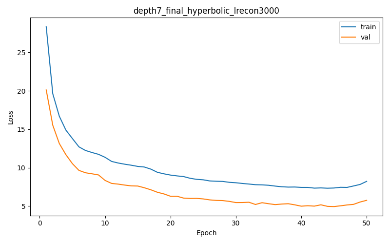

Best validation loss: 4.934151  
Test Recall@4: 0.4835  
Tree-Embedding Correlation: -0.1185  
Synthetic stats: mean_depth=6.1221, std_depth=1.2061, mean_tree_dist=5.2558, std_tree_dist=5.4068, mean_root_purity=0.5872, std_root_purity=0.1733

Sample trajectory (hyperbolic) 1:
  Visit 1: ['C121d4', 'C333d3', 'C333d4', 'C430d4']
  Visit 2: ['C231d3', 'C314d4', 'C443d3', 'C443d4']
  Visit 3: ['C032d3', 'C032d4', 'C443d3', 'C443d4']
  Visit 4: ['C022d3', 'C022d4', 'C442d3', 'C442d4']
  Visit 5: ['C032d3', 'C032d4', 'C040d3', 'C040d4']
  Visit 6: ['C022d3', 'C022d4', 'C112d3', 'C112d4']

Sample trajectory (hyperbolic) 2:
  Visit 1: ['C022d4', 'C114d4', 'C412d3', 'C412d4']
  Visit 2: ['C430d3', 'C430d4', 'C444d3', 'C444d4']
  Visit 3: ['C123d3', 'C123d4', 'C134d4', 'C313d2']
  Visit 4: ['C022d3', 'C022d4', 'C440d3', 'C440d4']
  Visit 5: ['C022d3', 'C022d4', 'C124d3', 'C124d4']
  Visit 6: ['C022d4', 'C112d3', 'C112d4', 'C114d4']

Sample trajectory (hyperbolic) 3:
  Visit 1: ['C031d3', 'C031d4', 'C424d0', 'C434d1']
  Visit 2: ['C102d3', 'C440d3', 'C440d4', 'C442d4']
  Visit 3: ['C021d1', 'C111d3', 'C111d4', 'C334d4']
  Visit 4: ['C041d0', 'C123d4', 'C210d3', 'C210d4']
  Visit 5: ['C022d3', 'C022d4', 'C112d3', 'C112d4']
  Visit 6: ['C102d3', 'C440d3', 'C442d3', 'C442d4']

### Experiment depth7_final | depth 7 | hyperbolic | lambda_recon=4000.0
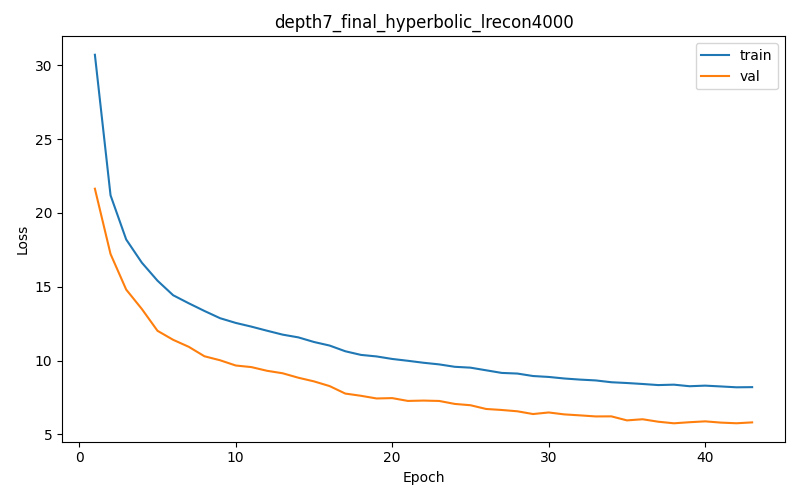

Best validation loss: 5.756914  
Test Recall@4: 0.5059  
Tree-Embedding Correlation: -0.0369  
Synthetic stats: mean_depth=5.4575, std_depth=1.7061, mean_tree_dist=4.9758, std_tree_dist=4.7640, mean_root_purity=0.5583, std_root_purity=0.1502

Sample trajectory (hyperbolic) 1:
  Visit 1: ['C110d3', 'C110d4', 'C134d3', 'C134d4']
  Visit 2: ['C324', 'C044d3', 'C332d1']
  Visit 3: ['C110d3', 'C110d4', 'C323d3', 'C323d4']
  Visit 4: ['C110d4', 'C323d4', 'C443d3', 'C443d4']
  Visit 5: ['C034d4', 'C100d4', 'C321d3', 'C411d4']
  Visit 6: ['C324', 'C044d3', 'C332d1', 'C413d4']

Sample trajectory (hyperbolic) 2:
  Visit 1: ['C324', 'C044d3', 'C044d4', 'C332d1']
  Visit 2: ['C110d3', 'C110d4', 'C323d3', 'C323d4']
  Visit 3: ['C324', 'C332d1', 'C343d2']
  Visit 4: ['C110d3', 'C110d4', 'C323d3', 'C323d4']
  Visit 5: ['C040', 'C110d3', 'C110d4', 'C413d0']
  Visit 6: ['C100d4', 'C110d3', 'C110d4', 'C323d4']

Sample trajectory (hyperbolic) 3:
  Visit 1: ['C232', 'C211d0', 'C323d4', 'C442d3']
  Visit 2: ['C324', 'C044d3', 'C332d2', 'C413d4']
  Visit 3: ['C110d3', 'C110d4', 'C323d3', 'C323d4']
  Visit 4: ['C321d3', 'C323d4', 'C342d3', 'C342d4']
  Visit 5: ['C324', 'C332d1', 'C332d2']
  Visit 6: ['C324', 'C044d3', 'C413d3', 'C413d4']

### Experiment depth7_final | depth 7 | hyperbolic | lambda_recon=5000.0
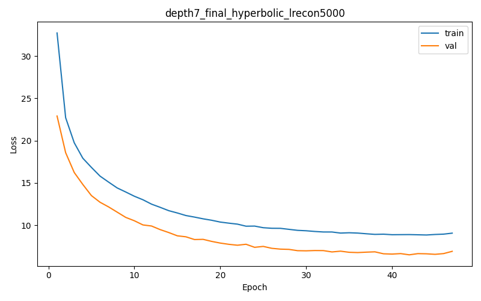

Best validation loss: 6.497522  
Test Recall@4: 0.5283  
Tree-Embedding Correlation: -0.1266  
Synthetic stats: mean_depth=5.7633, std_depth=1.6117, mean_tree_dist=3.4129, std_tree_dist=4.2249, mean_root_purity=0.5346, std_root_purity=0.1228

Sample trajectory (hyperbolic) 1:
  Visit 1: ['C111', 'C202d0', 'C211d2', 'C311d2']
  Visit 2: ['C111d3', 'C111d4', 'C414d3', 'C414d4']
  Visit 3: ['C031d3', 'C031d4', 'C111d3', 'C111d4']
  Visit 4: ['C111d3', 'C111d4', 'C241d3', 'C241d4']
  Visit 5: ['C213d3', 'C213d4', 'C220d3', 'C220d4']
  Visit 6: ['C111d3', 'C111d4', 'C444d3', 'C444d4']

Sample trajectory (hyperbolic) 2:
  Visit 1: ['C111d3', 'C111d4', 'C241d3', 'C241d4']
  Visit 2: ['C111d3', 'C111d4', 'C241d3', 'C241d4']
  Visit 3: ['C0', 'C010d3', 'C010d4', 'C103d4']
  Visit 4: ['C111d3', 'C111d4', 'C444d3', 'C444d4']
  Visit 5: ['C111d3', 'C111d4', 'C444d3', 'C444d4']
  Visit 6: ['C213d3', 'C213d4', 'C233d1', 'C341d3']

Sample trajectory (hyperbolic) 3:
  Visit 1: ['C111d3', 'C111d4', 'C444d3', 'C444d4']
  Visit 2: ['C111d3', 'C111d4', 'C241d3', 'C241d4']
  Visit 3: ['C111', 'C241', 'C121d1', 'C311d2']
  Visit 4: ['C110d0', 'C134d4', 'C213d3', 'C213d4']
  Visit 5: ['C0', 'C120', 'C341d3', 'C341d4']
  Visit 6: ['C111d3', 'C111d4', 'C414d3', 'C414d4']

## Comparison Table
| Depth / Experiment | Source | Embedding | lambda_recon | Mean depth | Depth std | Mean tree dist | Tree dist std | Mean root purity | Root purity std | Corr(tree, emb) | Best val loss | Test Recall@4 |
| --- | --- | --- | --- | --- | --- | --- | --- | --- | --- | --- | --- | --- |
| depth2_final | Real | — | — | 1.6439 | 0.5138 | 2.1206 | 1.2453 | 0.6242 | 0.2040 | — | — | — |
| depth2_final | Synthetic | Euclidean | 1 | 1.6917 | 0.4618 | 2.5391 | 1.1700 | 0.7128 | 0.2471 | -0.0216 | 1.8321 | 0.0672 |
| depth2_final | Synthetic | Euclidean | 10 | 1.3805 | 0.4872 | 1.8120 | 0.6290 | 0.4133 | 0.1548 | 0.0488 | 1.8745 | 0.2493 |
| depth2_final | Synthetic | Euclidean | 100 | 1.7430 | 0.4483 | 2.6803 | 1.2199 | 0.4926 | 0.1494 | -0.0155 | 2.0305 | 0.8702 |
| depth2_final | Synthetic | Euclidean | 1000 | 1.6424 | 0.5588 | 2.8897 | 1.0498 | 0.5012 | 0.1524 | 0.0527 | 2.4395 | 0.9227 |
| depth2_final | Synthetic | Hyperbolic | 1 | 1.8545 | 0.3551 | 3.8368 | 0.5690 | 0.4934 | 0.0671 | 0.0913 | 1.9793 | 0.0549 |
| depth2_final | Synthetic | Hyperbolic | 10 | 1.3006 | 0.6608 | 2.8233 | 0.9319 | 0.4627 | 0.1368 | -0.3309 | 2.8704 | 0.0516 |
| depth2_final | Synthetic | Hyperbolic | 100 | 1.1557 | 0.3678 | 1.9694 | 0.7683 | 0.5440 | 0.1790 | -0.0071 | 2.4156 | 0.1587 |
| depth2_final | Synthetic | Hyperbolic | 1000 | 1.8124 | 0.3994 | 1.9616 | 1.1097 | 0.6600 | 0.1985 | 0.5987 | 5.2825 | 0.5962 |
| depth2_final | Synthetic | Hyperbolic | 2000 | 1.8036 | 0.5111 | 2.1903 | 1.1438 | 0.5951 | 0.1734 | 0.6206 | 8.6071 | 0.5919 |
| depth2_final | Synthetic | Hyperbolic | 3000 | 1.8162 | 0.4106 | 1.7415 | 0.9391 | 0.6586 | 0.1799 | 0.6204 | 12.0129 | 0.5743 |
| depth7_final | Real | — | — | 5.3745 | 1.7323 | 5.7619 | 4.7536 | 0.6273 | 0.2051 | — | — | — |
| depth7_final | Synthetic | Euclidean | 1 | 5.4627 | 1.5877 | 7.2343 | 4.8878 | 0.5231 | 0.1190 | 0.0303 | 2.9355 | 0.0098 |
| depth7_final | Synthetic | Euclidean | 10 | 5.3407 | 1.9723 | 7.9726 | 4.7473 | 0.5426 | 0.1404 | -0.0285 | 2.8660 | 0.0111 |
| depth7_final | Synthetic | Euclidean | 100 | 5.7362 | 1.8264 | 1.4805 | 2.3376 | 0.5032 | 0.0358 | 0.0109 | 3.0084 | 0.0296 |
| depth7_final | Synthetic | Euclidean | 1000 | 4.6039 | 1.5346 | 8.8476 | 2.4226 | 0.5306 | 0.1438 | -0.0076 | 3.8880 | 0.4498 |
| depth7_final | Synthetic | Hyperbolic | 1 | 3.6498 | 1.2106 | 7.4803 | 1.8087 | 0.3989 | 0.1362 | -0.2411 | 1.8770 | 0.0051 |
| depth7_final | Synthetic | Hyperbolic | 10 | 3.1753 | 1.1717 | 6.2169 | 1.4446 | 0.6069 | 0.1825 | -0.2620 | 1.9224 | 0.0125 |
| depth7_final | Synthetic | Hyperbolic | 100 | 5.1840 | 1.7607 | 9.0683 | 3.8531 | 0.5493 | 0.1234 | 0.0583 | 1.9642 | 0.0137 |
| depth7_final | Synthetic | Hyperbolic | 1000 | 6.1469 | 1.2356 | 5.9719 | 5.5262 | 0.5666 | 0.1308 | 0.3997 | 4.3849 | 0.0617 |
| depth7_final | Synthetic | Hyperbolic | 1800 | 6.2866 | 0.9593 | 4.3535 | 5.2050 | 0.5509 | 0.1367 | 0.0571 | 3.9640 | 0.3819 |
| depth7_final | Synthetic | Hyperbolic | 2000 | 5.2436 | 1.8960 | 4.2188 | 4.4117 | 0.5246 | 0.1329 | 0.1375 | 4.1609 | 0.4096 |
| depth7_final | Synthetic | Hyperbolic | 2200 | 6.3591 | 0.8415 | 3.9483 | 5.0059 | 0.5505 | 0.1342 | 0.0963 | 4.5799 | 0.4015 |
| depth7_final | Synthetic | Hyperbolic | 2500 | 5.4921 | 1.7349 | 4.0347 | 4.2789 | 0.5372 | 0.1318 | -0.0900 | 4.4519 | 0.4611 |
| depth7_final | Synthetic | Hyperbolic | 3000 | 6.1221 | 1.2061 | 5.2558 | 5.4068 | 0.5872 | 0.1733 | -0.1185 | 4.9342 | 0.4835 |
| depth7_final | Synthetic | Hyperbolic | 4000 | 5.4575 | 1.7061 | 4.9758 | 4.7640 | 0.5583 | 0.1502 | -0.0369 | 5.7569 | 0.5059 |
| depth7_final | Synthetic | Hyperbolic | 5000 | 5.7633 | 1.6117 | 3.4129 | 4.2249 | 0.5346 | 0.1228 | -0.1266 | 6.4975 | 0.5283 |

## Results
These experiments apply the rectified-flow training loop in `src/train_rectified_flow.py` (depth2_final) and the deeper variant `src/train_rectified_flow2.py` (depth7_final). Each script couples a visit encoder/decoder with a rectified-flow velocity model, optimizes the sum of flow and reconstruction losses (weighted by `lambda_recon`), and reports Recall@4 plus the correlation between ICD tree distances and learned embedding distances.

On depth2_final, Euclidean runs respond strongly to reconstruction pressure—Recall@4 jumps from 0.07 to 0.92 as `lambda_recon` increases from 1 to 1000—but their tree/embedding correlations stay near zero. Hyperbolic models behave differently: moderate weights (10–100) compress trajectories toward the root and even produce negative correlations, yet very large weights (1000–3000) recover high correlation (~0.62) while keeping Recall@4 around 0.58. These large-λ hyperbolic models are the only ones that track the real hierarchy without introducing auxiliary regularizers.

Depth7_final highlights how quickly Euclidean embeddings deteriorate with hierarchy depth. Even with `lambda_recon=1000`, Recall@4 stalls at 0.45 and correlations hover around zero; the high-λ Euclidean models collapse most visits onto a handful of codes. Hyperbolic runs remain stable but show a trade-off: small λ (1–100) maintain reasonable depth coverage but low correlation, whereas very large weights (1800–2500) push Recall@4 past 0.38 and gradually increase correlation, at the cost of overshooting visit depth and inflating tree-distance variance. None of the rectified-flow settings match the strong tree alignment we previously observed with the diffusion-based `train_toy_withDecHypNoise.py` regularizer, underscoring that rectified flows alone struggle to encode long-range structure in deep taxonomies.

Overall, these tables reinforce three takeaways: (1) increasing `lambda_recon` primarily improves reconstruction accuracy, not hierarchical fidelity; (2) Euclidean embeddings fail dramatically as the depth of the ICD tree grows; and (3) hyperbolic embeddings are necessary but not sufficient—high-λ rectified flows can approximate the hierarchy, yet additional geometric regularization (as in the diffusion + decoder-noise pipeline) is still required for consistent structure preservation.
