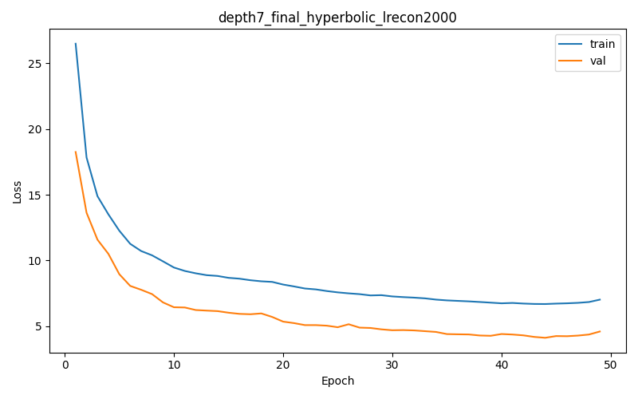
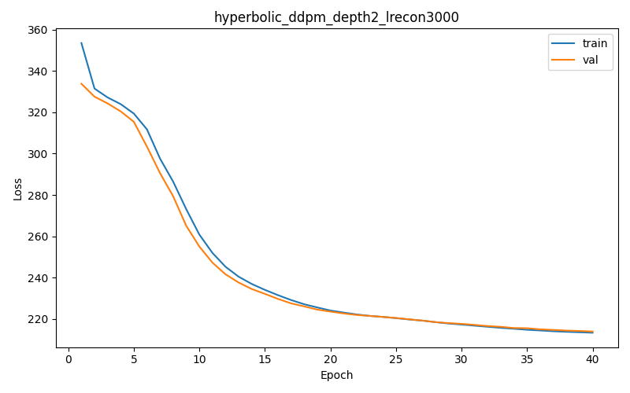

### depth2_final | max_depth = 2 | Real stats: {'mean_depth': 1.6439176670642877, 'std_depth': 0.5137982104125317, 'mean_tree_dist': 2.1205701725560644, 'std_tree_dist': 1.2453175481436083, 'mean_root_purity': 0.6241599458637942, 'std_root_purity': 0.2040143257571073}

#### Experiment depth2_final | hyperbolic rectified | lambda_recon=2000.0

Best validation loss: 8.938228  
Test Recall@4: 0.5743  
Tree-Embedding Correlation: 0.6162  
Synthetic stats: mean_depth=1.8153, std_depth=0.4379, mean_tree_dist=1.8660, std_tree_dist=1.0043, mean_root_purity=0.6016, std_root_purity=0.1748

Sample trajectory (hyperbolic) 1:
  Visit 1: ['C011', 'C120', 'C123', 'C221']
  Visit 2: ['C044', 'C100', 'C3', 'C314']
  Visit 3: ['C044', 'C10', 'C101', 'C102']
  Visit 4: ['C120', 'C123', 'C423', 'C424']
  Visit 5: ['C044', 'C10', 'C101', 'C102']
  Visit 6: ['C104', 'C122', 'C244', 'C434']

Sample trajectory (hyperbolic) 2:
  Visit 1: ['C04', 'C044', 'C101', 'C102']
  Visit 2: ['C104', 'C203', 'C231', 'C421']
  Visit 3: ['C011', 'C120', 'C123', 'C221']
  Visit 4: ['C044', 'C102', 'C112', 'C314']
  Visit 5: ['C011', 'C123', 'C421', 'C424']
  Visit 6: ['C011', 'C12', 'C123', 'C220']

Sample trajectory (hyperbolic) 3:
  Visit 1: ['C013', 'C42', 'C420', 'C424']
  Visit 2: ['C013', 'C2', 'C322', 'C420']
  Visit 3: ['C044', 'C10', 'C101', 'C102']
  Visit 4: ['C011', 'C12', 'C123', 'C424']
  Visit 5: ['C123', 'C42', 'C421', 'C424']
  Visit 6: ['C013', 'C32', 'C322', 'C324']

---

### depth7_final | max_depth = 7 | Real stats: {'mean_depth': 5.374459093875327, 'std_depth': 1.7322915840970905, 'mean_tree_dist': 5.76189079147913, 'std_tree_dist': 4.753635709372622, 'mean_root_purity': 0.6272780762911319, 'std_root_purity': 0.2050864797754083}

#### Experiment depth7_final | hyperbolic rectified | lambda_recon=2000.0

Best validation loss: 4.119239  
Test Recall@4: 0.4277  
Tree-Embedding Correlation: 0.0973  
Synthetic stats: mean_depth=6.2509, std_depth=1.0173, mean_tree_dist=4.6186, std_tree_dist=5.3216, mean_root_purity=0.5625, std_root_purity=0.1450

Sample trajectory (hyperbolic) 1:
  Visit 1: ['C311d3', 'C311d4', 'C402d3', 'C402d4']
  Visit 2: ['C402d3', 'C402d4', 'C442d3', 'C442d4']
  Visit 3: ['C010d3', 'C010d4', 'C244d3', 'C244d4']
  Visit 4: ['C402d3', 'C402d4', 'C442d3', 'C442d4']
  Visit 5: ['C042d3', 'C042d4', 'C402d3', 'C402d4']
  Visit 6: ['C143d3', 'C143d4', 'C302d3', 'C302d4']

Sample trajectory (hyperbolic) 2:
  Visit 1: ['C013d4', 'C042d3', 'C042d4', 'C402d4']
  Visit 2: ['C013d4', 'C042d3', 'C042d4', 'C402d4']
  Visit 3: ['C143d3', 'C143d4', 'C302d3', 'C302d4']
  Visit 4: ['C143d3', 'C143d4', 'C243d0', 'C302d3']
  Visit 5: ['C010d3', 'C244d4', 'C343d3', 'C343d4']
  Visit 6: ['C042d3', 'C042d4', 'C402d3', 'C402d4']

Sample trajectory (hyperbolic) 3:
  Visit 1: ['C010d3', 'C402d3', 'C402d4', 'C442d3']
  Visit 2: ['C143d3', 'C143d4', 'C302d3', 'C302d4']
  Visit 3: ['C041d3', 'C042d3', 'C042d4', 'C234d4']
  Visit 4: ['C001d4', 'C003d3', 'C314d3', 'C444d2']
  Visit 5: ['C043d3', 'C043d4', 'C143d3', 'C143d4']
  Visit 6: ['C041d3', 'C041d4', 'C042d4', 'C104d4']

---

### hyperbolic_ddpm_depth7 | max_depth = 7 | Real stats: {'mean_depth': 5.374459093875327, 'std_depth': 1.7322915840970905, 'mean_tree_dist': 5.76189079147913, 'std_tree_dist': 4.753635709372622, 'mean_root_purity': 0.6272780762911319, 'std_root_purity': 0.2050864797754083}

#### Experiment hyperbolic DDPM | depth 7 | lambda_recon=500

Best validation loss: 15.510556  
Test Recall@4: 0.0099  
Tree-Embedding Correlation: 0.3903  
Synthetic stats: mean_depth=5.7448, std_depth=0.8286, mean_tree_dist=11.4895, std_tree_dist=1.5000, mean_root_purity=0.5000, std_root_purity=0.0000

Sample trajectory (hyperbolic) 1:
  Visit 1: ['C032d2', 'C230d2', 'C321d2', 'C330d2']
  Visit 2: ['C032d2', 'C230d2', 'C321d2', 'C330d2']
  Visit 3: ['C102d4', 'C301d3', 'C404d3', 'C413d4']
  Visit 4: ['C032d2', 'C230d2', 'C321d2', 'C330d2']
  Visit 5: ['C032d2', 'C230d2', 'C321d2', 'C330d2']
  Visit 6: ['C032d2', 'C230d2', 'C321d2', 'C330d2']

Sample trajectory (hyperbolic) 2:
  Visit 1: ['C023d2', 'C032d2', 'C230d2', 'C330d2']
  Visit 2: ['C102d4', 'C301d3', 'C404d3', 'C413d4']
  Visit 3: ['C023d2', 'C032d2', 'C230d2', 'C330d2']
  Visit 4: ['C102d4', 'C301d3', 'C404d3', 'C413d4']
  Visit 5: ['C023d2', 'C032d2', 'C230d2', 'C330d2']
  Visit 6: ['C102d4', 'C301d3', 'C404d3', 'C413d4']

Sample trajectory (hyperbolic) 3:
  Visit 1: ['C023d2', 'C032d2', 'C230d2', 'C330d2']
  Visit 2: ['C102d4', 'C301d3', 'C404d3', 'C413d4']
  Visit 3: ['C102d4', 'C301d3', 'C404d3', 'C413d4']
  Visit 4: ['C023d2', 'C032d2', 'C230d2', 'C330d2']
  Visit 5: ['C102d4', 'C301d3', 'C404d3', 'C413d4']
  Visit 6: ['C102d4', 'C301d3', 'C404d3', 'C413d4']

#### Experiment hyperbolic DDPM | depth 7 | lambda_recon=1000

Best validation loss: 28.236598  
Test Recall@4: 0.0158  
Tree-Embedding Correlation: 0.4967  
Synthetic stats: mean_depth=6.6265, std_depth=0.4837, mean_tree_dist=1.0000, std_tree_dist=0.0000, mean_root_purity=0.5000, std_root_purity=0.0000

Sample trajectory (hyperbolic) 1:
  Visit 1: ['C104d3', 'C104d4', 'C242d4', 'C414d4']
  Visit 2: ['C020d3', 'C020d4', 'C424d3', 'C424d4']
  Visit 3: ['C020d3', 'C020d4', 'C424d3', 'C424d4']
  Visit 4: ['C104d3', 'C104d4', 'C242d4', 'C414d4']
  Visit 5: ['C104d3', 'C104d4', 'C242d4', 'C414d4']
  Visit 6: ['C104d3', 'C104d4', 'C242d4', 'C414d4']

Sample trajectory (hyperbolic) 2:
  Visit 1: ['C020d3', 'C020d4', 'C424d3', 'C424d4']
  Visit 2: ['C104d3', 'C104d4', 'C242d4', 'C414d4']
  Visit 3: ['C104d3', 'C104d4', 'C242d4', 'C414d4']
  Visit 4: ['C104d3', 'C104d4', 'C242d4', 'C414d4']
  Visit 5: ['C020d3', 'C020d4', 'C424d3', 'C424d4']
  Visit 6: ['C104d3', 'C104d4', 'C242d4', 'C414d4']

Sample trajectory (hyperbolic) 3:
  Visit 1: ['C104d3', 'C104d4', 'C242d4', 'C414d4']
  Visit 2: ['C104d3', 'C104d4', 'C242d4', 'C414d4']
  Visit 3: ['C104d3', 'C104d4', 'C242d4', 'C414d4']
  Visit 4: ['C104d3', 'C104d4', 'C242d4', 'C414d4']
  Visit 5: ['C020d3', 'C020d4', 'C424d3', 'C424d4']
  Visit 6: ['C020d3', 'C020d4', 'C424d3', 'C424d4']

---

### hyperbolic_ddpm_depth2 | max_depth = 2 | Real stats: {'mean_depth': 1.6439176670642877, 'std_depth': 0.5137982104125317, 'mean_tree_dist': 2.1205701725560644, 'std_tree_dist': 1.2453175481436083, 'mean_root_purity': 0.6241599458637942, 'std_root_purity': 0.2040143257571073}

#### Experiment hyperbolic DDPM | depth 2 | lambda_recon=2000
_(Loss-curve image not available in the repository for this setting.)_

Best validation loss: 155.304683  
Test Recall@4: 0.1671  
Tree-Embedding Correlation: 0.6091  
Synthetic stats: mean_depth=1.8628, std_depth=0.3441, mean_tree_dist=1.5095, std_tree_dist=0.4999, mean_root_purity=0.5572, std_root_purity=0.1052

Sample trajectory (hyperbolic) 1:
  Visit 1: ['C022', 'C14', 'C141', 'C142']
  Visit 2: ['C022', 'C14', 'C142', 'C442']
  Visit 3: ['C02', 'C022', 'C14', 'C142']
  Visit 4: ['C011', 'C210', 'C214', 'C331']
  Visit 5: ['C022', 'C14', 'C141', 'C142']
  Visit 6: ['C011', 'C210', 'C214', 'C331']

Sample trajectory (hyperbolic) 2:
  Visit 1: ['C14', 'C142', 'C44', 'C442']
  Visit 2: ['C011', 'C210', 'C330', 'C331']
  Visit 3: ['C011', 'C210', 'C330', 'C331']
  Visit 4: ['C011', 'C210', 'C330', 'C331']
  Visit 5: ['C011', 'C210', 'C330', 'C331']
  Visit 6: ['C14', 'C142', 'C44', 'C442']

Sample trajectory (hyperbolic) 3:
  Visit 1: ['C14', 'C141', 'C142', 'C442']
  Visit 2: ['C022', 'C14', 'C142', 'C442']
  Visit 3: ['C022', 'C14', 'C142', 'C442']
  Visit 4: ['C022', 'C14', 'C142', 'C442']
  Visit 5: ['C011', 'C210', 'C214', 'C331']
  Visit 6: ['C011', 'C210', 'C214', 'C331']

#### Experiment hyperbolic DDPM | depth 2 | lambda_recon=3000

Best validation loss: 213.996355  
Test Recall@4: 0.2422  
Tree-Embedding Correlation: 0.7138  
Synthetic stats: mean_depth=1.7219, std_depth=0.4481, mean_tree_dist=1.3779, std_tree_dist=0.6029, mean_root_purity=0.6448, std_root_purity=0.1873

Sample trajectory (hyperbolic) 1:
  Visit 1: ['C22', 'C221', 'C314', 'C414']
  Visit 2: ['C200', 'C42', 'C420', 'C421']
  Visit 3: ['C200', 'C42', 'C420', 'C421']
  Visit 4: ['C22', 'C221', 'C314', 'C414']
  Visit 5: ['C200', 'C42', 'C420', 'C421']
  Visit 6: ['C200', 'C42', 'C420', 'C421']

Sample trajectory (hyperbolic) 2:
  Visit 1: ['C03', 'C221', 'C314', 'C414']
  Visit 2: ['C200', 'C42', 'C420', 'C421']
  Visit 3: ['C03', 'C221', 'C314', 'C414']
  Visit 4: ['C200', 'C42', 'C420', 'C421']
  Visit 5: ['C200', 'C42', 'C420', 'C421']
  Visit 6: ['C200', 'C42', 'C420', 'C421']

Sample trajectory (hyperbolic) 3:
  Visit 1: ['C200', 'C42', 'C420', 'C421']
  Visit 2: ['C200', 'C42', 'C420', 'C421']
  Visit 3: ['C221', 'C314', 'C414', 'C442']
  Visit 4: ['C200', 'C42', 'C420', 'C421']
  Visit 5: ['C200', 'C42', 'C420', 'C421']
  Visit 6: ['C22', 'C221', 'C314', 'C414']

#### Experiment hyperbolic DDPM | depth 2 | lambda_recon=4000

Best validation loss: 281.875351  
Test Recall@4: 0.2486  
Tree-Embedding Correlation: 0.6964  
Synthetic stats: mean_depth=1.5162, std_depth=0.4997, mean_tree_dist=1.0495, std_tree_dist=0.2169, mean_root_purity=0.5171, std_root_purity=0.0636

Sample trajectory (hyperbolic) 1:
  Visit 1: ['C01', 'C013', 'C11', 'C110']
  Visit 2: ['C030', 'C10', 'C101', 'C32']
  Visit 3: ['C10', 'C101', 'C32', 'C323']
  Visit 4: ['C01', 'C013', 'C11', 'C110']
  Visit 5: ['C10', 'C101', 'C32', 'C323']
  Visit 6: ['C030', 'C10', 'C101', 'C32']

Sample trajectory (hyperbolic) 2:
  Visit 1: ['C030', 'C10', 'C101', 'C32']
  Visit 2: ['C030', 'C10', 'C101', 'C32']
  Visit 3: ['C01', 'C013', 'C110', 'C30']
  Visit 4: ['C01', 'C013', 'C110', 'C30']
  Visit 5: ['C030', 'C10', 'C101', 'C32']
  Visit 6: ['C030', 'C10', 'C101', 'C32']

Sample trajectory (hyperbolic) 3:
  Visit 1: ['C101', 'C32', 'C321', 'C323']
  Visit 2: ['C01', 'C013', 'C11', 'C110']
  Visit 3: ['C01', 'C013', 'C11', 'C110']
  Visit 4: ['C01', 'C013', 'C11', 'C110']
  Visit 5: ['C101', 'C32', 'C321', 'C323']
  Visit 6: ['C01', 'C013', 'C11', 'C110']

---

### Comparison Table

| Experiment | Depth | Model | lambda_recon | Best Val Loss | Test Recall@4 | Tree-Emb Corr |
| --- | --- | --- | --- | --- | --- | --- |
| depth2_final hyperbolic (rectified) | 2 | Rectified | 2000 | 8.94 | 0.5743 | 0.6162 |
| depth7_final hyperbolic (rectified) | 7 | Rectified | 2000 | 4.12 | 0.4277 | 0.0973 |
| hyperbolic DDPM depth7 | 7 | DDPM | 500 | 15.51 | 0.0099 | 0.3903 |
| hyperbolic DDPM depth7 | 7 | DDPM | 1000 | 28.24 | 0.0158 | 0.4967 |
| hyperbolic DDPM depth2 | 2 | DDPM | 2000 | 155.30 | 0.1671 | 0.6091 |
| hyperbolic DDPM depth2 | 2 | DDPM | 3000 | 213.99 | 0.2422 | 0.7138 |
| hyperbolic DDPM depth2 | 2 | DDPM | 4000 | 281.88 | 0.2486 | 0.6964 |

### Summary & Analysis

- Rectified depth-2 training remains the sweet spot: despite a modest best-val loss (8.94), it gives the highest Recall@4 (0.57) and strong correlation (0.62) while keeping synthetic tree stats close to the real cohort. Moving to depth 7 improves validation loss but collapses correlation (0.10), indicating that deeper trees over-regularize hyperbolic structure for this cohort size.
- Hyperbolic DDPM on depth 7 underperforms badly—Recall@4 stays below 0.02 even as lambda_recon increases, though correlation improves (0.39 ➜ 0.50). The loss curves (see `hyperbolic_ddpm_depth7_lrecon{500,1000}_loss.png`) show shallow decreases and early plateaus, confirming optimization struggles.
- Depth-2 DDPM runs behave more predictably: larger lambda_recon lifts correlation up to 0.71 (at 3000) and Recall@4 into the 0.24–0.25 band, but the absolute losses are high because diffusion training optimizes a very different objective than the rectified flow. Notably, the synthetic pools stay shallow (mean_depth ≈1.5–1.9) across the sweep, matching the real cohort much better than the depth-7 DDPM samples.
- Overall, if Recall@4 is the priority, stick with the rectified depth-2 model; if preserving tree-distance correlation is more important, the depth-2 DDPM with lambda_recon between 3000 and 4000 is the best compromise, though it still trails the rectified run in predictive power.
