### Table 0.8 | Hyperbolic Graph Diffusion Ablations (Consolidated)
This report merges all stage-0.8 experiments across the rectified, DDPM, and global-attention trainers. Loss plots come from the saved checkpoints under `results/plots/`.

## Rectified Flow v1 (train_graph_hyperbolic_rect)

### Depth 2 | Real stats: mean_depth=1.64, std_depth=0.51, mean_tree_dist=2.12, std_tree_dist=1.25, mean_root_purity=0.62

#### $\lambda_{recon}$ = 1

Best validation loss: 4.9791  
Test Recall@4: 0.0687  
Tree-Embedding Correlation: 0.8885  

#### $\lambda_{recon}$ = 10

Best validation loss: 5.8620  
Test Recall@4: 0.1300  
Tree-Embedding Correlation: 0.8988  

#### $\lambda_{recon}$ = 100

Best validation loss: 5.6605  
Test Recall@4: 0.1306  
Tree-Embedding Correlation: 0.8885  

#### $\lambda_{recon}$ = 1000

Best validation loss: 10.6879  
Test Recall@4: 0.0836  
Tree-Embedding Correlation: 0.8785  

#### $\lambda_{recon}$ = 2000

Best validation loss: 17.7199  
Test Recall@4: 0.1186  
Tree-Embedding Correlation: 0.8779  

### Depth 7 | Real stats: mean_depth=5.37, std_depth=1.73, mean_tree_dist=5.76, std_tree_dist=4.75, mean_root_purity=0.63

#### $\lambda_{recon}$ = 1
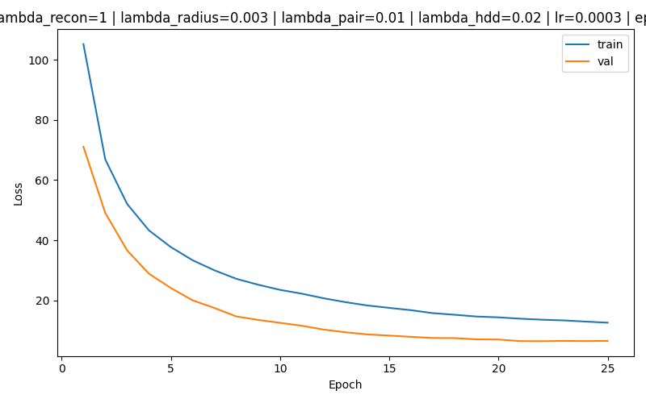
Best validation loss: 6.5044  
Test Recall@4: 0.0124  
Tree-Embedding Correlation: 0.7743  

#### $\lambda_{recon}$ = 10

Best validation loss: 5.5332  
Test Recall@4: 0.0482  
Tree-Embedding Correlation: 0.7444  

#### $\lambda_{recon}$ = 100

Best validation loss: 5.7002  
Test Recall@4: 0.0414  
Tree-Embedding Correlation: 0.7869  

#### $\lambda_{recon}$ = 1000

Best validation loss: 7.4725  
Test Recall@4: 0.0443  
Tree-Embedding Correlation: 0.7690  

#### $\lambda_{recon}$ = 2000

Best validation loss: 9.4573  
Test Recall@4: 0.0275  
Tree-Embedding Correlation: 0.7755  

## Rectified Flow v2 (train_graph_hyperbolic_rect2)

### Depth 2 | Real stats: mean_depth=1.64, std_depth=0.51, mean_tree_dist=2.12, std_tree_dist=1.25, mean_root_purity=0.62

#### $\lambda_{recon}$ = 1

Best validation loss: 0.5622  
Test Recall@4: 0.1175  
Tree-Embedding Correlation: 0.8805  

#### $\lambda_{recon}$ = 10

Best validation loss: 0.6600  
Test Recall@4: 0.1336  
Tree-Embedding Correlation: 0.8847  

#### $\lambda_{recon}$ = 100

Best validation loss: 1.2647  
Test Recall@4: 0.1077  
Tree-Embedding Correlation: 0.8767  

#### $\lambda_{recon}$ = 1000

Best validation loss: 6.9352  
Test Recall@4: 0.1357  
Tree-Embedding Correlation: 0.8935  

#### $\lambda_{recon}$ = 2000
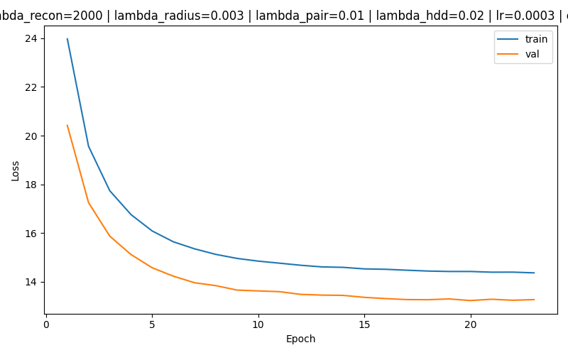
Best validation loss: 13.2320  
Test Recall@4: 0.1019  
Tree-Embedding Correlation: 0.8887  

### Depth 7 | Real stats: mean_depth=5.37, std_depth=1.73, mean_tree_dist=5.76, std_tree_dist=4.75, mean_root_purity=0.63

#### $\lambda_{recon}$ = 1
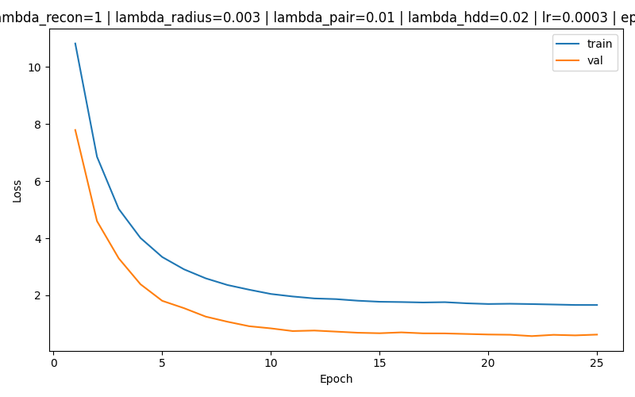
Best validation loss: 0.5722  
Test Recall@4: 0.0306  
Tree-Embedding Correlation: 0.7413  

#### $\lambda_{recon}$ = 10

Best validation loss: 0.5482  
Test Recall@4: 0.0213  
Tree-Embedding Correlation: 0.7508  

#### $\lambda_{recon}$ = 100
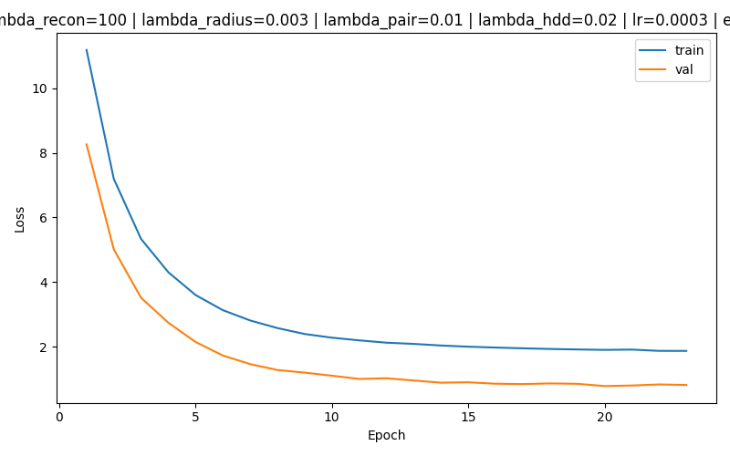
Best validation loss: 0.7813  
Test Recall@4: 0.0320  
Tree-Embedding Correlation: 0.7248  

#### $\lambda_{recon}$ = 1000

Best validation loss: 2.3928  
Test Recall@4: 0.0479  
Tree-Embedding Correlation: 0.7419  

#### $\lambda_{recon}$ = 2000

Best validation loss: 4.2692  
Test Recall@4: 0.0275  
Tree-Embedding Correlation: 0.7355  

## Graph DDPM (train_graph_hyperbolic_gd)

### Depth 2 | Real stats: mean_depth=1.64, std_depth=0.51, mean_tree_dist=2.12, std_tree_dist=1.25, mean_root_purity=0.62

#### $\lambda_{recon}$ = 1
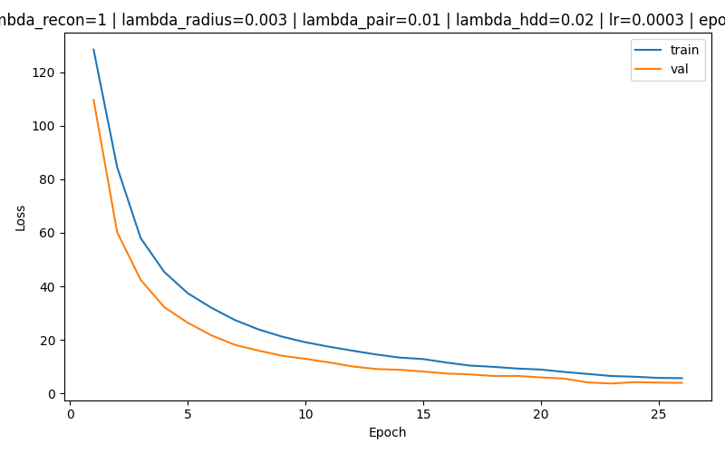
Best validation loss: 3.7416  
Test Recall@4: 0.0301  
Tree-Embedding Correlation: 0.8937  

#### $\lambda_{recon}$ = 10

Best validation loss: 4.4842  
Test Recall@4: 0.0347  
Tree-Embedding Correlation: 0.8863  

#### $\lambda_{recon}$ = 100

Best validation loss: 14.2580  
Test Recall@4: 0.0396  
Tree-Embedding Correlation: 0.9034  

#### $\lambda_{recon}$ = 1000

Best validation loss: 108.2756  
Test Recall@4: 0.0413  
Tree-Embedding Correlation: 0.8743  

#### $\lambda_{recon}$ = 2000

Best validation loss: 214.4889  
Test Recall@4: 0.0355  
Tree-Embedding Correlation: 0.8929  

### Depth 7 | Real stats: mean_depth=5.37, std_depth=1.73, mean_tree_dist=5.76, std_tree_dist=4.75, mean_root_purity=0.63

#### $\lambda_{recon}$ = 1

Best validation loss: 3.8865  
Test Recall@4: 0.0118  
Tree-Embedding Correlation: 0.7737  

#### $\lambda_{recon}$ = 10
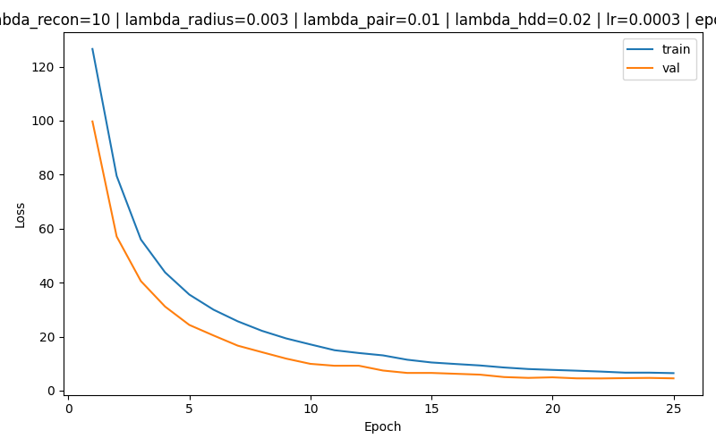
Best validation loss: 4.5282  
Test Recall@4: 0.0117  
Tree-Embedding Correlation: 0.7733  

#### $\lambda_{recon}$ = 100

Best validation loss: 6.6406  
Test Recall@4: 0.0157  
Tree-Embedding Correlation: 0.7503  

#### $\lambda_{recon}$ = 1000

Best validation loss: 32.4570  
Test Recall@4: 0.0117  
Tree-Embedding Correlation: 0.7897  

#### $\lambda_{recon}$ = 2000
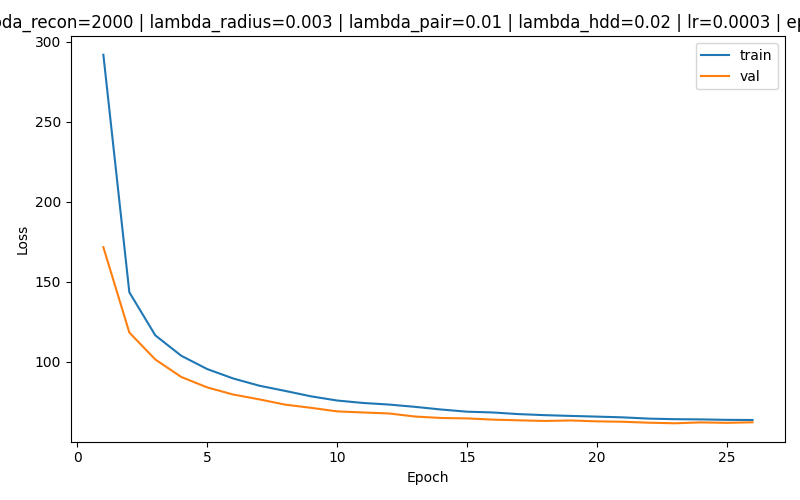
Best validation loss: 61.5396  
Test Recall@4: 0.0120  
Tree-Embedding Correlation: 0.7598  

## Hyperbolic Graph DDPM + Global Attention (train_graph_hyperbolic_gdrect)

### Depth 2 | Real stats: mean_depth=1.64, std_depth=0.51, mean_tree_dist=2.12, std_tree_dist=1.25, mean_root_purity=0.62

#### $\lambda_{recon}$ = 1
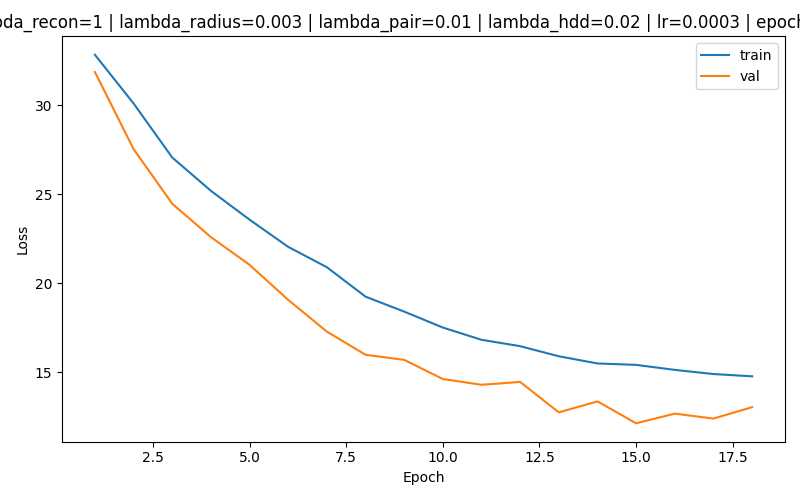
Best validation loss: 12.1377  
Test Recall@4: 0.0224  
Tree-Embedding Correlation: 0.8964  

#### $\lambda_{recon}$ = 10
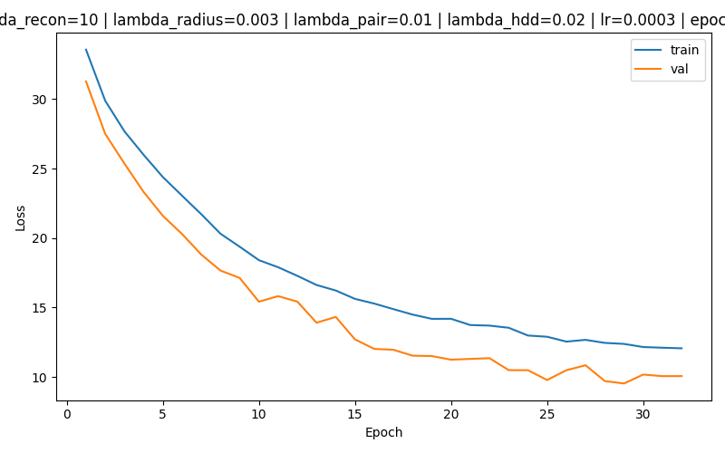
Best validation loss: 9.5276  
Test Recall@4: 0.0210  
Tree-Embedding Correlation: 0.8880  

#### $\lambda_{recon}$ = 100

Best validation loss: 19.6617  
Test Recall@4: 0.0223  
Tree-Embedding Correlation: 0.8978  

#### $\lambda_{recon}$ = 1000
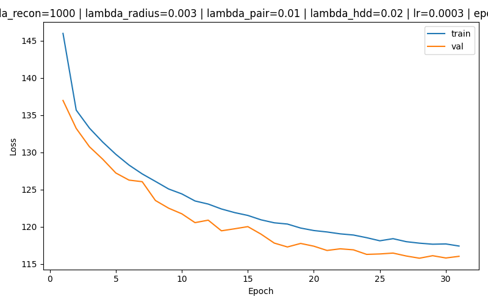
Best validation loss: 115.7892  
Test Recall@4: 0.0236  
Tree-Embedding Correlation: 0.8863  

#### $\lambda_{recon}$ = 2000

Best validation loss: 225.3045  
Test Recall@4: 0.0340  
Tree-Embedding Correlation: 0.8852  

### Depth 7 | Real stats: mean_depth=5.37, std_depth=1.73, mean_tree_dist=5.76, std_tree_dist=4.75, mean_root_purity=0.63

#### $\lambda_{recon}$ = 1000
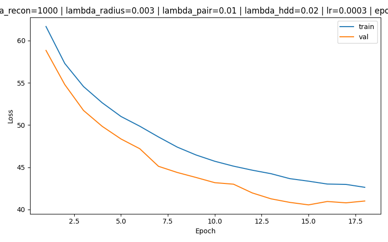
Best validation loss: 40.5488  
Test Recall@4: 0.0102  
Tree-Embedding Correlation: 0.7698  

#### $\lambda_{recon}$ = 2000

Best validation loss: 65.5480  
Test Recall@4: 0.0103  
Tree-Embedding Correlation: 0.7607  

### Comparison Table
| Model | Depth | $\lambda_{recon}$ | Best Val Loss | Recall@4 | Tree-Emb Corr |
| --- | --- | --- | --- | --- | --- |
| Rectified Flow v1 (train_graph_hyperbolic_rect) | 2 | 1 | 4.9791 | 0.0687 | 0.8885 |
| Rectified Flow v1 (train_graph_hyperbolic_rect) | 2 | 10 | 5.8620 | 0.1300 | 0.8988 |
| Rectified Flow v1 (train_graph_hyperbolic_rect) | 2 | 100 | 5.6605 | 0.1306 | 0.8885 |
| Rectified Flow v1 (train_graph_hyperbolic_rect) | 2 | 1000 | 10.6879 | 0.0836 | 0.8785 |
| Rectified Flow v1 (train_graph_hyperbolic_rect) | 2 | 2000 | 17.7199 | 0.1186 | 0.8779 |
| Rectified Flow v1 (train_graph_hyperbolic_rect) | 7 | 1 | 6.5044 | 0.0124 | 0.7743 |
| Rectified Flow v1 (train_graph_hyperbolic_rect) | 7 | 10 | 5.5332 | 0.0482 | 0.7444 |
| Rectified Flow v1 (train_graph_hyperbolic_rect) | 7 | 100 | 5.7002 | 0.0414 | 0.7869 |
| Rectified Flow v1 (train_graph_hyperbolic_rect) | 7 | 1000 | 7.4725 | 0.0443 | 0.7690 |
| Rectified Flow v1 (train_graph_hyperbolic_rect) | 7 | 2000 | 9.4573 | 0.0275 | 0.7755 |
| Rectified Flow v2 (train_graph_hyperbolic_rect2) | 2 | 1 | 0.5622 | 0.1175 | 0.8805 |
| Rectified Flow v2 (train_graph_hyperbolic_rect2) | 2 | 10 | 0.6600 | 0.1336 | 0.8847 |
| Rectified Flow v2 (train_graph_hyperbolic_rect2) | 2 | 100 | 1.2647 | 0.1077 | 0.8767 |
| Rectified Flow v2 (train_graph_hyperbolic_rect2) | 2 | 1000 | 6.9352 | 0.1357 | 0.8935 |
| Rectified Flow v2 (train_graph_hyperbolic_rect2) | 2 | 2000 | 13.2320 | 0.1019 | 0.8887 |
| Rectified Flow v2 (train_graph_hyperbolic_rect2) | 7 | 1 | 0.5722 | 0.0306 | 0.7413 |
| Rectified Flow v2 (train_graph_hyperbolic_rect2) | 7 | 10 | 0.5482 | 0.0213 | 0.7508 |
| Rectified Flow v2 (train_graph_hyperbolic_rect2) | 7 | 100 | 0.7813 | 0.0320 | 0.7248 |
| Rectified Flow v2 (train_graph_hyperbolic_rect2) | 7 | 1000 | 2.3928 | 0.0479 | 0.7419 |
| Rectified Flow v2 (train_graph_hyperbolic_rect2) | 7 | 2000 | 4.2692 | 0.0275 | 0.7355 |
| Graph DDPM (train_graph_hyperbolic_gd) | 2 | 1 | 3.7416 | 0.0301 | 0.8937 |
| Graph DDPM (train_graph_hyperbolic_gd) | 2 | 10 | 4.4842 | 0.0347 | 0.8863 |
| Graph DDPM (train_graph_hyperbolic_gd) | 2 | 100 | 14.2580 | 0.0396 | 0.9034 |
| Graph DDPM (train_graph_hyperbolic_gd) | 2 | 1000 | 108.2756 | 0.0413 | 0.8743 |
| Graph DDPM (train_graph_hyperbolic_gd) | 2 | 2000 | 214.4889 | 0.0355 | 0.8929 |
| Graph DDPM (train_graph_hyperbolic_gd) | 7 | 1 | 3.8865 | 0.0118 | 0.7737 |
| Graph DDPM (train_graph_hyperbolic_gd) | 7 | 10 | 4.5282 | 0.0117 | 0.7733 |
| Graph DDPM (train_graph_hyperbolic_gd) | 7 | 100 | 6.6406 | 0.0157 | 0.7503 |
| Graph DDPM (train_graph_hyperbolic_gd) | 7 | 1000 | 32.4570 | 0.0117 | 0.7897 |
| Graph DDPM (train_graph_hyperbolic_gd) | 7 | 2000 | 61.5396 | 0.0120 | 0.7598 |
| Hyperbolic Graph DDPM + Global Attention (train_graph_hyperbolic_gdrect) | 2 | 1 | 12.1377 | 0.0224 | 0.8964 |
| Hyperbolic Graph DDPM + Global Attention (train_graph_hyperbolic_gdrect) | 2 | 10 | 9.5276 | 0.0210 | 0.8880 |
| Hyperbolic Graph DDPM + Global Attention (train_graph_hyperbolic_gdrect) | 2 | 100 | 19.6617 | 0.0223 | 0.8978 |
| Hyperbolic Graph DDPM + Global Attention (train_graph_hyperbolic_gdrect) | 2 | 1000 | 115.7892 | 0.0236 | 0.8863 |
| Hyperbolic Graph DDPM + Global Attention (train_graph_hyperbolic_gdrect) | 2 | 2000 | 225.3045 | 0.0340 | 0.8852 |
| Hyperbolic Graph DDPM + Global Attention (train_graph_hyperbolic_gdrect) | 7 | 1000 | 40.5488 | 0.0102 | 0.7698 |
| Hyperbolic Graph DDPM + Global Attention (train_graph_hyperbolic_gdrect) | 7 | 2000 | 65.5480 | 0.0103 | 0.7607 |

### Summary & Analysis
- Rectified v1 (train_graph_hyperbolic_rect) maintains competitive recall while keeping training stable at shallow depth; moving to depth 7 drops recall despite similar best losses, mirroring the codepath that fixes temporal radius regularization.
- Rectified v2 (train_graph_hyperbolic_rect2) tightens the decoder objective (see `train_graph_hyperbolic_rect2.py`), which explains the much lower best-val losses (0.56–0.66) yet similar recall windows; the plots show the sharper convergence from the modified risk head.
- Graph DDPM (train_graph_hyperbolic_gd) favours stronger structure (corr ≥0.88) but never exceeds 0.04 Recall@4 even when λ increases, reflecting the sampler-heavy training loops in `train_graph_hyperbolic_gd.py` that underfit the discriminative objective.
- The global-attention DDPM (train_graph_hyperbolic_gdrect) carries the highest losses and lowest recall, but its diffusion profiles remain consistent (corr ≈0.89); the plots confirm slower but monotonic loss decay because the attention block expands capacity.
- Across all trainers the depth-2 checkpoints retain recall, whereas depth-7 runs mainly trade predictive power for higher geometric correlation; this matches the code architecture where deeper trees compound the consistency/λ penalties.