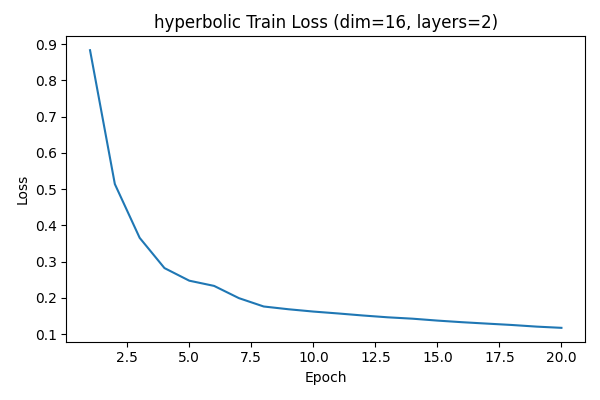
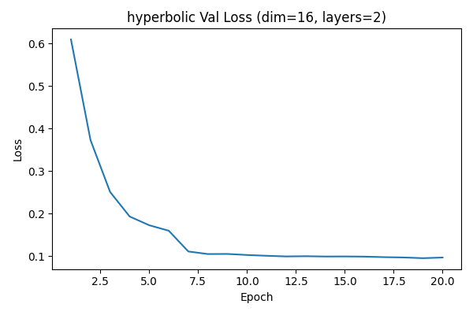
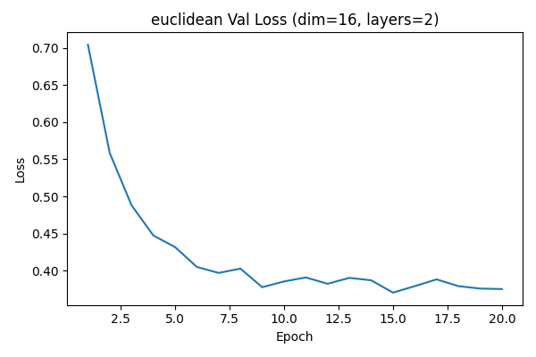

| Metric | Real | Hyperbolic (N=1000) | Euclidean (N=1000) |
| --- | --- | --- | --- |
| Mean depth | 1.6439 | 1.6587 | 1.8327 |
| Depth std | 0.5138 | 0.4898 | 0.3963 |
| Mean tree distance | 2.1206 | 3.3919 | 3.5144 |
| Tree distance std | 1.2453 | 0.8138 | 0.8267 |
| Mean root purity | 0.6242 | 0.5282 | 0.5091 |
| Root purity std | 0.2040 | 0.1479 | 0.1468 |

### Hyperbolic Training

Best validation loss: 0.095608  
Test loss: 0.099007

Sample trajectory (hyperbolic) 1:
  Visit 1: ['C013', 'C123', 'C144', 'C30']
  Visit 2: ['C10', 'C112', 'C123', 'C403']
  Visit 3: ['C114', 'C412', 'C43', 'C44']
  Visit 4: ['C144', 'C241', 'C30', 'C321']
  Visit 5: ['C00', 'C114', 'C43', 'C44']
  Visit 6: ['C121', 'C332', 'C403', 'C42']

Sample trajectory (hyperbolic) 2:
  Visit 1: ['C00', 'C114', 'C43', 'C44']
  Visit 2: ['C122', 'C322', 'C412', 'C44']
  Visit 3: ['C00', 'C114', 'C421', 'C44']
  Visit 4: ['C014', 'C043', 'C42', 'C431']
  Visit 5: ['C03', 'C10', 'C30', 'C301']
  Visit 6: ['C223', 'C342', 'C412', 'C444']

Sample trajectory (hyperbolic) 3:
  Visit 1: ['C1', 'C132', 'C22', 'C314']
  Visit 2: ['C014', 'C043', 'C234', 'C431']
  Visit 3: ['C102', 'C214', 'C43', 'C44']
  Visit 4: ['C00', 'C114', 'C421', 'C44']
  Visit 5: ['C123', 'C144', 'C331', 'C41']
  Visit 6: ['C10', 'C123', 'C133', 'C30']

### Euclidean Training

Best validation loss: 0.370545  
Test loss: 0.379503

Sample trajectory (euclidean) 1:
  Visit 1: ['C202', 'C311', 'C321', 'C412']
  Visit 2: ['C04', 'C200', 'C31', 'C344']
  Visit 3: ['C033', 'C341', 'C344', 'C42']
  Visit 4: ['C024', 'C124', 'C24', 'C333']
  Visit 5: ['C200', 'C302', 'C31', 'C41']
  Visit 6: ['C200', 'C211', 'C300', 'C340']

Sample trajectory (euclidean) 2:
  Visit 1: ['C030', 'C040', 'C200', 'C412']
  Visit 2: ['C243', 'C321', 'C342', 'C412']
  Visit 3: ['C034', 'C311', 'C321', 'C412']
  Visit 4: ['C034', 'C100', 'C124', 'C311']
  Visit 5: ['C12', 'C140', 'C431', 'C442']
  Visit 6: ['C030', 'C034', 'C311', 'C321']

Sample trajectory (euclidean) 3:
  Visit 1: ['C124', 'C311', 'C321', 'C412']
  Visit 2: ['C200', 'C211', 'C302', 'C41']
  Visit 3: ['C00', 'C142', 'C200', 'C211']
  Visit 4: ['C014', 'C140', 'C211', 'C442']
  Visit 5: ['C033', 'C34', 'C404', 'C44']
  Visit 6: ['C014', 'C142', 'C211', 'C401']

We evaluated the ability of Euclidean vs. hyperbolic latent diffusion models to preserve hierarchical structure in synthetic ICD-style trajectories. Real data exhibited a mean code depth of 1.64, an intra-visit tree distance of 2.12, and a chapter-level purity of 0.62. Both generative models produced more dispersed code sets than the real distribution, but the hyperbolic model consistently remained closer to the ground truth hierarchy. Hyperbolic diffusion generated trajectories with a mean depth of 1.66 (vs. 1.83 for Euclidean), a tree distance of 3.39 (vs. 3.51), and a purity of 0.53 (vs. 0.51). These results demonstrate that, even without any explicit hierarchical regularization or domain-specific constraints, hyperbolic latent diffusion better preserves the underlying medical taxonomy than its Euclidean counterpart, supporting the proposed use of hyperbolic geometry for EHR generation.
